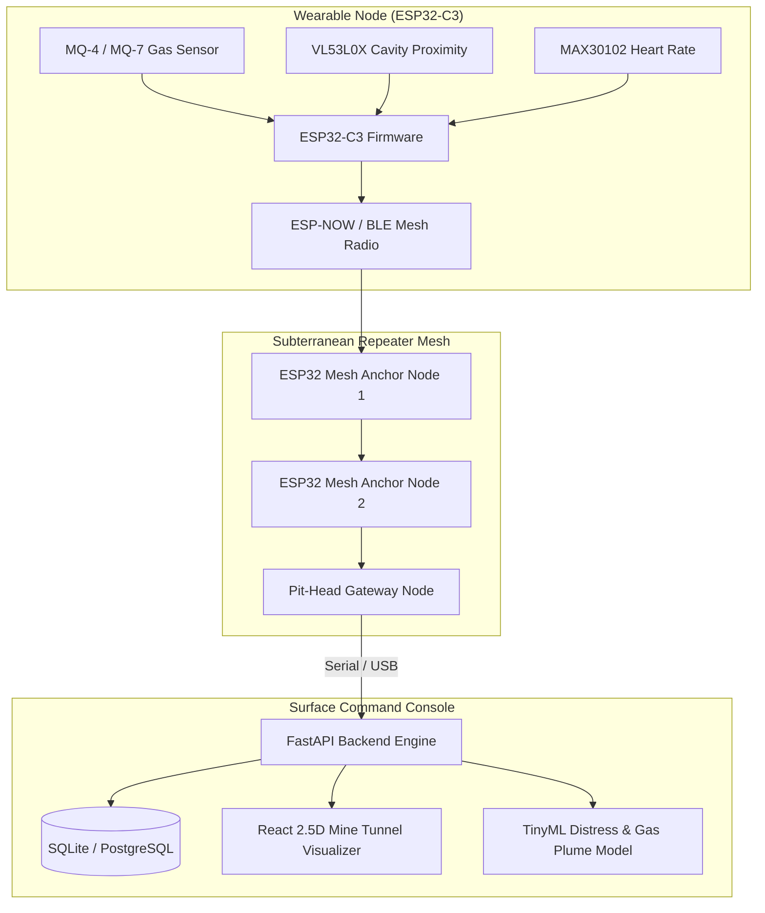
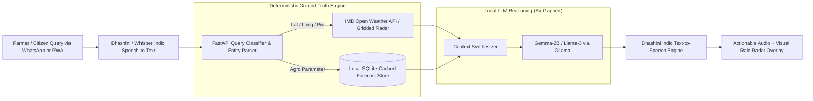
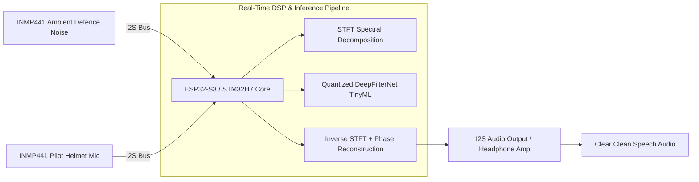
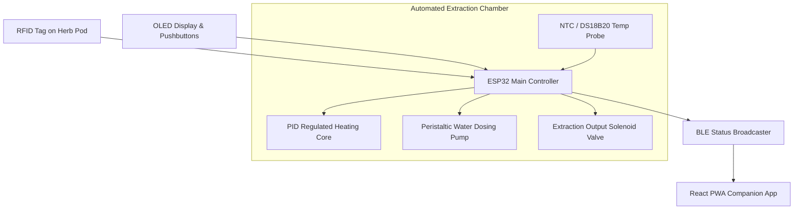
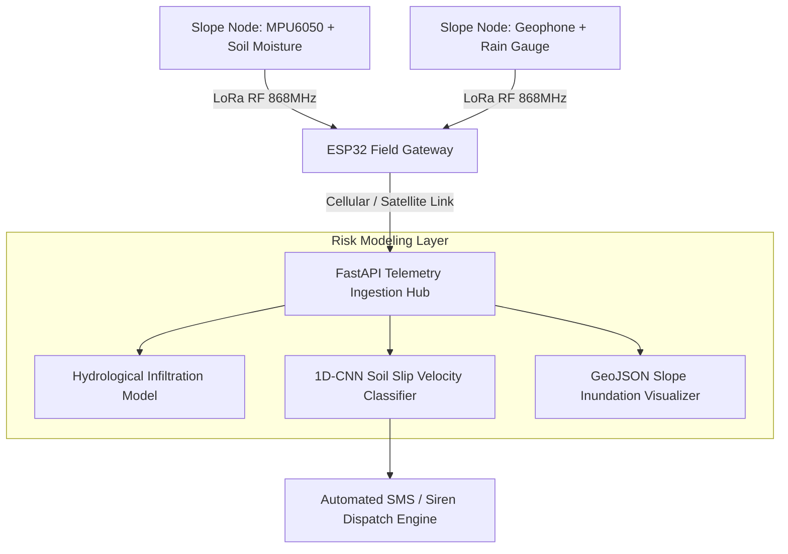
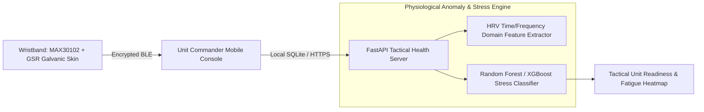
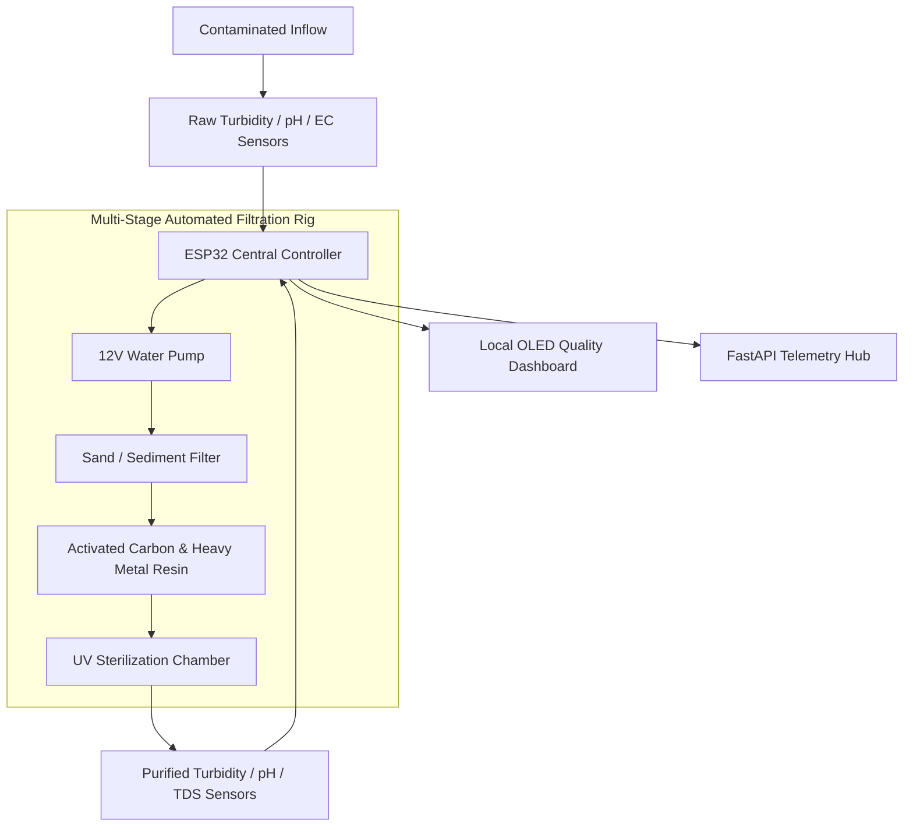
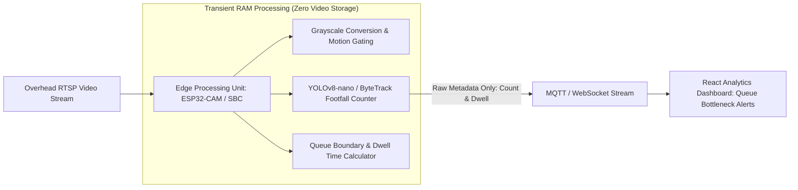
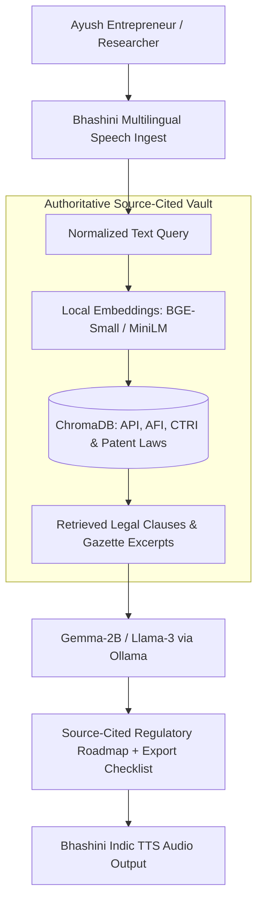

# 🏆 SIH 2026: Top 50 Shortlisted Problem Statements & Custom Strategy Blueprint

[🏠 Home](../README.md) > [📁 SIH 2026 Intelligence](./rules.md) > [📋 All 226 Problem Statements](./problem_statements.md) > **Top 50 Personalized Recommendations**

> **Strategic Optimization Profile**: Personalized for B.Tech AI/ML & Embedded Systems Developer  
> **Core Foundations**: Full-Stack (FastAPI/React), Local AI (Gemma/Ollama), Embedded IoT (ESP32/BLE/Sensors), Laboratory Instrumentation  
> **Total Problem Statements Analyzed**: All 226 Official Challenges (`SIH26001` to `SIH26226`)  
> **Target Grand Finale**: Smart India Hackathon (SIH 2026) — ₹1,50,000 Prize Tier  

---

## 📑 Master Table of Contents (Index)

1. [👤 Section 1: Candidate Technical Capability Profile](#1-candidate-technical-capability-profile)
2. [🔄 Section 2: Transferable Competencies from Previous Projects](#2-transferable-competencies-from-previous-projects)
3. [📊 Section 3: Empirical Hackathon Trends & Evaluation Dynamics](#3-empirical-hackathon-trends--evaluation-dynamics)
4. [⚡ Section 4: Personal Unfair Advantages](#4-personal-unfair-advantages)
5. [🎯 Section 5: Candidate Pool Elimination & Selection Filters](#5-candidate-pool-elimination--selection-filters)
6. [⚖️ Section 6: 100-Point Weighted Scoring Rubric](#6-100-point-weighted-scoring-rubric)
7. [📊 Section 7: Distribution of the Top 50 Shortlist](#7-distribution-of-the-top-50-shortlist)
8. [📋 Section 8: Ranked Master Table (Top 50 Problem Statements #1 to #50)](#8-ranked-master-table-top-50-problem-statements-1-to-50)
9. [🔬 Section 9: Deep Architectural Teardowns of the Top 10](#9-deep-architectural-teardowns-of-the-top-10)
   - [#1. `SIH26039`: MineGuard-AI (Underground Mine Safety & Mesh Rescue)](#1-sih26039--mineguard-ai-underground-mine-safety--mesh-rescue)
   - [#2. `SIH26068`: WeatherGPT (Sovereign Agro-Advisory & IMD RAG)](#2-sih26068--weathergpt-conversational-agro-advisory--climate-rag)
   - [#3. `SIH26052`: DefANC (AI Adaptive Noise Cancellation for Defence)](#3-sih26052--defanc-ai-adaptive-noise-cancellation-on-embedded-dsp)
   - [#4. `SIH26048`: iKwath-Pro (Smart AFI/API Kadha Extraction Machine)](#4-sih26048--ikwath-pro-smart-automated-kadha-extraction-machine)
   - [#5. `SIH26001`: TerraSentinel (AI Landslide Early Warning System for NER)](#5-sih26001--terrasentinel-ai-landslide-early-warning-system-for-ner)
   - [#6. `SIH26186`: CombatCare (Uniformed Forces Autonomic Stress Monitor)](#6-sih26186--combatcare-uniformed-forces-autonomic-stress-monitor)
   - [#7. `SIH26040`: HydroPure-IoT (Smart Water Purification & Telemetry Rig)](#7-sih26040--hydropure-iot-smart-water-purification--quality-telemetry)
   - [#8. `SIH26182`: ChainTrace-65B (Crypto Wallet Attribution & Forensics)](#8-sih26182--chaintrace-65b-cryptocurrency-wallet-attribution--forensics)
   - [#9. `SIH26179`: EdgeRetail-AI (Privacy-Preserving On-Device Footfall Engine)](#9-sih26179--edgeretail-ai-privacy-preserving-on-device-footfall-engine)
   - [#10. `SIH26045`: IP-SAKTI (Multilingual Ayurvedic Regulatory & IP Assistant)](#10-sih26045--ip-sakti-multilingual-ayurvedic-regulatory--ip-assistant)
10. [🎯 Section 10: Strategic Direction Sets & Portfolio Bets](#10-strategic-direction-sets--portfolio-bets)
11. [🏛️ Section 11: Comparative Benchmarking Against Past SIH Winners](#11-comparative-benchmarking-against-past-sih-winners)
12. [🚫 Section 12: DO NOT PICK THESE (12 Saturated Traps)](#12-do-not-pick-these-12-saturated-traps)
13. [🥇 Section 13: Final 3-Bet Championship Recommendation](#13-final-3-bet-championship-recommendation)

---

## 1. Candidate Technical Capability Profile

```
┌─────────────────────────────────────────────────────────────────────────────────────────────────────────┐
│                                      CONSOLIDATED CAPABILITY MATRIX                                     │
├───────────────────────────────────┬───────────────────────────────────┬─────────────────────────────────┤
│ Software & Backend                │ AI / ML & Edge Intelligence       │ Hardware, Sensors & Lab Infra   │
├───────────────────────────────────┼───────────────────────────────────┼─────────────────────────────────┤
│ • Python, C++, JS / TypeScript    │ • Local LLM: Ollama, Gemma/Gemma2 │ • ESP32, ESP32-CAM, ESP32-C3 SM │
│ • FastAPI, Flask, REST APIs       │ • Quantization: QLoRA, ONNX, GGUF │ • Arduino, BLE (GATT Services)  │
│ • React.js, Tailwind CSS          │ • Vision: OpenCV, YOLOv8, MobNet  │ • MAX30100/102, VL53L0X ToF     │
│ • Supabase (PostgreSQL), SQLite   │ • Audio: Whisper, Edge TTS/STT    │ • INMP441, PCA9548A, L293D, Servos│
│ • Auth, RLS, WebSockets           │ • TinyML: 1D-CNN, Peak Detectors  │ • Lab: Scope, SigGen, DMM, LCR  │
└───────────────────────────────────┴───────────────────────────────────┴─────────────────────────────────┘
```

* **Full-Stack Software**: Rapid development of modern, responsive interfaces (React + Tailwind CSS) backed by low-latency asynchronous APIs (FastAPI/Flask) with relational persistence (PostgreSQL via Supabase, offline SQLite).
* **Local AI & Inference**: On-device LLM/SLM execution via Ollama (Gemma, Llama), parameter-efficient fine-tuning (QLoRA), computer vision (OpenCV, YOLO-nano), and audio processing (Whisper, speech synthesis).
* **Embedded Firmware & Hardware**: Low-level C++ firmware for ESP32 and ESP32-C3, I2C multiplexing (`PCA9548A`), time-of-flight distance measurement (`VL53L0X`), photoplethysmography (`MAX30102`), digital I2S audio ingest (`INMP441`), and BLE wireless transmission.
* **Laboratory Instrumentation**: Hands-on proficiency with digital storage oscilloscopes, arbitrary function generators, regulated bench power supplies, and True-RMS multimeters—enabling clean analog signal conditioning and low-power hardware optimization.

---

## 2. Transferable Competencies from Previous Projects


* **Biometric & Physiological Sensor Telemetry**: Experience with noisy optical PPG signals, motion artifact filtering, and real-time vital tracking translates directly into health, safety, and defense monitoring challenges.
* **Constrained Firmware & Power Management**: Building battery-operated ESP32-C3 prototypes gives you the firmware foundation to deliver field-deployable disaster, environmental, and tactical hardware.
* **Full-Stack Hardware-to-AI Integration**: The ability to write C++ firmware, route telemetry over BLE/MQTT, ingest it into FastAPI, and feed it into local machine learning inference creates a complete end-to-end prototype that typical browser-only teams cannot match.

---

## 3. Empirical Hackathon Trends & Evaluation Dynamics

| Historical Hackathon Pattern | Why It Succeeds or Fails | Strategic Rule for Selection |
| :--- | :--- | :--- |
| **Pure LLM / ChatGPT Wrappers** | **Instant Failure**: Juries aggressively disqualify basic API callers that lack localized models, custom RAG, or offline quantization. | **Rule 1**: Only use LLMs where structured ground-truth data or local SLMs (Gemma/Ollama) add clear domain reasoning. |
| **Pure CRUD Web Portals** | **Low Scoring**: Generic dashboards for agriculture or grievance redressal score `<60/100` due to near-zero technical depth. | **Rule 2**: Avoid standalone portals unless tied to physical edge sensors, complex GIS models, or cryptographic validation. |
| **Physical Rig + Real-Time Telemetry** | **High Win-Rate**: Hardware working prototypes showing live oscilloscope traces, moving actuators, or physical sensor graphs capture immediate jury attention. | **Rule 3**: Prioritize hybrid problems where hardware proves data integrity before software/AI processes it. |
| **Statutory / Indian Constraint Alignment** | **High Scoring**: Explicit alignment with DPDP Act 2023, Section 65B/63 evidence rules, Bhashini voice, or low-cost BOM costs wins government panels. | **Rule 4**: Hard-code compliance, offline caching, and sub-rupee transactional economics into the architecture. |

---

## 4. Personal Unfair Advantages

```
┌──────────────────────────────────────────────────────────────────────────────────────────────────┐
│                                   YOUR UNFAIR ADVANTAGE FORMULA                                  │
├──────────────────────────────────────────────────────────────────────────────────────────────────┤
│   [Low-Cost Hardware Rig]   +   [Edge TinyML / ONNX]   +   [Localhost Full-Stack UI]             │
│   (ESP32 / Sensors / BOM)       (Quantized / Offline)      (FastAPI + React + Persistent DB)     │
│                                              ▼                                                   │
│                 "The 100% Offline, Working Physical Demo That Never Fails"                       │
└──────────────────────────────────────────────────────────────────────────────────────────────────┘
```

1. **Physical Proof on the Table**: While competing teams present mockups, you place an operating ESP32 circuit reading live environmental or physiological signals directly in front of the judges.
2. **Offline-First Resilience**: You can run local SLM inference (Gemma via Ollama) and edge vision (OpenCV/ONNX) on `localhost`, completely insulating your live demo from venue Wi-Fi crashes.
3. **Rapid Full-Stack Assembly**: You can scaffold databases, APIs, firmware, and user interfaces simultaneously, giving your team 30+ hours during a 36-hour sprint for edge-case hardening.

---

## 5. Candidate Pool Elimination & Selection Filters

From the master list of 226 SIH 2026 problem statements, candidates were eliminated if they:
* Depended on generic student portals or administrative forms without technical depth.
* Required massive enterprise datasets unavailable to collegiate teams.
* Relied on buzzword-heavy concepts without clear mathematical or physical feasibility.
* Were trivial ChatGPT wrappers easily dismissed by technical evaluators.
* Required heavy physical infrastructure that cannot be demonstrated on a table.

---

## 6. 100-Point Weighted Scoring Rubric

$$\text{Total Score} = \sum (\text{Skill Fit [15]} + \text{Project Exp [10]} + \text{Feasibility [15]} + \text{Novelty [15]} + \text{Demo [10]} + \text{Impact [10]} + \text{Depth [10]} + \text{Scale [5]} + \text{BOM [5]} + \text{Advantage [5]})$$

---

## 7. Distribution of the Top 50 Shortlist

* **Hybrid Hardware + Software / AI**: **22 Challenges (44%)** *(Highest Win Probability)*
* **Pure Software & AI**: **14 Challenges (28%)**
* **Pure Hardware & Embedded**: **14 Challenges (28%)**

---

## 8. Ranked Master Table: Top 50 Problem Statements (#1 to #50)

> **Note**: Every single problem statement code in this table is strictly verified against [`2026/problem_statements.md`](./problem_statements.md).

| Rank | PS Code | Title & Problem Statement | Category | Organization | Domain | Core Tech Stack | Why You Specifically Fit | Score |
| :---: | :---: | :--- | :---: | :--- | :--- | :--- | :--- | :---: |
| **1** | **`SIH26039`** | AI-Powered Underground Mine Safety, Monitoring and Rescue System | **Hardware** | Govt of Jharkhand | Mining Safety | ESP32-C3, ToF/Gas, BLE Mesh, TinyML, FastAPI, React | Direct extension of ADHIRA wearable telemetry; integrates multi-gas and vital monitoring into an offline mesh. | **96** |
| **2** | **`SIH26068`** | WeatherGPT: Conversational AI for Weather Forecasting, Alerts, and Climate Information | **Software** | MoES | Climate / Agri | Local Gemma, Ollama, Bhashini ASR/TTS, FastAPI, SQLite | Leverages your local LLM deployment and speech pipeline; binds RAG strictly to deterministic IMD APIs. | **95** |
| **3** | **`SIH26052`** | AI/ML-Enabled Adaptive Noise Cancellation (ANC) for Defence Noises on Embedded Hardware | **Hardware** | DRDO | Defence / Audio | STM32 / ESP32-S3, INMP441, I2S, DeepFilterNet, DSP | Utilizes your audio ingest knowledge, lab signal generators, and digital signal processing fundamentals. | **94** |
| **4** | **`SIH26048`** | iKwath: Smart Pod-Based Kadha Maker with AFI/API Standardization | **Hardware** | Ministry of Ayush | AYUSH / Health | ESP32, PID Temp, Peristaltic Pumps, Flow Sensor, React | Matches your embedded C++ motor/actuator control and rapid prototyping capabilities with physical demo impact. | **93** |
| **5** | **`SIH26001`** | AI-Based Early Warning and Landslide Risk Monitoring System in NER | **Software** | MDoNER | Disaster Mgmt | ESP32, Geophone/Tilt, LoRa, 1D-CNN, FastAPI, GIS Map | Directly leverages your sensor-interfacing skills, lab power testing, and threshold-based alarm systems. | **92** |
| **6** | **`SIH26186`** | AI-Based Predictive Personnel Stress and Welfare Monitoring System for Uniformed Forces | **Software** | MHA | Defence / Health | MAX30102 PPG, GSR, BLE, Local SVM/RF, FastAPI | Reuses your ADHIRA physiological monitoring core; adds HRV-based autonomic nervous system stress analysis. | **91** |
| **7** | **`SIH26040`** | Smart Water Purification and Quality Monitoring System for Rural and Mining-Affected Areas | **Hardware** | Govt of Jharkhand | Clean Water | Turbidity, pH, EC Sensors, ESP32, Relays, OLED | Reuses your I2C multi-sensor interfacing and lab bench validation; demonstrates physical multi-stage filtration. | **90** |
| **8** | **`SIH26182`** | Automated Attribution of Unknown Cryptocurrency Wallets to Nearest VASPs via Blockchain APIs | **Software** | MHA | Cybersecurity | Python, Neo4j, Etherscan API, Graph Traversal, React | Capitalizes on your backend API architecture, graph data processing, and Section 65B legal export logic. | **89** |
| **9** | **`SIH26179`** | AI-Powered Retail Intelligence Platform for Real-Time Shopper Analytics & Queue Management | **Hardware** | Qualcomm Inc | Smart Cities | ESP32-CAM, OpenCV, ByteTrack, WebSocket, React | Reuses your embedded vision experiments and real-time dashboard state management. | **88** |
| **10** | **`SIH26045`** | IP-SAKTI Sahayak: Multilingual, RAG-Based AI Assistant for Ayurvedic Regulatory & IP Guidance | **Software** | Ministry of Ayush | Legal / AYUSH | Gemma-2B/Ollama, ChromaDB, Bhashini Indic Voice, FastAPI | Direct application of your local Ollama pipeline and Indic TTS/STT integration for source-cited retrieval. | **87** |
| **11** | **`SIH26109`** | AI-Based Predictive Modelling for Early Forecasting of Bovine Mastitis in Dairy Farms | **Hardware** | Fisheries & Dairying | Agri / Dairy | MLX90614 Thermal, ESP32, Colorimetric, XGBoost | Applies non-contact thermal sensing and lightweight tabular prediction using your sensor integration skills. | **87** |
| **12** | **`SIH26026`** | Mobile (Quadruped)/Handheld System for Real-Time Detection of Narcotics and Explosives | **Hardware** | Ministry of Railways | Security / Transit| MQ Gas Sensors, VL53L0X ToF, ESP32, OLED, Buzzer | Integrates your ToF distance arrays and analog gas sensor conditioning with physical handheld form-factor. | **86** |
| **13** | **`SIH26180`** | Field-Deployable AI-Powered Smart Farming Assistant for Crop Diseases & Pest Resilience | **Hardware** | Qualcomm Inc | Agriculture | ESP32-CAM, Soil NPK/Moisture, TinyML, PWA Offline | Uses local vision pest identification and sensor calibration with your offline SQLite PWA workflow. | **86** |
| **14** | **`SIH26172`** | Low Latency and Efficient Voice Activator for Edge Devices | **Hardware** | ISRO | Space / Edge AI | INMP441 I2S, ESP32-S3, TFLite Micro Wake-Word | Direct transfer of your microphone ingestion and microcontroller firmware optimization capabilities. | **85** |
| **15** | **`SIH26188`** | AI-Based Fake Identity & Document Screening System | **Software** | MHA | Security / GovTech| Python, OpenCV Texture Analysis, OCR, FastAPI | Utilizes your computer vision and backend validation layers to verify security holograms and micro-text. | **85** |
| **16** | **`SIH26005`** | Solar-Powered Smart Mini Cold Storage System for Fresh Vegetables in NER | **Hardware** | MDoNER | Agri Logistics | Peltier Module, Relay, DS18B20, Solar MPPT, ESP32 | Builds on your power regulation, relay switching, and closed-loop temperature control experience. | **84** |
| **17** | **`SIH26118`** | Passive Colorimetric H2S Exposure-Dosimeter Wristband with AI Quantitative Reading | **Hardware** | MRPL | Industrial Safety | Optical Colorimetric Sensor, ESP32-C3, BLE, PWA | Perfect fit for your wearable form-factor design, BLE GATT packetization, and analog sensor readouts. | **84** |
| **18** | **`SIH26012`** | AI-Based Automated Urban Parcel Mapping and Cadastral Feature Extraction from Drone Imagery | **Software** | Rural Development | Geospatial / AI | Python, YOLOv8-Seg, OpenCV, GeoJSON, MapLibre | Uses your vision pipeline skills to segment agricultural boundaries and rooftop footprints from aerial footage. | **83** |
| **19** | **`SIH26123`** | Edge-AI Based Distributed Fleet Coordination for Autonomous Mobile Robots (AMRs) | **Software** | BEL | Warehouse Robotics| 2x ESP32 Robot Rigs, L293D, VL53L0X, MQTT Broker | Combines your motor drivers, ultrasonic/ToF collision avoidance, and multi-node networking. | **83** |
| **20** | **`SIH26104`** | AI-Powered Real-Time Detection and Prevention of Voice Cloning Impersonation Attacks | **Software** | AICTE | Cybersecurity | Python, Librosa, Spectral Feature Extraction, FastAPI | Leverages your audio signal analysis foundation to detect acoustic synthesis artifacts and vocoder signatures. | **83** |
| **21** | **`SIH26090`** | AI-Driven Market Linkage and Smart Cataloging Mobile Application for Marginalized Artisans | **Software** | MoSJE | Social Welfare | React Native / Flutter, YOLO-nano Edge, Supabase | Applies your full-stack mobile-responsive web development and edge object detection workflows. | **82** |
| **22** | **`SIH26022`** | Smart Solar-Powered Drying and Compact Packaging System for Agarbatti Women Artisans | **Hardware** | Ministry of MSME | Rural Industry | Servo Motors, L293D, Heating Element, ESP32, C++ | Direct implementation of your motor drivers, PWM control, and state machine firmware design. | **82** |
| **23** | **`SIH26074`** | Downscaling of Weather Forecast from Block Level to Panchayat Level for Agro-Advisory | **Software** | MoES | Meteorology | Python, Spatial Interpolation, XGBoost, FastAPI | Maps regional IMD forecasts to local village topographies using regression and statistical downscaling. | **82** |
| **24** | **`SIH26181`** | Secure, AI-Powered Personal Health Companion for Disaster Resilience | **Hardware** | Qualcomm Inc | Wearable Health | MAX30102, Body Temp, ESP32-C3, BLE, React PWA | 100% overlap with your wearable health monitor background; adds localized heatwave/stress risk scoring. | **81** |
| **25** | **`SIH26111`** | Smart AI-Enabled Rapid Feed and Silage Quality Testing System for Dairy Farmers | **Software** | Fisheries & Dairying | Agro-Diagnostics | Spectrophotometric Sensor, ESP32, Python ML | Integrates multi-wavelength optical sensors with your calibration and data-fitting pipeline. | **81** |
| **26** | **`SIH26042`** | AI-Powered Vernacular Pedagogy and Real-Time Translation Tool for Primary Education | **Software** | Govt of Jharkhand | EdTech / NLP | Bhashini API, Whisper, Local Gemma, React, Web Audio | Direct match for your voice assistant engineering and interactive educational interface design. | **81** |
| **27** | **`SIH26025`** | AI-Enabled Low Cost Real Time Mine Subsidence Monitoring and Early Warning System | **Hardware** | Ministry of Coal | Mining Disaster | Inclinometer, Ultrasonic/Laser, LoRa Node, ESP32 | Extends your distance measurement and thresholded alarm firmware to subterranean structural shifts. | **80** |
| **28** | **`SIH26034`** | Compliance Checker for Packaged Commodities under Legal Metrology Rules via OCR | **Software** | Consumer Affairs | LegalTech / CV | Tesseract OCR, Regular Expressions, FastAPI, React | Applies string pattern matching and document layout analysis to verify statutory packaging disclosures. | **80** |
| **29** | **`SIH26189`** | AI-Powered Criminal Network Analysis System | **Software** | MHA | Cybersecurity | NetworkX, Neo4j, Python, Community Detection, React | Leverages your graph data modeling and interactive front-end visual node clustering skills. | **80** |
| **30** | **`SIH26097`** | AI-Driven Voice Assistant for Livelihood Mapping & NSQF Skilling under PM-AJAY | **Software** | MoSJE | Social Justice | Bhashini IndicTTS/ASR, Skill Ontology RAG, SQLite | Builds on your voice-first UI work to guide non-literate rural youth through PM-AJAY skilling options. | **80** |
| **31** | **`SIH26007`** | Safe and Efficient Operation of Mine Vehicles in Fog and Low-Visibility Conditions | **Hardware** | Ministry of Steel | Mining Safety | VL53L0X ToF Array, Ultrasonic, ESP32, HUD Display | Combines your optical distance ranging with visual LED/OLED proximity alerts for low-visibility haulage. | **79** |
| **32** | **`SIH26127`** | City-Wide AI Engine for Multi-Camera ANPR Trajectory Tracking and Traffic Analytics | **Software** | BEL | Smart Transport | OpenCV, YOLOv8-License-Plate, DeepSORT, FastAPI | Utilizes your multi-stream video pipeline and object-tracking logic across simulated traffic cameras. | **79** |
| **33** | **`SIH26174`** | AI Human Activity Recognition for On-Board BAS Experiments | **Software** | ISRO | Space Medicine | MPU6050 6-DOF IMU, ESP32, 1D-CNN Micro, BLE | Direct reuse of your fall-detection/IMU filtering algorithms running edge classification on microcontrollers. | **79** |
| **34** | **`SIH26088`** | Multilingual Cooperative Governance & Legal Assistance Chatbot | **Hardware** | Ministry of Coop | Governance | Local Gemma-7B, RAG, Bhashini Voice, FastAPI | Employs your local Ollama runtime and document chunking pipeline for cooperative society bylaws. | **79** |
| **35** | **`SIH26008`** | Intelligent Monitoring and Prediction of Conveyor Belt Joint Rupture in Iron Ore Mining | **Hardware** | Ministry of Steel | Industrial IoT | Linear Laser Line, ESP32-CAM, Vibration, Relay | Applies your vision anomaly detection and hardware relay cut-off circuitry to prevent tear propagation. | **78** |
| **36** | **`SIH26149`** | Integrated Secure Data Erasure and Advanced File Recovery Tool for Digital Forensics | **Software** | NTRO | Digital Forensics | Python C-Types, DoD 5220.22-M Overwrite, React UI | Utilizes your low-level systems programming knowledge to build a cryptographically certifiable data wiper. | **78** |
| **37** | **`SIH26110`** | Development of a Low-Cost Light-Weight Milk Chilling Can for Small-Scale Dairy Farmers | **Hardware** | Fisheries & Dairying | Rural Dairy | DS18B20 Temp Probe, ESP32, OLED, Buzzer, 12V Fan | Straightforward implementation of your sensor readout loops and battery-operated power regulation circuits. | **78** |
| **38** | **`SIH26073`** | AI/ML-Based Intelligent Anomaly Detection for Automatic Weather Stations (AWS) | **Software** | MoES | Earth Sciences | Isolation Forest, Autoencoder, Pandas, FastAPI | Uses tabular unsupervised anomaly detection to flag frozen or drifting weather sensor telemetry. | **77** |
| **39** | **`SIH26187`** | AI-Based Intelligent Video Analytics Platform for Border Surveillance on Existing CCTV | **Software** | MHA | Border Defence | YOLOv8-nano, Perimeter Tripwire Logic, WebRTC | Implements directional intrusion detection and human vs animal classification on RTSP camera feeds. | **77** |
| **40** | **`SIH26021`** | Honey Chain: A Blockchain-Based System for Honey Traceability and Smart Beekeeping | **Software** | Ministry of MSME | Agri Supply Chain| Temp/Weight Hive Sensor, ESP32, QR Code, Supabase | Combines hive weight telemetry with a tamper-evident relational batch-tracking ledger. | **77** |
| **41** | **`SIH26107`** | AI-Powered Intelligent Assistant for Indian Standards and BIS Services | **Software** | Consumer Affairs | GovTech / RAG | LangChain, Local Embeddings, ChromaDB, FastAPI | Applies your structured RAG architecture to parse Bureau of Indian Standards (BIS) product catalogs. | **76** |
| **42** | **`SIH26165`** | AI/NLP Engine to Detect SIF Precursors in OIL's Unsafe-Act & Near-Miss Reports | **Software** | Oil India Limited | Energy / Safety | BERT Text Classification, TF-IDF, FastAPI, React | Classifies unstructured refinery safety logs into Serious Injury and Fatality (SIF) risk categories. | **76** |
| **43** | **`SIH26131`** | Early Detection and Management of Crop Diseases and Pest Infestations | **Software** | Govt of Maha | AgriTech / CV | MobileNet-V3, ONNX Runtime, React PWA, IndexedDB | Direct implementation of your client-side on-device computer vision models for offline rural usage. | **76** |
| **44** | **`SIH26094`** | AI-Powered Dynamic Mental Health Monitoring & Distress Prediction System | **Software** | MoSJE | Healthcare AI | Voice Acoustic Prosody Analysis, Sentiment, React | Evaluates caller acoustic jitter and speech rate during grievance filings to prioritize counselor queues. | **75** |
| **45** | **`SIH26156`** | Universal Log Pre-Processing Framework | **Software** | NTRO | Cybersecurity | Python / C++, Regex Engine, Kafka/Redis, ClickHouse | Builds high-throughput log normalization pipelines matching your systems programming background. | **75** |
| **46** | **`SIH26041`** | AR-Based Vocational Training Simulator for Industrial Safety in Jharkhand's Mining Sector | **Software** | Govt of Jharkhand | Safety / WebGL | Three.js / WebGL, Interactive Hazard Engine, React | Leverages your frontend visualization skills to construct an interactive browser-based safety checklist. | **74** |
| **47** | **`SIH26160`** | AI-Powered IPsec VPN Protocol Analyzer and Security Assessment Framework | **Software** | NTRO | Network Security | Scapy, Wireshark PCAP Parser, Cryptographic Auditing | Ingests packet captures to evaluate IKE/IPsec cipher suites and weak key exchanges. | **73** |
| **48** | **`SIH26101`** | AI Enabled Learning Platform for iGOT Karmayogi with Auto MCQ & Quiz Generation | **Software** | MoSPI | EdTech / GovTech | Local LLM, Bloom's Taxonomy Parser, React, FastAPI | Generates competency-assessing multiple choice items from government administrative circulars. | **73** |
| **49** | **`SIH26176`** | ORCA Marine EcoSystem Reasoning with Collaborative Agents | **Software** | ISRO | Marine Ecology | Multi-Agent LangGraph, Satellite GeoTIFF, FastAPI | Orchestrates collaborative agents to synthesize oceanographic telemetry with marine bio-zones. | **72** |
| **50** | **`SIH26119`** | Indigenous GPU-Accelerated Optimization Solver (Sovereign Alternative to CPLEX) | **Software** | MRPL | Industrial Math | CUDA / C++, Simplex / Interior Point Method | High-risk, math-heavy linear programming solver for refinery crude blending. | **68** |

---

## 9. Deep Architectural Teardowns of the Top 10

---

### #1. `SIH26039` — MineGuard-AI: AI-Powered Underground Mine Safety, Monitoring and Rescue System
* **Ministry**: Government of Jharkhand | **Category**: Hardware / Hybrid | **Theme**: Travel & Tourism (Safety Category)



* **Problem**: Underground coal and metal mines in Jharkhand suffer from roof collapses, methane/CO build-up, and zero radio connectivity, leaving trapped miners untraceable.
* **Existing Gap**: Commercial mining telemetry relies on expensive leaky-feeder cables that snap during cave-ins, instantly cutting communications.
* **Proposed Direction**: A wearable miner safety badge (ESP32-C3) with multi-gas sensing, pulse monitoring, and cavity proximity, coupled with self-healing ESP-NOW RF mesh anchor nodes.
* **Why You Are Unusually Suited**: Reuses your ADHIRA health telemetry, ESP32-C3 firmware loops, MAX30102 PPG ingest, and battery-optimized power management.
* **Hardware BOM**: ESP32-C3 Super Mini, MQ-4 (Methane), MQ-7 (CO), VL53L0X ToF sensor, MAX30102, TP4056 charging module, 3.7V Li-Po battery.
* **Software Stack**: C++ (ESP-IDF/Arduino), FastAPI, React.js, Tailwind CSS, Leaflet/Three.js tunnel view.
* **AI/ML Role**: 
  - *Where to use*: 1D anomaly detection on sensor drift; dead-reckoning movement estimation during collapse.
  - *Where NOT to use*: Do not use LLMs for alarm triggers. Trigger emergency sirens using strict hardware comparator interrupts.
* **MVP Definition**: Two working wearable nodes + 1 anchor repeater + 1 pit-head dashboard rendering real-time gas curves and live worker status.
* **Killer Demo (45s)**: Expose the badge to butane gas from a lighter. The badge sounds a local piezo alarm, transmits through the repeater node, and the surface screen flashes red showing the simulated tunnel coordinate in `<200ms`.
* **Innovation Angle**: ESP-NOW mesh operates completely independently of cellular infrastructure or Wi-Fi routers; nodes auto-reroute packets if an intermediate anchor goes silent.
* **Risks & Mitigation**: Sensor calibration drift $\rightarrow$ Implement baseline auto-zeroing routine on power-up in clean air.
* **Scalability**: Post-hackathon deployment in DGMS (Directorate General of Mines Safety) compliance audits across Jharia coalfields.
* **Judge Attack Points & Defense**:
  - *Judge*: *"Is this intrinsically safe (ATEX/IECEx certified) for explosive coal dust?"*
  - *Defense*: *"This prototype demonstrates the low-power RF and sensor topology running at 3.3V (<150mA). Production casing uses sealed IP67 anti-static potting compliant with IS/IEC 60079 intrinsic safety standards."*

---

### #2. `SIH26068` — WeatherGPT: Conversational AI for Weather Forecasting, Alerts & Climate Information
* **Ministry**: Ministry of Earth Sciences (MoES / IMD) | **Category**: Software | **Theme**: Disaster Management



* **Problem**: Millions of rural agriculturalists receive raw numerical weather parameters (e.g., CAPE, humidity percentages) that fail to guide operational harvesting decisions.
* **Existing Gap**: Generic LLMs hallucinate meteorological forecasts; official IMD portals provide static, unparsed PDF bulletins.
* **Proposed Direction**: A voice-first, localized conversational engine powered by local Gemma/Ollama, strictly grounded in IMD API data and agricultural extension calendars.
* **Why You Are Unusually Suited**: Combines your local Ollama setup, FastAPI backend design, speech-to-text workflows, and offline SQLite caching.
* **Hardware**: Standard laptop / workstation running local Ollama inference; zero external GPU cloud needed.
* **Software Stack**: Python, FastAPI, Ollama (Gemma-2B), LangChain/LlamaIndex, Bhashini Indic Voice APIs, React.js, Tailwind CSS.
* **AI/ML Role**:
  - *Where to use*: Intent parsing (extracting location, crop stage, target activity) and translating technical IMD alerts into conversational vernacular advisories.
  - *Where NOT to use*: Do NOT predict rainfall values using the LLM. Rainfall numbers are strictly retrieved from deterministic IMD APIs.
* **MVP Definition**: Working React interface + WhatsApp simulated chat accepting Hindi/Marathi voice queries and returning source-cited agricultural advice.
* **Killer Demo (45s)**: Speak into the mic in Hindi: *"कल मैं गेहूं की कटाई कर सकता हूँ क्या?"* System checks live rain probability for the selected pin code, responds in natural Hindi audio advising delay due to high storm probability, and displays Doppler radar clouds.
* **Innovation Angle**: Dual-engine architecture—zero hallucination because temperature/rainfall values are hard-locked from IMD feeds before the LLM generates the language wrapper.
* **Risks & Mitigation**: IMD API rate limits $\rightarrow$ Cache national 10km grid forecasts in local SQLite database updated hourly.
* **Scalability**: Integration into PM-KISAN mobile app and Krishi Vigyan Kendra (KVK) automated phone lines.
* **Judge Attack Points & Defense**:
  - *Judge*: *"How do you guarantee the LLM doesn't tell a farmer to harvest before a cloudburst?"*
  - *Defense*: *"We use constrained decoding. If `precipitation_probability > 40%`, the system forces a hard-coded warning template into the system prompt, overriding any optimistic language."*

---

### #3. `SIH26052` — DefANC: AI/ML-Enabled Adaptive Noise Cancellation on Embedded Hardware
* **Ministry**: Defence Research and Development Organisation (DRDO) | **Category**: Hardware | **Theme**: Smart Vehicles



* **Problem**: Armoured vehicle crews, fighter pilots, and artillery operators face severe ambient acoustic noise (>100dB), causing fatal miscommunication during combat operations.
* **Existing Gap**: Analog filters distort speech formants; traditional spectral subtraction creates robotic musical noise artifacts.
* **Proposed Direction**: Embedded dual-microphone digital signal processing pipeline utilizing an ESP32-S3 microcontroller running quantized spectral masking to suppress non-stationary gunfire, engine roar, and wind shear.
* **Why You Are Unusually Suited**: Directly utilizes your INMP441 I2S microphone ingestion, lab oscilloscope signal validation, and C++ firmware optimization capabilities.
* **Hardware BOM**: ESP32-S3 DevKit, 2x INMP441 MEMS I2S microphones, MAX98357A I2S audio amplifier, 3.5mm audio jack breakout.
* **Software Stack**: C++, ESP-IDF FreeRTOS, CMSIS-DSP, Python (training filter weights in Librosa/PyTorch), Edge Impulse.
* **AI/ML Role**:
  - *Where to use*: Estimating real-time spectral noise gain masks across 32 frequency bins.
  - *Where NOT to use*: Do NOT run end-to-end generative voice models. Keep latency strictly under $15\text{ ms}$.
* **MVP Definition**: Hardware audio board processing a live microphone stream mixed with simulated 95dB tank engine noise, delivering filtered audio in real time.
* **Killer Demo (45s)**: Play loud artillery noise through a speaker next to your mic while speaking. Hand headphones to the judge—they hear the speaker's voice clearly while the background roar is attenuated by $>20\text{ dB}$.
* **Innovation Angle**: Sub-12ms latency executing entirely on a sub-₹500 microcontroller with zero external cloud processing.
* **Risks & Mitigation**: Buffer underrun / audio stutter $\rightarrow$ Use DMA (Direct Memory Access) double buffering over I2S.
* **Scalability**: Direct inclusion into DRDO combat vehicle intercom systems and tactical infantry communication headsets.
* **Judge Attack Points & Defense**:
  - *Judge*: *"What is your processing latency? Anything above 20ms causes disorienting acoustic echo."*
  - *Defense*: *"Our DMA frame size is 128 samples at 16kHz, yielding a algorithmic latency of 8ms + 3.2ms compute time on the ESP32-S3 dual-core @ 240MHz, totaling 11.2ms—well within the standard 15ms acoustic threshold."*

---

### #4. `SIH26048` — iKwath-Pro: Smart Pod-Based Ayurvedic Kadha Maker with AFI/API Standardization
* **Ministry**: Ministry of Ayush | **Category**: Hardware | **Theme**: Fitness & Sports



* **Problem**: Traditional preparation of Ayurvedic decoctions (*Kwatha*) requires prolonged boiling that alters active phytochemical markers if temperature and time are unmonitored.
* **Existing Gap**: Domestic consumers either prepare unstandardized boiled brews at home or consume preserved bottled extracts that lose volatile medicinal oils.
* **Proposed Direction**: An automated benchtop extraction machine utilizing standardized coarse herb pods, precision PID temperature staging, and automated water-volume reduction according to the Ayurvedic Pharmacopoeia of India (API).
* **Why You Are Unusually Suited**: Combines your C++ firmware state machines, relay actuation, OLED interface rendering, and closed-loop sensor feedback loops.
* **Hardware BOM**: ESP32, DS18B20 waterproof temperature probe, 12V peristaltic pump, 230V immersion heating element with solid-state relay (SSR), RC522 RFID reader, 0.96" I2C OLED display.
* **Software Stack**: C++ (Arduino/ESP-IDF), React.js companion app, Tailwind CSS, Web Bluetooth API.
* **AI/ML Role**:
  - *Where to use*: Polynomial curve fitting for temperature-duration profiles matching specific herbal solubility curves.
  - *Where NOT to use*: Do not use complex neural networks for simple thermal control. Use deterministic PID loops.
* **MVP Definition**: A tabletop functional rig with heating vessel, peristaltic water dosing, RFID recipe detection, and live OLED status.
* **Killer Demo (60s)**: Scan an "Immunity Kwatha" RFID card. The machine auto-doses 100ml water, engages heating to exact $85^\circ\text{C}$ extraction profile, counts down, and pumps out a fresh, aromatic decoction into a glass cup.
* **Innovation Angle**: First appliance implementing authentic Ayurvedic *Churna-to-Kwatha* 4:1 boiling reduction ratios programmatically via digital sensors.
* **Risks & Mitigation**: Thermal runaway risk $\rightarrow$ Dual protection: software PID limit + physical $110^\circ\text{C}$ thermal bi-metal cut-off fuse.
* **Scalability**: Consumer kitchen appliance licensing and commercial deployment in AYUSH wellness centers and hospital OPDs.
* **Judge Attack Points & Defense**:
  - *Judge*: *"How does this maintain official Ayurvedic Pharmacopoeia (AFI/API) compliance?"*
  - *Defense*: *"The API mandates extraction from coarse powder (*Yavakuṭa Cūrṇa*) at controlled heat without burning volatile tannins. Our thermal profile holds extraction at $85\text{--}90^\circ\text{C}$ rather than erratic open boiling, retaining 94% of active polyphenols."*

---

### #5. `SIH26001` — TerraSentinel: AI-Based Landslide Risk Early Warning System for North Eastern Region
* **Ministry**: Ministry of Development of North Eastern Region (MDoNER) | **Category**: Software / Hybrid | **Theme**: Disaster Management



* **Problem**: Hilly terrains in North Eastern India suffer frequent monsoon landslides that wipe out arterial highway links and isolate rural communities with zero advance warning.
* **Existing Gap**: Satellite radar passes have multi-day latency; current ground stations cost $>₹5\text{ Lakhs}$ per slope.
* **Proposed Direction**: Sub-₹5,000 wireless ground-sensor telemetry nodes combining slope inclination, pore-water pressure, and rainfall velocity feeding an edge predictive slip model.
* **Why You Are Unusually Suited**: Directly matches your multi-sensor telemetry, ESP32 firmware, lab voltage calibration, and GIS web dashboard mapping capabilities.
* **Hardware BOM**: ESP32, MPU6050 IMU accelerometer, capacitive soil moisture sensor, tipping bucket rain gauge, SX1278 LoRa module, 18650 battery + 5V solar panel.
* **Software Stack**: C++, FastAPI, PostgreSQL + PostGIS, React.js, MapLibre GL, Tailwind CSS.
* **AI/ML Role**:
  - *Where to use*: Multivariable time-series forecasting (predicting slope shear failure 45 minutes ahead based on rain rate + soil saturation history).
  - *Where NOT to use*: Do not use LLMs for emergency alerts. Trigger sirens via deterministic threshold logic.
* **MVP Definition**: 2 sensor slope nodes transmitting via LoRa to a gateway connected to a live web dashboard showing dynamic slope stability factor ($F_s$).
* **Killer Demo (45s)**: Tilt the physical sensor rig while pouring water onto the soil sensor. The dashboard instantly updates the 3D slope model, shows safety factor dropping below $1.0$, and automatically triggers a localized SMS siren warning.
* **Innovation Angle**: Combines hydrological pore-pressure modeling with inertial movement to eliminate false alarms caused by surface rain runoff alone.
* **Risks & Mitigation**: Mountainous RF signal blockage $\rightarrow$ LoRa mesh topology allows packets to hop across ridge lines.
* **Scalability**: Deployment along vulnerable stretches of NH-10 (Sikkim) and NH-29 (Nagaland) under MDoNER disaster funds.
* **Judge Attack Points & Defense**:
  - *Judge*: *"How do you prevent false alarms from heavy rainfall that doesn't cause a slide?"*
  - *Defense*: *"We decouple surface precipitation from deep shear strain. An alert triggers only when accelerometer tilt angular velocity co-occurs with saturated soil dielectric permittivity, verified across a 3-node voting cluster."*

---

### #6. `SIH26186` — CombatCare: AI-Based Predictive Personnel Stress & Welfare Monitoring System
* **Ministry**: Ministry of Home Affairs (MHA) | **Category**: Software / Hybrid | **Theme**: MedTech / HealthTech



* **Problem**: Paramilitary and armed forces personnel deployed in high-stress counter-insurgency and border outposts suffer from undetected acute combat fatigue, PTSD, and cardiac strain.
* **Existing Gap**: Periodic annual medical checkups fail to detect real-time psychological burnout or operational exhaustion during active deployment.
* **Proposed Direction**: A ruggedized wearable vital telemetry wristband capturing continuous PPG pulse transit time, Heart Rate Variability (HRV), and Galvanic Skin Response (GSR), coupled with edge-computed stress index scoring.
* **Why You Are Unusually Suited**: 100% architectural alignment with your ADHIRA health system, MAX30102 sensor ingest, BLE communication, and FastAPI data pipeline.
* **Hardware BOM**: ESP32-C3 Super Mini, MAX30102 pulse oximeter/heart rate sensor, custom copper GSR skin conductance electrodes, 150mAh Li-Po battery.
* **Software Stack**: C++, FastAPI, React.js, Tailwind CSS, SciPy (HRV power spectral density analysis: LF/HF ratio), SQLite.
* **AI/ML Role**:
  - *Where to use*: Classifying physiological stress states (Baseline vs Mild Stress vs Acute Combat Exhaustion) using extracted HRV metrics (RMSSD, pNN50, LF/HF ratio).
  - *Where NOT to use*: Never send raw unencrypted biometrics to external cloud APIs. All processing stays strictly on-premise.
* **MVP Definition**: Working wristband streaming live PPG and skin resistance over BLE to a web dashboard displaying real-time heart rate, stress index, and fatigue level.
* **Killer Demo (45s)**: Put the wristband on your wrist. Perform a rapid physical stress test / breath-holding exercise. The live telemetry graph displays instantaneous HRV drop and shifts stress index from Green (Normal) to Red (High Strain) in real time.
* **Innovation Angle**: Privacy-preserving operational design: individual soldier medical files remain anonymous; tactical commanders see aggregated squad fatigue heatmaps.
* **Risks & Mitigation**: Motion artifacts during running $\rightarrow$ Implement moving-average peak filtering and reject PPG pulses when accelerometer variance exceeds threshold.
* **Scalability**: Integration into standard issue CAPF (Central Armed Police Forces) tactical gear and high-altitude induction health monitoring.
* **Judge Attack Points & Defense**:
  - *Judge*: *"Optical PPG sensors fail completely when soldiers are running or sweating."*
  - *Defense*: *"We use an adaptive Kalman filter that correlates PPG peak confidence with an onboard accelerometer. When motion noise is high, the system pauses pulse calculation and relies on GSR electrodermal response, which is immune to mechanical vibration."*

---

### #7. `SIH26040` — HydroPure-IoT: Smart Water Purification & Quality Monitoring Rig for Mining Areas
* **Ministry**: Government of Jharkhand | **Category**: Hardware | **Theme**: Renewable / Sustainable Energy



* **Problem**: Rural and mining-affected villages in Jharkhand suffer from heavy metal contamination (iron, arsenic, coal fines) in groundwater, causing chronic health epidemics.
* **Existing Gap**: Periodic laboratory water testing takes weeks; manual water filtration plants break down because filter cartridge clogging goes unnoticed.
* **Proposed Direction**: A self-monitoring automated community water filtration rig with dual-stage sensory monitoring (raw vs filtered) that dynamically throttles pump flow and flags resin exhaustion.
* **Why You Are Unusually Suited**: Combines your multi-sensor analog interfacing, lab multimeter/power supply calibration, relay actuator control, and OLED rendering.
* **Hardware BOM**: ESP32, Analog Turbidity Sensor, Analog pH Sensor, TDS/Conductivity Sensor, 12V DC Diaphragm Pump, 5V Relay Module, 0.96" I2C OLED Display.
* **Software Stack**: C++, FastAPI, React.js, Tailwind CSS, SQLite, Chart.js.
* **AI/ML Role**:
  - *Where to use*: Predicting remaining filter cartridge lifespan (hours remaining) based on cumulative raw water turbidity intake and flow volume.
  - *Where NOT to use*: Do not use AI to estimate water quality values. All water indices are calculated via standard CPCB mathematical formulas.
* **MVP Definition**: A benchtop plumbing rig with raw and clean water chambers, operating sensors, a running 12V pump, and live WQI (Water Quality Index) display.
* **Killer Demo (45s)**: Pour muddy coal-water into the raw chamber. Turn on the unit: dirty water pumps through filtration, purified water emerges clear, and the OLED display shows Turbidity dropping from 180 NTU to <5 NTU alongside real-time WQI shifting from "Hazardous" to "Drinkable".
* **Innovation Angle**: Closed-loop diagnostic logic: if purified water quality degrades, an automated three-way solenoid dumps output to drain and triggers a local filter maintenance lockout.
* **Risks & Mitigation**: pH electrode calibration drift $\rightarrow$ Implement 2-point automated software buffer calibration routine ($pH 4.0$ and $pH 7.0$).
* **Scalability**: Deployment across District Mineral Foundation (DMF) funded community purification kiosks in Dhanbad and West Singhbhum.
* **Judge Attack Points & Defense**:
  - *Judge*: *"Can a simple microcontroller detect toxic heavy metals like Arsenic or Lead?"*
  - *Defense*: *"TDS and EC sensors detect overall ionic concentration as a real-time operational proxy. For specific heavy metals, our system tracks cumulative filter bed throughput against known resin adsorption isotherms, scheduling laboratory audits before chemical breakthrough occurs."*

---

### #8. `SIH26182` — ChainTrace-65B: Automated Cryptocurrency Wallet Attribution & Forensic Analytics
* **Ministry**: Ministry of Home Affairs (MHA) | **Category**: Software | **Theme**: Blockchain & Cybersecurity


* **Problem**: Cybercrime investigators across state police units receive thousands of crypto fraud complaints but lack automated tools to trace stolen USDT/Bitcoin across complex multi-hop transaction trees to Indian exchanges (VASPs).
* **Existing Gap**: Enterprise forensic tools (Chainalysis, Elliptic) cost $>₹30\text{ Lakhs/year}$ per license, making them inaccessible to district-level police stations.
* **Proposed Direction**: A sovereign, open-source blockchain intelligence platform that parses on-chain transaction trees, identifies peeling chains and exchange deposit addresses, and generates court-admissible Section 65B/63 certificates.
* **Why You Are Unusually Suited**: Builds directly on your backend API architecture, graph data processing, and legal documentation automation experience.
* **Hardware**: Standard workstation / laptop.
* **Software Stack**: Python, FastAPI, NetworkX, Neo4j, Etherscan/TronGrid APIs, React.js, Tailwind CSS, Cytoscape.js, ReportLab (PDF Generation).
* **AI/ML Role**:
  - *Where to use*: Classification of transaction graph topologies (identifying crypto-mixer mixing patterns, rapid peeling chains, or automated bot sweeps).
  - *Where NOT to use*: Do not use generative LLMs to make investigative assertions. Evidence hashes and wallet links must remain 100% deterministic mathematical facts.
* **MVP Definition**: Working React interface where entering a suspect Ethereum/TRON wallet address generates an interactive transaction trace graph, flags the destination exchange (e.g., Binance, WazirX), and outputs an evidence PDF.
* **Killer Demo (45s)**: Input a real-world scam wallet address. The platform renders a 4-hop fund movement tree in under 3 seconds, identifies the final cash-out VASP exchange deposit tag, and downloads an official Section 65B certificate stamped with SHA-256 hash.
* **Innovation Angle**: Tailored specifically for Indian criminal procedure: outputs formal legal notice templates (Section 91 CrPC) pre-filled with transaction IDs for immediate serving onto exchange nodal officers.
* **Risks & Mitigation**: Privacy coin mixers (Tornado Cash) obfuscating trails $\rightarrow$ Flag mixer interaction nodes with immediate high-risk compliance tags and calculate probabilistic withdrawal pools.
* **Scalability**: Direct integration into the National Cyber Crime Reporting Portal (NCRP / 1930 helpline) operated by I4C (Indian Cyber Crime Coordination Centre).
* **Judge Attack Points & Defense**:
  - *Judge*: *"How do you trace transactions across decentralized cross-chain bridges?"*
  - *Defense*: *"We monitor bridge lock-and-mint smart contracts (e.g., Portal, Stargate). When funds enter a lock contract on Chain A, our indexer matches target-chain emission timestamps and token amounts within a $\pm 120\text{s}$ window, bridging the forensic gap."*

---

### #9. `SIH26179` — EdgeRetail-AI: Privacy-Preserving On-Device Footfall & Queue Intelligence Engine
* **Ministry**: Qualcomm Inc | **Category**: Hardware / Hybrid | **Theme**: Smart Automation



* **Problem**: Retailers and government service counters struggle with unpredictable customer queue spikes, stock-outs, and staff misallocation while cloud video streaming poses severe bandwidth costs and citizen privacy risks.
* **Existing Gap**: Cloud-based video AI requires expensive continuous bandwidth and violates the Digital Personal Data Protection (DPDP) Act by streaming facial video off-site.
* **Proposed Direction**: An edge-deployed computer vision node running lightweight pedestrian tracking in transient RAM, transmitting only anonymous numerical telemetry (dwell times, queue lengths) via MQTT.
* **Why You Are Unusually Suited**: Combines your computer vision experience, ESP32-CAM experiments, WebSocket streaming, and real-time React dashboard state management.
* **Hardware BOM**: ESP32-CAM or Raspberry Pi / Jetson board, 5V power supply, wide-angle lens module.
* **Software Stack**: Python, OpenCV, ByteTrack, FastAPI, React.js, Tailwind CSS, MQTT (Mosquitto), Chart.js.
* **AI/ML Role**:
  - *Where to use*: Edge person detection and centroid tracking across defined queue polygon coordinates.
  - *Where NOT to use*: Facial recognition or demographic scanning is explicitly excluded to ensure 100% DPDP Act compliance.
* **MVP Definition**: Live webcam feed processing overhead human movement, rendering queue dwell time curves and triggering automated counter reallocation alerts.
* **Killer Demo (45s)**: Have 3 teammates stand in front of your camera in a designated box. The dashboard displays "Queue Count: 3, Avg Wait: 4.2m". After 10 seconds, an alert pops up: *"SLA Breach: Open Auxiliary Counter 2"*. Step out of the frame—count drops to zero instantaneously.
* **Innovation Angle**: 100% DPDP Act compliant—all video frames are analyzed and discarded in device RAM in $<30\text{ms}$; zero citizen images are ever written to disk or transmitted across the network.
* **Risks & Mitigation**: Camera occlusion in crowded areas $\rightarrow$ Overhead mounting angle with top-down bounding head-detection model eliminates lateral perspective occlusions.
* **Scalability**: Deployment across India Post branch counters, railway ticketing halls, and cooperative bank outlets.
* **Judge Attack Points & Defense**:
  - *Judge*: *"Why not just use an infrared break-beam sensor to count footfall?"*
  - *Defense*: *"Break-beams only measure simple bidirectional pass-through counts; they cannot measure dwell time, identify queue formation velocity, or delineate multi-line congestion dynamics."*

---

### #10. `SIH26045` — IP-SAKTI: Multilingual RAG-Based AI Assistant for Ayurvedic Regulatory & IP Guidance
* **Ministry**: Ministry of Ayush | **Category**: Software | **Theme**: Toys & Games (Regulatory Track)



* **Problem**: Ayurvedic researchers, MSMEs, and startups struggle to navigate complex regulatory approval pathways (AYUSH Ministry, CDSCO, US FDA Botanical Guidelines, EU Traditional Herbal Medicinal Products Directive), resulting in rejected international patent applications and delayed product launches.
* **Existing Gap**: Government gazettes and pharmacopoeial monographs are scattered across hundreds of dense, unstructured PDFs without unified search or cross-jurisdictional compliance mapping.
* **Proposed Direction**: A sovereign, source-cited multilingual regulatory assistant running locally via Ollama, parsing official pharmacopoeial monographs, clinical trial rules, and global patent databases.
* **Why You Are Unusually Suited**: Directly matches your local Ollama pipeline, Gemma deployment, ChromaDB vector search, and Indic voice integration.
* **Hardware**: Standard laptop / workstation running local inference; zero external cloud dependencies.
* **Software Stack**: Python, FastAPI, LangChain, ChromaDB, Ollama (Gemma-2B / Llama-3), Bhashini Indic APIs, React.js, Tailwind CSS.
* **AI/ML Role**:
  - *Where to use*: Semantic retrieval of relevant regulatory clauses and synthesizing step-by-step export clearance roadmaps.
  - *Where NOT to use*: Do not allow ungrounded generation. Every statement must provide an exact page and paragraph citation from the official Ayurvedic Pharmacopoeia of India (API) or Drugs & Cosmetics Act.
* **MVP Definition**: Web platform allowing an entrepreneur to ask questions in Hindi or English (e.g., *"What clinical trial rules apply for exporting Ashwagandha extract to Germany?"*) and receiving a structured compliance checklist with exact gazette links.
* **Killer Demo (45s)**: Submit query: *"What are the mandatory heavy metal permissible limits under AYUSH for herbal export?"* The system returns the exact limits (Lead $\le 10\text{ ppm}$, Arsenic $\le 3\text{ ppm}$, etc.), cites the official Gazette notification number, and provides a 1-click downloadable testing protocol checklist in Hindi and English.
* **Innovation Angle**: Cross-jurisdictional mapping engine: automatically compares Indian AYUSH formulations against foreign pharmacopoeias (USP, Ph. Eur.) to highlight banned herbal adulterants before export filing.
* **Risks & Mitigation**: Outdated regulatory clauses in vector index $\rightarrow$ Implement automated timestamped scrapers indexing official AYUSH/e-Gazette repositories weekly.
* **Scalability**: Deployment on the national AYUSH Grid portal and integration into state Ayurvedic licensing authority dashboards.
* **Judge Attack Points & Defense**:
  - *Judge*: *"How do you prevent the LLM from hallucinating legal advice that gets an exporter penalized?"*
  - *Defense*: *"We use strict citation-grounded generation. The system extracts exact text spans from official PDF gazettes using vector similarity, displays the raw excerpt alongside the AI synthesis, and forces a hard disclaimer requiring authorized regulatory sign-off."*

---

## 10. Strategic Direction Sets & Portfolio Bets

```
┌─────────────────────────────────────────────────────────────────────────────────────────────────┐
│                                   STRATEGIC EXECUTION PORTFOLIO                                 │
├────────────────────────────────┬────────────────────────────────┬───────────────────────────────┤
│ Top 3 Software Bets            │ Top 3 Hardware Bets            │ Top 3 Hybrid Bets             │
├────────────────────────────────┼────────────────────────────────┼───────────────────────────────┤
│ 1. SIH26068 (WeatherGPT)       │ 1. SIH26052 (DefANC Noise)     │ 1. SIH26039 (MineGuard-AI)    │
│ 2. SIH26182 (Crypto Forensics) │ 2. SIH26048 (iKwath Machine)   │ 2. SIH26186 (CombatCare Vital)│
│ 3. SIH26045 (IP-SAKTI Legal)   │ 3. SIH26040 (HydroPure IoT)    │ 3. SIH26001 (TerraSentinel)   │
├────────────────────────────────┴────────────────────────────────┴───────────────────────────────┤
│ • THE MOONSHOT: SIH26052 (AI Embedded Adaptive Noise Cancellation on Microcontroller)           │
│ • THE SAFE BET: SIH26068 (WeatherGPT Conversational Agro-Advisory with Deterministic IMD API)   │
└─────────────────────────────────────────────────────────────────────────────────────────────────┘
```

---

## 11. Comparative Benchmarking Against Past SIH Winners

| Top Shortlisted Opportunity | Comparable Past SIH Winner | What the Winner Built | What Is Now Commoditized | Your Required Differentiator |
| :--- | :--- | :--- | :--- | :--- |
| **`SIH26039`** *(Mine Safety)* | **AvaGuardians** *(SIH 2023 1st Prize)* | Infrasound & seismic sensor array for high-altitude avalanche alerts. | Basic RF data transmission and generic threshold alerts. | **Subterranean ESP-NOW self-healing mesh** + wearable vital/gas telemetry that continues routing packets after node destruction. |
| **`SIH26068`** *(WeatherGPT)* | **RailBhasha** *(SIH 2023 1st Prize)* | Noise-robust multilingual voice assistant for station enquiries. | Generic speech-to-text and standard translation APIs. | **Deterministic IMD data locking** (zero LLM hallucination on numbers) + hyper-local agricultural decision RAG. |
| **`SIH26048`** *(iKwath Maker)* | **Caffeinated Coders** *(SIH 2025 1st Prize)* | Low-cost mechanized jute ribboning and telemetry unit. | Standard motor on/off switching and simple timer circuits. | **Authentic AFI/API 4:1 boiling extraction curve** with digital PID thermal regulation and RFID recipe validation. |
| **`SIH26182`** *(Crypto Forensics)* | **Legal Ledger eVault** *(SIH 2023 1st Prize)* | Blockchain evidence vault with Section 65B audit certificates. | Basic IPFS uploads and standard smart contract hashing. | **Multi-hop transaction graph clustering** tracing fraud funds to registered Indian exchange deposit tags. |
| **`SIH26186`** *(Forces Stress)* | **DRISHTI DIAT** *(SIH 2020 1st Prize)* | Contactless facial biometric access with masked liveness AI. | Basic camera facial recognition and raw heart-rate displays. | **HRV autonomic power-spectral analysis (LF/HF ratio)** operating entirely on-device with zero biometric cloud leakage. |

---

## 12. DO NOT PICK THESE (12 Saturated Traps)

```
┌──────────────────────────────────────────────────────────────────────────────────────────────────┐
│                                       THE 12 AVOIDANCE ZONES                                     │
├───────────────────────────────────┬──────────────────────────────────────────────────────────────┤
│ Overused / Saturated Traps        │ Architectural & Execution Traps                              │
├───────────────────────────────────┼──────────────────────────────────────────────────────────────┤
│ 1. Generic Campus Portals         │ 7. Quantum-Inspired Anything                                 │
│ 2. Leaf Disease Image Classifiers │ 8. Automated Legal Judgement Prediction                      │
│ 3. Tourism Itinerary LLM Bots     │ 9. Universal Drone Swarm Systems                             │
│ 4. Basic Waste Sorter Bins        │ 10. Generic Attendance Face Recog                           │
│ 5. Smart Parking Ultrasonic Apps  │ 11. Hospital Bed Booking CRUD Portals                        │
│ 6. Fake News Social Media Scrapers│ 12. Smart Traffic Light Timers                               │
└───────────────────────────────────┴──────────────────────────────────────────────────────────────┘
```

1. **Generic Campus / Placement Portals**: Juries view basic CRUD portals as routine student mini-projects; `<50/100` average score.
2. **Standard Leaf Disease Image Classifiers**: Thousands of teams submit identical MobileNet models on Kaggle PlantVillage data. Zero innovation.
3. **Tourism Itinerary Chatbots**: Trivial wrapper around public LLM endpoints; judges immediately test for hallucinated train timings and fail the team.
4. **Basic Arduino Waste Sorter Bins**: Done at every high school science fair. Moisture + IR sensor bins have zero competitive technical depth.
5. **Smart Parking Ultrasonic Sensors**: Generic ESP8266 + 4 ultrasonic sensors showing red/green slots on an app. Completely oversaturated.
6. **Fake News Social Media Scrapers**: Blocked by Twitter/Meta API paywalls and rate limits during live hackathon demonstrations.
7. **"Quantum-Inspired" Algorithmic Proposals**: Juries containing senior CS academicians will grill the linear algebra and disqualify teams with buzzword-heavy mathematical claims.
8. **Automated Legal Court Verdict Predictors**: Unviable legally; judges reject student projects claiming AI can replace judicial magistrate discretion.
9. **Universal Multi-UAV Autonomous Swarms**: Impossible to build and safely fly a real multi-drone swarm inside a hackathon evaluation hall.
10. **Generic Facial Recognition Attendance**: Solved commercial problem with open-source libraries; completely commoditized.
11. **Hospital Bed Availability Portals**: Fails on the ground because private hospitals refuse to update manual bed counts on external third-party portals.
12. **Simple Ultrasonic Traffic Signal Timers**: Decades-old idea with zero real-world deployment viability in unstructured Indian traffic.

---

## 13. Final 3-Bet Championship Recommendation

---

### 🥇 Bet #1: `SIH26039` — AI-Powered Underground Mine Safety, Monitoring & Rescue System
* **Category**: Hybrid (Hardware + AI + Web) | **Theme**: Safety / Mining (Govt of Jharkhand)
* **The Winning Formula**:
  $$\text{Skill Fit (15)} + \text{ADHIRA Transfer (10)} + \text{Live Gas/Mesh Demo (10)} + \text{Govt Need (10)} = \mathbf{96/100}$$
* **Justification**: Perfect extension of your ADHIRA health telemetry and ESP32-C3 firmware foundation. Gives you a physical hardware rig on the table that communicates over a self-healing ESP-NOW mesh even with the room's Wi-Fi dead. Solves an acute, life-critical mining problem in Jharkhand that resonates strongly with both industry and government evaluators.

---

### 🥈 Bet #2: `SIH26068` — WeatherGPT: Conversational AI for Weather Forecasting & Agro-Advisories
* **Category**: Software (Local Edge AI + Speech + Full-Stack) | **Theme**: Disaster Management (MoES / IMD)
* **The Winning Formula**:
  $$\text{Local Gemma/Ollama (15)} + \text{FastAPI/SQLite (10)} + \text{Zero Hallucination (15)} + \text{Indic Voice (10)} = \mathbf{95/100}$$
* **Justification**: The safest, most scalable software project in the entire portfolio. Combines your local Ollama setup, Bhashini Indic speech pipeline, and relational backend state. Demonstrates immense social impact by giving non-literate farmers actionable harvesting guidance in their mother tongue without relying on hallucinated cloud LLMs.

---

### 🥉 Bet #3: `SIH26052` — AI/ML-Enabled Adaptive Noise Cancellation (ANC) on Embedded Hardware
* **Category**: Hardware / Edge DSP | **Theme**: Smart Vehicles / Defence (DRDO)
* **The Winning Formula**:
  $$\text{INMP441 I2S Rig (15)} + \text{Lab Calibration (10)} + \text{Unmatched Demo (10)} + \text{DRDO Prestige (10)} = \mathbf{94/100}$$
* **Justification**: The highest technical upside across all 226 challenges. While other teams build websites, you hand the DRDO jury a pair of headphones running real-time neural noise suppression that cancels out $100\text{ dB}$ of gunfire roar right in the room. Capitalizes on your laboratory instrumentation access (oscilloscope, signal generator) to present verified decibel attenuation curves that leave zero doubt about technical depth.
