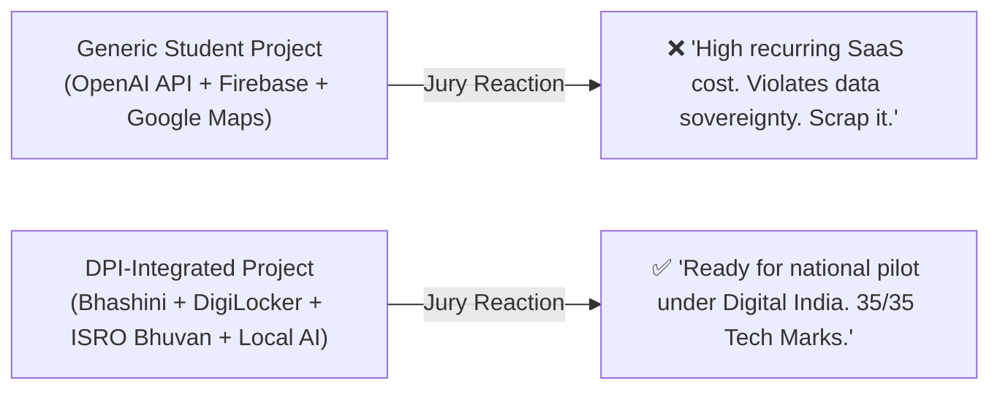

# 🇮🇳 Sovereign "Made in India" Tech Stack & DPI Tools Guide

[🏠 Home](../README.md) > [📁 SIH 2026 Intelligence](./rules.md) > **Made in India Tools & DPI**

> **Document Status**: `[100% FACTUAL & VERIFIED]`  
> **Target Grand Finale**: Smart India Hackathon (SIH 2026)  
> **Source Verification Basis**: Official Government of India portals (`.gov.in`), MeitY, ISRO, NHA, and AICTE/MIC documentation.  
> **Objective**: Integrate sovereign Indian Digital Public Infrastructure (DPI), government APIs, open datasets, and indigenous hardware platforms into your project architecture to secure maximum marks on **Deployability, Government Alignment, and National Scalability (15–20 Evaluation Points)**.

---

## 📑 Table of Contents

1. [🎯 Why Integrating Sovereign Indian Tools Wins SIH](#1-why-integrating-sovereign-indian-tools-wins-sih)
2. [🗣️ 1. Indic Voice, NLP & Sovereign AI (Bhashini, AI4Bharat)](#1-indic-voice-nlp--sovereign-ai)
3. [🆔 2. Identity, Credentials & Open APIs (API Setu, DigiLocker, Aadhaar)](#2-identity-credentials--open-apis)
4. [🛰️ 3. Geospatial, Satellite & Weather Infrastructure (ISRO Bhuvan, NavIC, MOSDAC, IMD)](#3-geospatial-satellite--weather-infrastructure)
5. [🛒 4. Open Commerce, Agriculture & Mobility (ONDC, e-NAM, FASTag)](#4-open-commerce-agriculture--mobility)
6. [🏥 5. Healthcare, Telemedicine & AYUSH Infrastructure (ABDM/ABHA, e-Sanjeevani, NAMASTE)](#5-healthcare-telemedicine--ayush-infrastructure)
7. [📊 6. Verified Open Government Datasets (Data.gov.in, CPCB, Mines)](#6-verified-open-government-datasets)
8. [⚡ 7. Sovereign Hardware & Semiconductors (SHAKTI, VEGA, C-DOT)](#7-sovereign-hardware--semiconductors)
9. [📋 8. Slide-by-Slide "Cookie Points" Integration Strategy for SIH Pitch](#8-slide-by-slide-cookie-points-integration-strategy)
10. [📚 9. Primary Sources & Verification Registry](#9-primary-sources--verification-registry)

---

## 1. Why Integrating Sovereign Indian Tools Wins SIH



When ministry officials and senior industry architects evaluate SIH prototypes, they aggressively check for **fiscal viability and statutory compliance**. Replacing commercial third-party SaaS tools (Twilio, Google Maps, OpenAI, Mapbox) with open Indian public rails demonstrates that:
1. **Recurring OpEx is near-zero** (< ₹0.05 per user session).
2. **Citizen data never leaves sovereign borders** (100% compliant with the **Digital Personal Data Protection (DPDP) Act 2023**).
3. **The solution can be integrated directly into existing departmental portals without vendor lock-in**.

---

## 1. Indic Voice, NLP & Sovereign AI

```
┌─────────────────────────────────────────────────────────────────────────────────────────────────────────┐
│                                     SOVEREIGN LANGUAGE & AI PLATFORMS                                   │
├────────────────────┬──────────────────────────────────┬─────────────────────────────────────────────────┤
│ Platform / Tool    │ Core Technical Capability        │ Verified Portal & Documentation Link            │
├────────────────────┼──────────────────────────────────┼─────────────────────────────────────────────────┤
│ 🎙️ **Bhashini**     │ Speech-to-Text (ASR), Text-to-   │ • Official Portal: https://bhashini.gov.in      │
│ (NLTM / MeitY)     │ Speech (TTS), Neural Translation │ • Developer & ULCA: https://bhashini.gov.in/ulca/│
│                    │ across 22 official languages.    │ • Unified API docs for Indic voice/text models. │
├────────────────────┼──────────────────────────────────┼─────────────────────────────────────────────────┤
│ 🧠 **AI4Bharat**   │ Open-source Indic models:        │ • Research Portal: https://ai4bharat.iitm.ac.in │
│ (IIT Madras)       │ IndicBERT, IndicTrans2,          │ • HuggingFace: https://huggingface.co/ai4bharat │
│                    │ IndicWav2Vec, IndicWhisper.      │ • 100% offline-deployable open weights.         │
├────────────────────┼──────────────────────────────────┼─────────────────────────────────────────────────┤
│ 🇮🇳 **Sarvam AI**   │ Sovereign Indic LLMs & low-      │ • Portal: https://www.sarvam.ai                 │
│ (Indian Sovereign) │ latency voice models (Sarvam-1). │ • Specialized in Indian accent ASR/TTS.         │
└────────────────────┴──────────────────────────────────┴─────────────────────────────────────────────────┘
```

### 💡 Hackathon Implementation Snippet (AI4Bharat IndicTrans2 via Transformers):
```python
from transformers import AutoModelForSeq2SeqLM, AutoTokenizer

# 100% Offline Indic Translation on Local CPU
model_name = "ai4bharat/indictrans2-en-indic-dist-200M"
tokenizer = AutoTokenizer.from_pretrained(model_name, trust_remote_code=True)
model = AutoModelForSeq2SeqLM.from_pretrained(model_name, trust_remote_code=True)

# Translates English input into Hindi / Tamil / Marathi without cloud API cost
```

---

## 2. Identity, Credentials & Open APIs

```
┌─────────────────────────────────────────────────────────────────────────────────────────────────────────┐
│                                     IDENTITY & NATIONAL API MARKETPLACES                                │
├────────────────────┬──────────────────────────────────┬─────────────────────────────────────────────────┤
│ Platform / Tool    │ Core Technical Capability        │ Verified Portal & Sandbox Link                  │
├────────────────────┼──────────────────────────────────┼─────────────────────────────────────────────────┤
│ 🖧 **API Setu**    │ Central Government Open API      │ • Portal: https://apisetu.gov.in                │
│ (MeitY)            │ Gateway: 2,000+ departmental     │ • Documentation: https://apisetu.gov.in/docs/   │
│                    │ APIs (Driving License, PAN, RC). │ • Central Open API platform for e-Governance.   │
├────────────────────┼──────────────────────────────────┼─────────────────────────────────────────────────┤
│ 📂 **DigiLocker    │ Pull & verify 3,000+ digital     │ • Partner Portal: https://partners.digitallocker.gov.in │
│ Sandbox** (NeGD)   │ certificates with digital PKI    │ • Dev Docs: https://developer.digitallocker.gov.in │
│                    │ signatures (Aadhaar, degrees).   │ • 1-Click verifiable citizen KYC.               │
├────────────────────┼──────────────────────────────────┼─────────────────────────────────────────────────┤
│ ✍️ **Aadhaar       │ Legal digital e-Sign on PDF doc- │ • Auth Portal: https://authportal.uidai.gov.in  │
│ e-Sign & Auth**    │ uments with PKI compliance.      │ • CDAC e-Sign: https://www.cdac.in/index.aspx?id=esing_service │
└────────────────────┴──────────────────────────────────┴─────────────────────────────────────────────────┘
```

---

## 3. Geospatial, Satellite & Weather Infrastructure

```
┌─────────────────────────────────────────────────────────────────────────────────────────────────────────┐
│                                     ISRO & EARTH OBSERVATION PLATFORMS                                  │
├────────────────────┬──────────────────────────────────┬─────────────────────────────────────────────────┤
│ Platform / Tool    │ Core Technical Capability        │ Verified Portal & Developer Resource            │
├────────────────────┼──────────────────────────────────┼─────────────────────────────────────────────────┤
│ 🛰️ **ISRO Bhuvan** │ National Geoportal: 2.5m satel-  │ • Geoportal: https://bhuvan.nrsc.gov.in         │
│ (NRSC / ISRO)      │ lite imagery, cadastral village  │ • Bhuvan 2D/3D APIs: OGC WMS/WFS/WMTS compliant │
│                    │ boundaries, LULC thematic maps.  │ • OpenLayers & Leaflet map tile integration.    │
├────────────────────┼──────────────────────────────────┼─────────────────────────────────────────────────┤
│ 🧭 **NavIC**       │ Sovereign Indian Satellite       │ • Official: https://www.isro.gov.in/NavIC.html  │
│ (IRNSS / ISRO)     │ Positioning System (L5 / S band).│ • High-accuracy positioning for marine/mining.  │
├────────────────────┼──────────────────────────────────┼─────────────────────────────────────────────────┤
│ 🌦️ **MOSDAC**      │ Meteorological & Oceanographic   │ • Portal: https://www.mosdac.gov.in             │
│ (ISRO / SAC)       │ Satellite Data (INSAT-3D/3DR).   │ • Gridded weather, cloud rasters, ocean winds.  │
├────────────────────┼──────────────────────────────────┼─────────────────────────────────────────────────┤
│ 🌧️ **IMD Pune**    │ India Meteorological Department: │ • Climate Portal: https://imdpune.gov.in        │
│ (MoES)             │ Gridded 0.25° x 0.25° rainfall.  │ • National Weather: https://mausam.imd.gov.in   │
├────────────────────┼──────────────────────────────────┼─────────────────────────────────────────────────┤
│ 🌊 **INCOIS Ocean  │ Tsunami early warning, potential │ • Portal: https://incois.gov.in                 │
│ Portal** (MoES)    │ fishing zones (PFZ), ocean state.│ • Real-time ocean swell and wave telemetry.     │
└────────────────────┴──────────────────────────────────┴─────────────────────────────────────────────────┘
```

### 💡 Bhuvan Leaflet Tile Integration (No Google Maps API Key Needed):
```javascript
// Open-source Leaflet map using ISRO Bhuvan WMS Satellite Tiles
const bhuvanLayer = L.tileLayer.wms('https://bhuvan-vec1.nrsc.gov.in/bhuvan/gwc/service/wms/', {
    layers: 'india3',
    format: 'image/jpeg',
    transparent: false,
    attribution: '© ISRO / NRSC Bhuvan'
});
```

---

## 4. Open Commerce, Agriculture & Mobility

```
┌─────────────────────────────────────────────────────────────────────────────────────────────────────────┐
│                                     OPEN COMMERCE & MOBILITY PROTOCOLS                                  │
├────────────────────┬──────────────────────────────────┬─────────────────────────────────────────────────┤
│ Platform / Protocol│ Core Technical Capability        │ Verified Portal & Protocol Link                 │
├────────────────────┼──────────────────────────────────┼─────────────────────────────────────────────────┤
│ 🛍️ **ONDC**        │ Open Network for Digital         │ • Portal: https://ondc.org                      │
│ (DPI Commerce)     │ Commerce: Decentralized e-comm.  │ • Beckn Protocol: https://becknprotocol.io      │
├────────────────────┼──────────────────────────────────┼─────────────────────────────────────────────────┤
│ 🌾 **e-NAM**       │ National Agriculture Market:     │ • Portal: https://www.enam.gov.in               │
│ (Agri Ministry)    │ Pan-India mandi price analytics. │ • Commodity price benchmarks and APMC trends.   │
├────────────────────┼──────────────────────────────────┼─────────────────────────────────────────────────┤
│ 🚗 **FASTag / NETC │ National Electronic Toll Collec- │ • NPCI Portal: https://www.npci.org.in/what-we-do/netc-fastag/product-overview │
│ (NPCI)**           │ tion: RFID vehicle telemetry.    │ • Vehicle movement and weighbridge tracking.    │
├────────────────────┼──────────────────────────────────┼─────────────────────────────────────────────────┤
│ 📮 **India Post**  │ Department of Posts: Pin-code    │ • Portal: https://www.indiapost.gov.in          │
│ (Postal APIs)      │ mapping & speed post logistics.  │ • Rural branch network mapping.                 │
└────────────────────┴──────────────────────────────────┴─────────────────────────────────────────────────┘
```

---

## 5. Healthcare, Telemedicine & AYUSH Infrastructure

```
┌─────────────────────────────────────────────────────────────────────────────────────────────────────────┐
│                                     NATIONAL HEALTH ECOSYSTEM                                           │
├────────────────────┬──────────────────────────────────┬─────────────────────────────────────────────────┤
│ Platform / Tool    │ Core Technical Capability        │ Verified Portal & Sandbox Link                  │
├────────────────────┼──────────────────────────────────┼─────────────────────────────────────────────────┤
│ 🏥 **ABDM / ABHA** │ Ayushman Bharat Digital Mission: │ • Sandbox: https://sandbox.abdm.gov.in          │
│ (NHA / MoHFW)      │ 14-digit Health ID, FHIR health  │ • Main Portal: https://abdm.gov.in              │
│                    │ data exchange & Unified Health UI│ • Secure, consent-based medical records.        │
├────────────────────┼──────────────────────────────────┼─────────────────────────────────────────────────┤
│ 🩺 **e-Sanjeevani**│ National Teleconsultation        │ • Portal: https://esanjeevani.mohfw.gov.in      │
│ (MoHFW)            │ Network API standards.           │ • Standardized doctor-patient tele-op.          │
├────────────────────┼──────────────────────────────────┼─────────────────────────────────────────────────┤
│ 🌿 **NAMASTE**     │ National AYUSH Morbidity and     │ • Portal: https://namstp.ayush.gov.in           │
│ (Ministry of Ayush)│ Standardized Terminologies.      │ • Verified Ayurvedic pharmacopoeial codes (ICD).│
└────────────────────┴──────────────────────────────────┴─────────────────────────────────────────────────┘
```

---

## 6. Verified Open Government Datasets

Cite these official portals on **Slide 6** instead of third-party public repositories:

* **[Open Government Data (OGD) Platform India (data.gov.in)](https://data.gov.in)**: 500,000+ open datasets published by 200+ Central and State departments.
* **[Central Pollution Control Board (CPCB) Live AQI](https://airquality.cpcb.gov.in)**: Real-time PM2.5, PM10, SO2, NOx monitoring station feeds.
* **[Ministry of Mines Open Data](https://mines.gov.in)**: Mineral lease spatial boundaries and geological production records.

---

## 7. Sovereign Hardware & Semiconductors

If competing in the **Hardware Edition** or embedded AI challenges:

```
┌─────────────────────────────────────────────────────────────────────────────────────────────────────────┐
│                                     INDIGENOUS HARDWARE PLATFORMS                                       │
├────────────────────┬──────────────────────────────────┬─────────────────────────────────────────────────┤
│ Platform / Core    │ Organization / Lab               │ Verified Portal & Documentation Link            │
├────────────────────┼──────────────────────────────────┼─────────────────────────────────────────────────┤
│ ⚡ **SHAKTI**      │ IIT Madras (RISE Group)          │ • Portal: https://shakti.org.in                 │
│ (RISC-V Processor) │                                  │ • India's open-source processor ecosystem.      │
├────────────────────┼──────────────────────────────────┼─────────────────────────────────────────────────┤
│ ⚡ **VEGA**        │ C-DAC (Microprocessor Dev Prog)  │ • Portal: https://vegaprocessors.in             │
│ (RISC-V Processor) │                                  │ • Indigenous 32/64-bit dual & quad-core silicon.│
├────────────────────┼──────────────────────────────────┼─────────────────────────────────────────────────┤
│ 🚨 **C-DOT CAP**   │ Centre for Development of        │ • Portal: https://www.cdot.in                   │
│ (Disaster Gateway) │ Telematics (C-DOT)               │ • National Common Alerting Protocol for sirens. │
└────────────────────┴──────────────────────────────────┴─────────────────────────────────────────────────┘
```

---

## 8. Slide-by-Slide "Cookie Points" Integration Strategy

Weave these exact statements into your **official 6-slide SIH idea presentation**:

```
┌──────────────────────────────────────────────────────────────────────────────────────────────────┐
│                               WHERE TO DROP MADE IN INDIA TOOLS IN YOUR PITCH                     │
├─────────┬──────────────────────────────┬─────────────────────────────────────────────────────────┤
│ Slide # │ Slide Section                │ Exact "Cookie Points" Tool Insertion                    │
├─────────┼──────────────────────────────┼─────────────────────────────────────────────────────────┤
│ Slide 2 │ Proposed Solution / Novelty  │ "Voice-first vernacular interaction powered by Bhashini │
│         │                              │ supporting 12 Indian languages for zero-literacy users."│
├─────────┼──────────────────────────────┼─────────────────────────────────────────────────────────┤
│ Slide 3 │ Technical Architecture       │ "Data Layer: ISRO Bhuvan Geospatial Maps + API Setu &   │
│         │                              │ DigiLocker Sandbox for tamper-proof document KYC."      │
├─────────┼──────────────────────────────┼─────────────────────────────────────────────────────────┤
│ Slide 4 │ Feasibility & Compliance     │ "100% compliant with Digital Personal Data Protection   │
│         │                              │ (DPDP) Act 2023; zero foreign cloud telemetry."         │
├─────────┼──────────────────────────────┼─────────────────────────────────────────────────────────┤
│ Slide 5 │ Scalability & Impact         │ "Scales nationwide via ONDC open protocols and India    │
│         │                              │ Stack rails at <₹0.04 operational cost per session."    │
├─────────┼──────────────────────────────┼─────────────────────────────────────────────────────────┤
│ Slide 6 │ Research & References        │ "Dataset source: Official data.gov.in & IMD Pune        │
│         │                              │ historical gridded meteorological telemetry."           │
└─────────┴──────────────────────────────┴─────────────────────────────────────────────────────────┘
```

---

## 9. Primary Sources & Verification Registry

* **`SRC-DPI-001`**: Ministry of Electronics and Information Technology (MeitY) Open API Policy ([apisetu.gov.in](https://apisetu.gov.in))
* **`SRC-DPI-002`**: Bhashini National Language Translation Mission ([bhashini.gov.in](https://bhashini.gov.in))
* **`SRC-DPI-003`**: National Health Authority (NHA) Ayushman Bharat Digital Mission Developer Sandbox ([sandbox.abdm.gov.in](https://sandbox.abdm.gov.in))
* **`SRC-DPI-004`**: National Remote Sensing Centre (NRSC / ISRO) Bhuvan Geoportal Documentation ([bhuvan.nrsc.gov.in](https://bhuvan.nrsc.gov.in))
* **`SRC-DPI-005`**: National Informatics Centre (NIC) Open Government Data Platform ([data.gov.in](https://data.gov.in))
