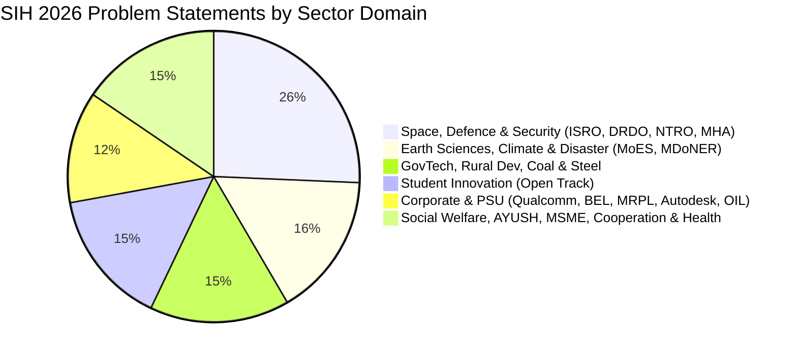

# SIH 2026: Official Problem Statements Master Directory

[🏠 Home](../README.md) > [📁 SIH 2026 Intelligence](./rules.md) > **Problem Statements**

> **Official Document Status**: `[OFFICIAL FACT]`  
> **Source**: Ministry of Education's Innovation Cell (MIC) & AICTE Official Problem Statement Release  
> **Submission Deadline**: **20th September 2026** *(Official Deadline)*  
> **Total Problem Statements**: **226** (168 Software | 58 Hardware)  
> **Prize Money**: **₹1,50,000 per Problem Statement** for winning teams  
> **Cap Rule**: Maximum 500 ideas per PS before automatic portal freeze  

---

## 🧭 Navigation & Sectoral Breakdown

---

## 📊 Summary Statistics

| Category | Total Problem Statements | Key Participating Ministries / Organizations |
| :--- | :---: | :--- |
| **Software** | **168** | ISRO, MoES, NTRO, MHA, MoSJE, Govt of Maharashtra, Rural Dev, Steel, Coal, Ayush |
| **Hardware** | **58** | DRDO, Qualcomm, MoD, Autodesk, MoES, MSME, Fisheries & Dairying, MDoNER, Student Innovation |
| **Total** | **226** | **50+ Union Ministries, State Governments, PSUs, and Global Industry Leaders** |

---

## 📋 Master Problem Statements Table (SIH26001 – SIH26226)

| S.No | PS Number | Category | Organization / Ministry | Theme | Problem Statement Title |
| :---: | :---: | :---: | :--- | :--- | :--- |
| 1 | **`SIH26001`** | `Software` | Ministry of Development of North Eastern Region (MDoNER) | Disaster Management | AI-Based early warning and landslide Risk Monitoring System in NER |
| 2 | **`SIH26002`** | `Software` | Ministry of Development of North Eastern Region (MDoNER) | Smart Automation | AI-Based Smart Logistics and Accessibility Intelligence Platform for North Eastern Region (NER) |
| 3 | **`SIH26003`** | `Software` | Ministry of Development of North Eastern Region (MDoNER) | Space Technology | AI-Based Cognitive Gaming and Memory Assistance Platform for Elderly Dementia Patients in North Eastern Region (NER) |
| 4 | **`SIH26004`** | `Hardware` | Ministry of Development of North Eastern Region (MDoNER) | Space Technology | AI-Assisted Early Detection System for Osteoarthritis (OA) Risk Markers in North Eastern Region (NER) |
| 5 | **`SIH26005`** | `Hardware` | Ministry of Development of North Eastern Region (MDoNER) | Smart Vehicles | Solar-Powered Smart Mini Cold Storage System for Fresh Vegetables in North Eastern Region (NER) |
| 6 | **`SIH26006`** | `Software` | Ministry of Steel | Transportation & Logistics | Development of an Intelligent Freight Forecasting Model for Optimized Vessel Chartering and Bulk Cargo Procurement from overseas to East Coast of India |
| 7 | **`SIH26007`** | `Hardware` | Ministry of Steel | Smart Automation | Safe and Efficient Operation of Mine Vehicles in Fog and Low-Visibility Conditions in Open Cast Iron Ore Mines |
| 8 | **`SIH26008`** | `Hardware` | Ministry of Steel | Smart Automation | Belt Joint Rupture and Conveyor Belt Damages in Iron Ore Mining Industry: Intelligent Monitoring and Prediction of Conveyor Belt Joint Rupture and Damages in Iron Ore Mining Industry |
| 9 | **`SIH26009`** | `Software` | Ministry of Steel | Smart Automation | Using AI/ML and Space Technology to Identify Manganese Reserves and Overcome Production Shortfalls |
| 10 | **`SIH26010`** | `Hardware` | Ministry of Rural Development | Smart Automation | Survey/Resurvey of Rural Agricultural Land in India |
| 11 | **`SIH26011`** | `Software` | Ministry of Rural Development | Space Technology | 3D ULPIN Generation and vertical Property Mapping System |
| 12 | **`SIH26012`** | `Software` | Ministry of Rural Development | Robotics and Drones | AI-Based Automated Urban Parcel Mapping and Cadastral Feature Extraction System using Drone Imagery |
| 13 | **`SIH26013`** | `Software` | Ministry of Rural Development | Disaster Management | Automated Integration and Intelligent Harmonization of Multi-source Geospatial Data for urban Land Record Management |
| 14 | **`SIH26014`** | `Software` | Ministry of Rural Development | Robotics and Drones | An Integrated GIS-based Digital Public Infrastructure for Land Governance |
| 15 | **`SIH26015`** | `Software` | Ministry of Rural Development | Disaster Management | Application of Geospatial Techniques for visualization and analysis to interpret Geo-Coded Images to enhance watershed Development Outcomes |
| 16 | **`SIH26016`** | `Software` | Ministry of Rural Development | Miscellaneous | Real-Time National Land Acquisition & Management System for End-to-End Digital Monitoring and Decision Support |
| 17 | **`SIH26017`** | `Software` | Ministry of Rural Development | Agriculture, FoodTech & Rural Development | Predictive Analytics System for Early Detection of Land Acquisition Delays |
| 18 | **`SIH26018`** | `Software` | Ministry of Rural Development | MedTech / BioTech / HealthTech | Intelligent Land Record Digitization and Validation System |
| 19 | **`SIH26019`** | `Software` | Ministry of Rural Development | Blockchain & Cybersecurity | National Digital Platform for Research, Policy Innovation, and Evidence-Based Land Governance |
| 20 | **`SIH26020`** | `Hardware` | Ministry of MSME | Blockchain & Cybersecurity | Design and Development of Innovative Hand-Spinning Equipment for Enhancing Khadi Artisan Productivity and Income |
| 21 | **`SIH26021`** | `Software` | Ministry of MSME | Smart Automation | Honey Chain: A block chain-based system for honey traceability and smart beekeeping management |
| 22 | **`SIH26022`** | `Hardware` | Ministry of MSME | Agriculture, FoodTech & Rural Development | Design and develop a smart, solar-powered drying and compact packaging system to support home-based agarbatti manufacturing by rural women artisans |
| 23 | **`SIH26023`** | `Software` | Ministry of Coal | Miscellaneous | AI-Powered Geological, Mining and other Reporting Solution for CMPDI/CIL subsidiaries |
| 24 | **`SIH26024`** | `Software` | Ministry of Coal | Smart Automation | AI-Based Smart Governance and Compliance Monitoring System for Coal Mines |
| 25 | **`SIH26025`** | `Hardware` | Ministry of Coal | Disaster Management | Development of an AI-enabled Low Cost Real Time Mine Subsidence Monitoring, Prediction and Early Warning System for Underground Coal Mines in India |
| 26 | **`SIH26026`** | `Hardware` | Ministry of Railways | Robotics and Drones | Development of Mobile (Quadruped)/Handheld Device/System for Real-Time Detection of Narcotics and Explosives across Indian Railways |
| 27 | **`SIH26027`** | `Software` | Ministry of Railways | Transportation & Logistics | AI-Powered Automatic Block Planning to Maximize Asset Availability for Train Operations on Indian Railways |
| 28 | **`SIH26028`** | `Software` | Ministry of Railways | Disaster Management | Dynamic Forecast of Expected Time of Arrival (ETA) for Coaching Trains |
| 29 | **`SIH26029`** | `Hardware` | Ministry of Consumer Affairs, Food & Public Distribution | Disaster Management | Automated High-Current Short-Circuit Test System for IEC 60898-1:2015 MCB Compliance |
| 30 | **`SIH26030`** | `Hardware` | Ministry of Consumer Affairs, Food & Public Distribution | Smart Automation | Automated Cable Specimen Preparation System for IS 10810 and IS 7098 Compliance |
| 31 | **`SIH26031`** | `Software` | Ministry of Consumer Affairs, Food & Public Distribution | Fitness & Sports | Quality assessment and grading of onions are often subjective and vary across procurement centers, resulting in disputes and inconsistencies |
| 32 | **`SIH26032`** | `Software` | Ministry of Consumer Affairs, Food & Public Distribution | Heritage & Culture | Farmers often face long waiting times, lack of information regarding procurement schedules, and uncertainty about procurement status |
| 33 | **`SIH26033`** | `Software` | Ministry of Consumer Affairs, Food & Public Distribution | MedTech / BioTech / HealthTech | Multiple intermediaries reduce farmers earnings and increase consumer prices |
| 34 | **`SIH26034`** | `Software` | Ministry of Consumer Affairs, Food & Public Distribution | Agriculture, FoodTech & Rural Development | Software System to check compliance of Packaged Commodities under Legal Metrology(Packaged Commodities) Rules, 2011 by scanning products, images and labels |
| 35 | **`SIH26035`** | `Software` | Ministry of Consumer Affairs, Food & Public Distribution | Smart Vehicles | Development of a Software Program/Application for Generation of Test Reports for Non-Automatic Weighing Instruments (NAWI) as per OIML Recommendation R-76 |
| 36 | **`SIH26036`** | `Software` | Ministry of Consumer Affairs, Food & Public Distribution | Transportation & Logistics | Development of an Online Verification System for Weighing and Measuring Instruments |
| 37 | **`SIH26037`** | `Software` | MathWorks | Robotics and Drones | Adaptive Path Planning and Collision Avoidance for Autonomous Vehicles on Unstructured Indian Roads |
| 38 | **`SIH26038`** | `Software` | MathWorks | Clean & Green Technology | Explainable AI for Diabetic Retinopathy Screening in Rural India |
| 39 | **`SIH26039`** | `Hardware` | Government of Jharkhand | Travel & Tourism | AI-Powered Underground Mine Safety, Monitoring and Rescue System |
| 40 | **`SIH26040`** | `Hardware` | Government of Jharkhand | Renewable / Sustainable Energy | Smart Water Purification and Quality Monitoring System for Rural and Mining-Affected Areas |
| 41 | **`SIH26041`** | `Software` | Government of Jharkhand | Blockchain & Cybersecurity | AR-Based Vocational Training Simulator for Industrial Safety in Jharkhand's Mining & Manufacturing Sector |
| 42 | **`SIH26042`** | `Software` | Government of Jharkhand | Smart Education | AI-Powered Vernacular Pedagogy and Real-Time Translation Tool for Mother Tongue-Based Primary Education |
| 43 | **`SIH26043`** | `Software` | Government of Jharkhand | Disaster Management | A digital platform to crowdsource societal challenges and facilitate collaborative problem solving through universities and industry partnerships |
| 44 | **`SIH26044`** | `Software` | Ministry of Ayush | Miscellaneous | Portal for Academia - Industry collaboration for Skill Mapping, Internships and Placement |
| 45 | **`SIH26045`** | `Software` | Ministry of Ayush | Toys & Games | IP-SAKTI Sahayak: a multilingual, RAG-based (source-cited) AI assistant for Intellectual Property and regulatory guidance in Ayurveda, across national and international regimes |
| 46 | **`SIH26046`** | `Software` | Ministry of Ayush | Space Technology | AIIA Clinical Trials Dashboard - a real-time, cloud-based, GCP-compliant Clinical Trial Management System (CTMS) for Ayurveda research, with CDISC/FHIR-interoperable data, role-based KPIs, and integrated ethics, regulatory (CTRI / NDCT Rules 2019) and pharmacovigilance tracking |
| 47 | **`SIH26047`** | `Software` | Ministry of Ayush | Smart Automation | Patient Case-Taking Software |
| 48 | **`SIH26048`** | `Hardware` | Ministry of Ayush | Fitness & Sports | iKwath - a pod-based smart Kwatha (Kadha) maker that prepares a fresh, AFI/API-standardized decoction from coarse powder (yavakut churna) on demand, in the shortest practical time without altering the decoctions quality or yield |
| 49 | **`SIH26049`** | `Hardware` | DRDO | Heritage & Culture | Modifications to improve the reliability, efficiency, and lifespan of electrical and electronic equipment and systems in the ambient condition of subzero temperature and low pressure of High Altitude Areas(HAA) and Super High Altitude Areas (SHAA) of Ladakh region |
| 50 | **`SIH26050`** | `Hardware` | DRDO | MedTech / BioTech / HealthTech | High Altitude Performance Optimization and Robust Design of Anti-Drone System |
| 51 | **`SIH26051`** | `Software` | DRDO | Agriculture, FoodTech & Rural Development | Software Based Model Development for Design of Area Specific Shelter for Thermal Comfort Maintenance |
| 52 | **`SIH26052`** | `Hardware` | DRDO | Smart Vehicles | To develop an AI/ML-enabled adaptive noise cancellation (ANC) system that effectively suppresses stationary, non-stationary, and impulsive defence noises while maintaining high speech intelligibility and real-time performance on embedded hardware |
| 53 | **`SIH26053`** | `Software` | DRDO | Transportation & Logistics | Adaptive Variable Resolution 2.5D Lidar Mapping for Dynamic Environment Perception |
| 54 | **`SIH26054`** | `Software` | DRDO | Robotics and Drones | AI-Enabled Real-Time Digital Twin System for Health Monitoring, Fault Prediction and Mission Reliability Enhancement of Aero Piston Engines used in MALE UAVs |
| 55 | **`SIH26055`** | `Software` | DRDO | Clean & Green Technology | Smart Scan strategy for Electronic Warfare |
| 56 | **`SIH26056`** | `Software` | MoSPI | Travel & Tourism | Development of a Real-time Airfare Price Index for India through Automated Web Scraping of Airline and Online Travel Aggregator Portals for Augmentation of the Consumer Price Index (CPI) |
| 57 | **`SIH26057`** | `Software` | Ministry of Earth Sciences (MoES) | Renewable / Sustainable Energy | AI-Powered Automated Underwater Marine Debris and Anomaly Detection System using Side-Scan Sonar Imagery |
| 58 | **`SIH26058`** | `Hardware` | Ministry of Earth Sciences (MoES) | Blockchain & Cybersecurity | Development of a Low-Power, Real-Time Adaptive Software-Defined Sonar Transmitter Payload for Autonomous Underwater Vehicles (AUVs) |
| 59 | **`SIH26059`** | `Software` | Ministry of Earth Sciences (MoES) | Smart Education | AI-Enabled Antarctic Sea-Ice, Iceberg Trajectory, and Navigation Decision Support System |
| 60 | **`SIH26060`** | `Software` | Ministry of Earth Sciences (MoES) | Disaster Management | Digital Platform for efficient remote management of Indian Antarctic Research Stations |
| 61 | **`SIH26061`** | `Software` | Ministry of Earth Sciences (MoES) | Miscellaneous | AI-Driven Smart Energy Management System for Polar Research Stations |
| 62 | **`SIH26062`** | `Software` | Ministry of Earth Sciences (MoES) | Toys & Games | Integrated Polar Expedition Logistics and Asset Management System |
| 63 | **`SIH26063`** | `Software` | Ministry of Earth Sciences (MoES) | Space Technology | Integrated Polar Science Outreach, Knowledge Repository and Media Dissemination Portal |
| 64 | **`SIH26064`** | `Hardware` | Ministry of Earth Sciences (MoES) | Smart Resource Conservation | Low-Cost Deployable Seafloor Metal Detection Sensor for Ocean Resource Exploration |
| 65 | **`SIH26065`** | `Hardware` | Ministry of Earth Sciences (MoES) | Smart Automation | Autonomous Low-Cost Ocean Observation Platform for Polar and Southern Oceans |
| 66 | **`SIH26066`** | `Software` | Ministry of Earth Sciences (MoES) | Space Technology | OceanEmbed - Satellite Embedding-Based Deep Learning Framework for Reconstruction of Subsurface Ocean Temperature from Surface Satellite Observations |
| 67 | **`SIH26067`** | `Software` | Ministry of Earth Sciences (MoES) | Smart Automation | Develop a web-based interactive 3D visualization platform that integrates numerical ocean model outputs and in-situ observations |
| 68 | **`SIH26068`** | `Software` | Ministry of Earth Sciences (MoES) | Disaster Management | WeatherGPT: Conversational AI for Weather Forecasting, Alerts, and Climate Information |
| 69 | **`SIH26069`** | `Software` | Ministry of Earth Sciences (MoES) | Disaster Management | National Weather Big Data Analytics Platform |
| 70 | **`SIH26070`** | `Software` | Ministry of Earth Sciences (MoES) | Smart Education | To develop an Artificial Intelligence (AI) / Machine Learning (ML) based system for identification, classification, and prediction of different tropical cyclone patterns using multi-source satellite data |
| 71 | **`SIH26071`** | `Software` | Ministry of Earth Sciences (MoES) | Disaster Management | AI/ML-Based Integrated heavy rainfall Early Warning and Inundation Prediction System using Satellite, Radar, observational Weather and numerical weather prediction model data |
| 72 | **`SIH26072`** | `Software` | Ministry of Earth Sciences (MoES) | Disaster Management | AIML based Nowcasting of thunderstorm and lightning using atmospheric observation including multiple radars, satellite, lightning and model data |
| 73 | **`SIH26073`** | `Software` | Ministry of Earth Sciences (MoES) | Disaster Management | AI/ML-Based Intelligent Anomaly Detection for Automatic Weather Stations (AWS) |
| 74 | **`SIH26074`** | `Software` | Ministry of Earth Sciences (MoES) | Disaster Management | Downscaling of weather forecast from Block level to Panchayat level: Inferring high-resolution plots/data/information from low-resolution plot/data/information/variables for agro-meteorological advisory services |
| 75 | **`SIH26075`** | `Software` | Ministry of Earth Sciences (MoES) | Smart Education | Participants are invited to design and develop CAPACITY CONNECT: A Digital Capacity Building and Learning Management Portal to support organizational training, competency development, and knowledge sharing through a centralized web-based platform |
| 76 | **`SIH26076`** | `Software` | Ministry of Earth Sciences (MoES) | Miscellaneous | Development of personalized homepage for 'Mausam' mobile application |
| 77 | **`SIH26077`** | `Software` | Ministry of Earth Sciences (MoES) | Disaster Management | AI-Driven Hyper-Local Early Warning System for Severe Weather Nowcasting |
| 78 | **`SIH26078`** | `Software` | Ministry of Earth Sciences (MoES) | Disaster Management | AI-Driven Spatio-Temporal Tracking of Extreme Weather Anomalies in Medium-Range Forecasts |
| 79 | **`SIH26079`** | `Software` | Ministry of Earth Sciences (MoES) | Disaster Management | AI-Based Forecast Bust Detection for Medium-Range Weather Forecasts |
| 80 | **`SIH26080`** | `Software` | Ministry of Earth Sciences (MoES) | Disaster Management | Regime-Aware AI Post-Processing of Monsoon Rainfall Forecasts |
| 81 | **`SIH26081`** | `Software` | Ministry of Earth Sciences (MoES) | Miscellaneous | Hybrid AINWP Multi-Model Forecast Blending System |
| 82 | **`SIH26082`** | `Software` | Ministry of Earth Sciences (MoES) | Disaster Management | Air Pollution Weather Coupled Forecasting System (Delhi NCR Focus) |
| 83 | **`SIH26083`** | `Software` | Ministry of Earth Sciences (MoES) | Disaster Management | Extreme Heatwave Early Warning and Human Thermal Stress Index |
| 84 | **`SIH26084`** | `Software` | Ministry of Earth Sciences (MoES) | Disaster Management | Convective scale nowcasting for Thunderstorms, Hail & Cloudbursts (06 hr) |
| 85 | **`SIH26085`** | `Software` | Ministry of Earth Sciences (MoES) | Disaster Management | Urban Flood Nowcasting System (Drainage and Rainfall Coupling) |
| 86 | **`SIH26086`** | `Software` | Ministry of Earth Sciences (MoES) | Miscellaneous | Hyperlocal Monsoon Onset & Break Prediction System (Block/Village Scale) |
| 87 | **`SIH26087`** | `Hardware` | Ministry of Cooperation | Smart Education | AI-Enabled Cooperative Capacity Building, ERP & Employment Ecosystem |
| 88 | **`SIH26088`** | `Hardware` | Ministry of Cooperation | Smart Automation | Multilingual Cooperative Governance & Legal Assistance Chatbot |
| 89 | **`SIH26089`** | `Software` | Ministry of Cooperation | Smart Automation | Cooperative Gig Services Platform for Household & Community Services |
| 90 | **`SIH26090`** | `Software` | Ministry of Social Justice and Empowerment (MoSJE) | Miscellaneous | AI-Driven Market Linkage and Smart Cataloging Mobile Application for Marginalized Artisans |
| 91 | **`SIH26091`** | `Software` | Ministry of Social Justice and Empowerment (MoSJE) | Miscellaneous | AI-Driven Hyper-Local Business Advisory and Financial Structuring Assistant for Rural Micro-Entrepreneurs |
| 92 | **`SIH26092`** | `Software` | Ministry of Social Justice and Empowerment (MoSJE) | Miscellaneous | AI-Driven Scheme Matching for Marginalized Entrepreneurs |
| 93 | **`SIH26093`** | `Software` | Ministry of Social Justice and Empowerment (MoSJE) | Smart Automation | AI-Based Real-Time Stress and Trauma Assessment Module for Victims/Complainants Accessing NHAA (14566) and Integrated Portal |
| 94 | **`SIH26094`** | `Software` | Ministry of Social Justice and Empowerment (MoSJE) | MedTech / BioTech / HealthTech | AI-Powered Dynamic Mental Health Monitoring and Distress Prediction System for Victims of Atrocities |
| 95 | **`SIH26095`** | `Software` | Ministry of Social Justice and Empowerment (MoSJE) | Miscellaneous | Smart Real-Time Monitoring & Inspection Mobile App |
| 96 | **`SIH26096`** | `Hardware` | Ministry of Social Justice and Empowerment (MoSJE) | Heritage & Culture | Digital Heritage Archive for Memorials, Manuscripts & Ambedkar: AI-Powered Institutional Archive and Audio-Visual Knowledge Platform |
| 97 | **`SIH26097`** | `Software` | Ministry of Social Justice and Empowerment (MoSJE) | Smart Education | AI-Driven voice Assistant for livelihood Mapping and NSQF-Aligned Skilling Recommendations for SC Communities under GIA component of PM-AJAY |
| 98 | **`SIH26098`** | `Hardware` | Ministry of Defence (MoD) | Miscellaneous | Development of a Low-Cost Precision Guidance and Smart Electronic Fuze System for a 155 mm Artillery Shell |
| 99 | **`SIH26099`** | `Software` | Ministry of Petroleum & Natural Gas | Smart Automation | AI-Driven Standardization and Harmonization of Material Codes Across CPSEs |
| 100 | **`SIH26100`** | `Software` | Ministry of Petroleum & Natural Gas | Smart Automation | AI-Powered Integrated Bid Compliance Verification Platform for GeM Procurement |
| 101 | **`SIH26101`** | `Software` | MoSPI | Smart Education | Develop an AI enabled learning platform that identifies competency gaps, recommends personalized training through integration with the iGOT Karmayogi ecosystem, and capable of generating Quizzes and Multiple choice questions (MCQs) from uploaded learning materials to strengthen capacity building in India's Official Statistical System |
| 102 | **`SIH26102`** | `Software` | MoSPI | Miscellaneous | Development of an AI-powered system to detect anomalies, fraud, and inefficiencies in MPLAD Scheme implementation |
| 103 | **`SIH26103`** | `Software` | MoSPI | Smart Automation | Use case on web-based integrated project-monitoring platform |
| 104 | **`SIH26104`** | `Software` | All India Council for Technical Education (AICTE) | Miscellaneous | AI-Powered Real-Time Detection and Prevention of Voice Cloning Impersonation Attacks |
| 105 | **`SIH26105`** | `Software` | All India Council for Technical Education (AICTE) | Blockchain & Cybersecurity | AI-Powered Continuous Cyber Risk Quantification and Investment Optimization Platform |
| 106 | **`SIH26106`** | `Software` | All India Council for Technical Education (AICTE) | Blockchain & Cybersecurity | AI-Powered Email Threat Detection, GeoLocation and Forensic Intelligence Platform |
| 107 | **`SIH26107`** | `Software` | Ministry of Consumer Affairs, Food & Public Distribution | Smart Automation | AI-powered Intelligent Assistant for Indian Standards and BIS Services for Industries and Consumers |
| 108 | **`SIH26108`** | `Software` | Ministry of Consumer Affairs, Food & Public Distribution | Smart Automation | AI-Powered Recommendation Engine for Identifying Applicable Indian Standards for Procurement Specifications |
| 109 | **`SIH26109`** | `Hardware` | Ministry of Fisheries, Animal Husbandry & Dairying | Agriculture, FoodTech & Rural Development | AI-Based Predictive Modelling for Early Forecasting of Bovine Mastitis in Indian Dairy Farms |
| 110 | **`SIH26110`** | `Hardware` | Ministry of Fisheries, Animal Husbandry & Dairying | Agriculture, FoodTech & Rural Development | Development of a Low-Cost Light-weight Milk Chilling Can for Small-Scale Dairy Farmers |
| 111 | **`SIH26111`** | `Software` | Ministry of Fisheries, Animal Husbandry & Dairying | Agriculture, FoodTech & Rural Development | Smart AI-Enabled Rapid Feed and Silage Quality Testing System for Dairy Farmers |
| 112 | **`SIH26112`** | `Hardware` | Autodesk | Robotics and Drones | Design and Develop a Modular Autonomous Mobile Robot (AMR) Platform for Smart Warehouse Automation |
| 113 | **`SIH26113`** | `Hardware` | Autodesk | MedTech / BioTech / HealthTech | Human augmentation technologies are transforming healthcare, rehabilitation, industrial ergonomics, assistive living, sports, and personal mobility by improving human capabilities and enhancing quality of life |
| 114 | **`SIH26114`** | `Software` | Autodesk | Smart Automation | Smart City Site Planning using Autodesk Forma Site Design |
| 115 | **`SIH26115`** | `Software` | Autodesk | MedTech / BioTech / HealthTech | Design and Develop a Smart Mobile Medical-Waste Collection and Segregation System |
| 116 | **`SIH26116`** | `Software` | Autodesk | Smart Education | Urban Mixed-Use Design Challenge - Design a centrally located mixed-use building in Autodesk Revit with commercial spaces (Ground + 1st floor) and residential units (up to 8 floors). 1 Level of Basement (Car Parking + EV Charging), Total (B+G+9) |
| 117 | **`SIH26117`** | `Software` | Mangalore Refinery and Petrochemicals Limited (MRPL) | Smart Automation | Sovereign On-Premise Agentic AI Workbench using Open-Weight Multimodal LLMs for Confidential Industrial Work |
| 118 | **`SIH26118`** | `Hardware` | Mangalore Refinery and Petrochemicals Limited (MRPL) | Miscellaneous | Passive Colorimetric H2S Exposure-Dosimeter Wristband with AI-Based Quantitative Reading |
| 119 | **`SIH26119`** | `Software` | Mangalore Refinery and Petrochemicals Limited (MRPL) | Miscellaneous | Indigenous GPU-Accelerated Optimization Solver (Sovereign Alternative to Express / CPLEX) |
| 120 | **`SIH26120`** | `Software` | Oil India Limited | Smart Automation | Digital Twin for Well-to-Surface Optimization of Cyclic Steam Stimulation (CSS) and Sucker Rod Pump (SRP) Operations for Heavy Oil Wells of Baghewala Field |
| 121 | **`SIH26121`** | `Software` | Oil India Limited | Smart Automation | eRTMAC-NWIS (Nearby Wells Intelligence System): An AI-Powered Offset Well Knowledge and Decision Support Platform for Drilling Operations |
| 122 | **`SIH26122`** | `Software` | Oil India Limited | Smart Automation | Intelligent Data Capture & Schedule-Linking Layer for Infrastructure Project Management: Real-Time Actual Progress Tracking (Planning-to-Execution Bridge) |
| 123 | **`SIH26123`** | `Software` | Bharat Electronics Limited (BEL) | Robotics and Drones | Edge-AI Based Distributed Fleet Coordination for Autonomous Mobile Robots (AMRs) in Smart Warehouses |
| 124 | **`SIH26124`** | `Software` | Bharat Electronics Limited (BEL) | Fitness & Sports | AI-Powered Mobile Urban Intelligence Platform Using Public Transport Fleet |
| 125 | **`SIH26125`** | `Software` | Bharat Electronics Limited (BEL) | Blockchain & Cybersecurity | Blockchain-Based Secure Platform for Identity, Access Control, and Digital Asset Management |
| 126 | **`SIH26126`** | `Software` | Bharat Electronics Limited (BEL) | Robotics and Drones | Vision Based Autonomous Navigation for Unmanned Ground Vehicle for Outdoor environment |
| 127 | **`SIH26127`** | `Software` | Bharat Electronics Limited (BEL) | Transportation & Logistics | City-Wide AI Engine for Multi-Camera ANPR Trajectory Tracking and Urban Traffic Analytics |
| 128 | **`SIH26128`** | `Software` | Government Of Maharashtra | Agriculture, FoodTech & Rural Development | Efficient systems for early detection, prevention, and management of livestock diseases and animal health issues |
| 129 | **`SIH26129`** | `Software` | Government Of Maharashtra | Smart Automation | System integration and interoperability among government digital platforms, resulting in fragmented service delivery |
| 130 | **`SIH26130`** | `Software` | Government Of Maharashtra | Smart Automation | Efficiency in streamlining industrial approvals, compliance processes, and access to government support services |
| 131 | **`SIH26131`** | `Software` | Government Of Maharashtra | Agriculture, FoodTech & Rural Development | Early detection and management of crop diseases and pest infestations |
| 132 | **`SIH26132`** | `Software` | Government Of Maharashtra | Agriculture, FoodTech & Rural Development | Strengthening market linkages and price discovery for farmers |
| 133 | **`SIH26133`** | `Software` | Government Of Maharashtra | MedTech / BioTech / HealthTech | Accessibility and quality of public healthcare services, particularly in rural and underserved areas |
| 134 | **`SIH26134`** | `Software` | Government Of Maharashtra | Miscellaneous | Challenges in aligning skill development programs with industry requirements and emerging job market demands |
| 135 | **`SIH26135`** | `Software` | Government Of Maharashtra | Smart Education | Difficulties in tracking employment outcomes, skill gaps, and the impact of skilling initiatives |
| 136 | **`SIH26136`** | `Software` | Government Of Maharashtra | Smart Automation | Startup friendly public procurement mechanism that enables government departments to identify, pilot, procure, and scale innovative solutions from eligible startups |
| 137 | **`SIH26137`** | `Software` | Egreen Quanta | Fitness & Sports | Quantum-Inspired Intelligent Traffic Route Optimization in Transportation Systems Using Metaheuristic Optimization |
| 138 | **`SIH26138`** | `Software` | Egreen Quanta | Smart Vehicles | Quantum-Inspired Fuel Consumption Prediction and Green Fleet Optimization |
| 139 | **`SIH26139`** | `Software` | Egreen Quanta | MedTech / BioTech / HealthTech | Hybrid Quantum Machine Learning Platform for Early Disease Detection |
| 140 | **`SIH26140`** | `Software` | Egreen Quanta | Smart Education | AI-Based Interactive Quantum Algorithm Learning Platform |
| 141 | **`SIH26141`** | `Software` | Egreen Quanta | Blockchain & Cybersecurity | Quantum-Inspired Cyber Threat Detection for Digital Signature Security |
| 142 | **`SIH26142`** | `Software` | National Technical Research Organisation (NTRO) | Smart Education | Deep Learning Based Super Resolution Mapping (SRM) from Medium Resolution Satellite Imageries |
| 143 | **`SIH26143`** | `Software` | National Technical Research Organisation (NTRO) | Space Technology | Leveraging satellite imagery to determine Oil spills at sea along with AIS data correlations to identify vessel responsible for the spill |
| 144 | **`SIH26144`** | `Hardware` | National Technical Research Organisation (NTRO) | Miscellaneous | Design & Development of a High-Sensitivity Micro barometer Infrasound sensor |
| 145 | **`SIH26145`** | `Software` | National Technical Research Organisation (NTRO) | Blockchain & Cybersecurity | AI-Based Detection of Cyber Threats in Unidirectional IP Traffic |
| 146 | **`SIH26146`** | `Software` | National Technical Research Organisation (NTRO) | Transportation & Logistics | AI-Powered Monitoring & Analysis of Bitcoin Transaction Traffic |
| 147 | **`SIH26147`** | `Software` | National Technical Research Organisation (NTRO) | Miscellaneous | Automated model for analysis of .IQ and .wav files along with signal parameter extraction |
| 148 | **`SIH26148`** | `Software` | National Technical Research Organisation (NTRO) | Blockchain & Cybersecurity | Creation of scripts/functions with new programming language to commence Computer & Network forensic analysis without triggering security solutions |
| 149 | **`SIH26149`** | `Software` | National Technical Research Organisation (NTRO) | Blockchain & Cybersecurity | Design and Development of an Integrated Secure Data Erasure and Advanced File Recovery Tool for Digital Forensics and Data Sanitization |
| 150 | **`SIH26150`** | `Software` | National Technical Research Organisation (NTRO) | Blockchain & Cybersecurity | Development of a Multi-Vendor DVR/NVR Forensic Analysis Tool for Standardized Acquisition, Recovery, and Analysis of Surveillance Evidence |
| 151 | **`SIH26151`** | `Software` | National Technical Research Organisation (NTRO) | Blockchain & Cybersecurity | Dark web threat actor de-anonymization |
| 152 | **`SIH26152`** | `Software` | National Technical Research Organisation (NTRO) | Miscellaneous | Social Media Analytics |
| 153 | **`SIH26153`** | `Software` | National Technical Research Organisation (NTRO) | Blockchain & Cybersecurity | AI based Network Attack Forecasting from Network Traffic Data |
| 154 | **`SIH26154`** | `Software` | National Technical Research Organisation (NTRO) | Smart Automation | Gen AI Platform for Automated Content Transformation |
| 155 | **`SIH26155`** | `Software` | National Technical Research Organisation (NTRO) | Blockchain & Cybersecurity | AI-Driven Multi-Vendor Network Security Compliance Auditor |
| 156 | **`SIH26156`** | `Software` | National Technical Research Organisation (NTRO) | Miscellaneous | Universal Log Pre-processing Framework |
| 157 | **`SIH26157`** | `Software` | National Technical Research Organisation (NTRO) | Miscellaneous | Supervisory Analytics Tool for SOC Assessment (SAT-SA) |
| 158 | **`SIH26158`** | `Software` | National Technical Research Organisation (NTRO) | Robotics and Drones | Single-Pass Drone Video to Accurate 3D Model Generation System |
| 159 | **`SIH26159`** | `Software` | National Technical Research Organisation (NTRO) | Blockchain & Cybersecurity | SecureMailScope: AI-Assisted Cryptographic Security Posture Assessment for Secure Email Communications |
| 160 | **`SIH26160`** | `Software` | National Technical Research Organisation (NTRO) | Blockchain & Cybersecurity | AI-Powered IPsec VPN Protocol Analyzer and Security Assessment Framework |
| 161 | **`SIH26161`** | `Software` | National Technical Research Organisation (NTRO) | Disaster Management | Dam Break Inundation Modelling Using Hydrodynamic Modelling of any River |
| 162 | **`SIH26162`** | `Software` | National Technical Research Organisation (NTRO) | Miscellaneous | AI-Based Detection and Classification of Industrial Fires and Persistent Thermal Sources Using NASA FIRMS, OSM & Satellite Data |
| 163 | **`SIH26163`** | `Software` | National Technical Research Organisation (NTRO) | Miscellaneous | Security Assessment of the World Monitor application |
| 164 | **`SIH26164`** | `Software` | National Technical Research Organisation (NTRO) | Blockchain & Cybersecurity | Enterprise Cryptographic Discovery & Analysis Tool (ECDAT) |
| 165 | **`SIH26165`** | `Software` | Oil India Limited | Miscellaneous | AI/NLP Engine to Detect Serious Injury & Fatality (SIF) Precursors in OIL's Unsafe-Act/Unsafe-Condition and Near-Miss Reports |
| 166 | **`SIH26166`** | `Software` | Indian Space Research Organisation (ISRO) | Space Technology | Multi-modal, Sun angle and scale invariant image correspondence using Chandrayaan-2 optical images (OHRC, TMC and IIRS) |
| 167 | **`SIH26167`** | `Software` | Indian Space Research Organisation (ISRO) | Space Technology | SatQuery AI - An Interactive Vision-Language Assistant for Multimodal Remote Sensing Image Analysis through Text Queries |
| 168 | **`SIH26168`** | `Software` | Indian Space Research Organisation (ISRO) | Miscellaneous | AI-ML based Intelligent Dead Reckoning system for seamless navigation |
| 169 | **`SIH26169`** | `Software` | Indian Space Research Organisation (ISRO) | Miscellaneous | Development of an AI-Based Virtual Camera Tracking System for Coarse Alignment of Mobile Free Space Optical Communication (FSOC) Terminals |
| 170 | **`SIH26170`** | `Software` | Indian Space Research Organisation (ISRO) | Smart Automation | AI-Driven Anomaly Detection in Component Burn-In & Screening |
| 171 | **`SIH26171`** | `Software` | Indian Space Research Organisation (ISRO) | Miscellaneous | On-device Visual Perception for Light-weight Browser Agents |
| 172 | **`SIH26172`** | `Hardware` | Indian Space Research Organisation (ISRO) | Miscellaneous | Low Latency and Efficient Voice Activator for Edge Devices |
| 173 | **`SIH26173`** | `Software` | Indian Space Research Organisation (ISRO) | Miscellaneous | iTantra - Indian Multilingual TTS & STT Aided Neural Transceiver Radio Access for low bitrate links |
| 174 | **`SIH26174`** | `Software` | Indian Space Research Organisation (ISRO) | Miscellaneous | AI Human Activity Recognition for On-board BAS Experiments |
| 175 | **`SIH26175`** | `Software` | Indian Space Research Organisation (ISRO) | Miscellaneous | DepthWizard - Single-View Height Estimation and 3D Flythrough |
| 176 | **`SIH26176`** | `Software` | Indian Space Research Organisation (ISRO) | Miscellaneous | ORCA Marine Ecosystem Reasoning with Collaborative Agents |
| 177 | **`SIH26177`** | `Hardware` | Qualcomm Inc | Robotics and Drones | A deployable AI-powered autonomous drone that aids search-and-rescue operations by detecting people and hazards, thereby improving responder safety and reducing victim discovery time |
| 178 | **`SIH26178`** | `Hardware` | Qualcomm Inc | Disaster Management | A resilient, AI-powered environmental monitoring network that provides early detection, localized intelligence, and actionable alerts for floods, forest fires, pollution events, and other environmental hazards common in India, enabling authorities and communities to shift from reactive disaster response to proactive risk prevention |
| 179 | **`SIH26179`** | `Hardware` | Qualcomm Inc | Smart Automation | To build an AI-powered retail intelligence platform that delivers real-time shopper analytics, automated inventory visibility, and proactive queue management through on-device AI, enabling retailers to reduce stock-outs, improve customer experience, optimize staffing, and increase operational efficiency while maintaining privacy and minimizing cloud dependency |
| 180 | **`SIH26180`** | `Hardware` | Qualcomm Inc | Disaster Management | A field-deployable AI-powered Smart Farming Assistant that helps farmers detect crop diseases, pests, nutrient deficiencies, and irrigation needs at an early stage, while improving resilience against droughts, floods, heat waves, and other agricultural risks common in India. The solution should enable higher yields, lower input costs, more efficient water usage, and faster response to emerging threats through real-time on-device intelligence |
| 181 | **`SIH26181`** | `Hardware` | Qualcomm Inc | MedTech / BioTech / HealthTech | A secure, AI-powered Personal Health Companion that delivers real-time, privacy-preserving health monitoring and early warning capabilities, helping individuals recognize health risks before they become emergencies. The solution should improve resilience during heat waves, floods, pollution events, and other disasters common in India while enabling continuous health support through on-device intelligence |
| 182 | **`SIH26182`** | `Software` | Ministry of Home Affairs (MHA) | Blockchain & Cybersecurity | Automated Attribution of Unknown Cryptocurrency Wallets to Nearest Virtual Asset Service Providers (VASPs) through Blockchain Intelligence APIs |
| 183 | **`SIH26183`** | `Software` | Ministry of Home Affairs (MHA) | Blockchain & Cybersecurity | Real-Time Identification of Fraud-Linked Cryptocurrency Exchanges from Victim-Reported Suspect Wallet Addresses through Automated Blockchain Analytics |
| 184 | **`SIH26184`** | `Software` | Ministry of Home Affairs (MHA) | Blockchain & Cybersecurity | Development of a Predictive Analytics Framework for Cybercrime Complaints to Forecast Likely Cash Withdrawal Locations in Advance, Enabling Generation of Actionable Intelligence for Timely and Proactive Cybercrime Intervention |
| 185 | **`SIH26185`** | `Hardware` | Ministry of Home Affairs (MHA) | Miscellaneous | Helmet mounted conformal antenna for tactical communications in urban CQB environments |
| 186 | **`SIH26186`** | `Software` | Ministry of Home Affairs (MHA) | MedTech / BioTech / HealthTech | AI-Based Predictive Personnel Stress and Welfare Monitoring System for Uniformed Forces |
| 187 | **`SIH26187`** | `Software` | Ministry of Home Affairs (MHA) | Smart Automation | AI-Based Intelligent Video Analytics Platform for Border Surveillance using existing CCTV Infrastructure |
| 188 | **`SIH26188`** | `Software` | Ministry of Home Affairs (MHA) | Miscellaneous | AI-Based Fake Identity & Document Screening System |
| 189 | **`SIH26189`** | `Software` | Ministry of Home Affairs (MHA) | Blockchain & Cybersecurity | AI-Powered Criminal Network Analysis System |
| 190 | **`SIH26190`** | `Software` | Ministry of Home Affairs (MHA) | Miscellaneous | Secure Digital Document Management System for Legal and Investigation Documents |
| 191 | **`SIH26191`** | `Software` | Ministry of Home Affairs (MHA) | Disaster Management | Intelligent Identification of Hazard-Based Red Zones, Carrying Capacity Assessment, and Immediate Relocation Needs for Vulnerable Habitations |
| 192 | **`SIH26192`** | `Software` | Ministry of Home Affairs (MHA) | Disaster Management | Flash Flood Prediction System for Hilly Regions using Multi-Source Data Theme |
| 193 | **`SIH26193`** | `Software` | AICTE | Smart Resource Conservation | Student Innovation - Smart Resource Conservation (Software) |
| 194 | **`SIH26194`** | `Software` | AICTE | Fitness & Sports | Student Innovation - Fitness & Sports (Software) |
| 195 | **`SIH26195`** | `Software` | AICTE | Heritage & Culture | Student Innovation - Heritage & Culture (Software) |
| 196 | **`SIH26196`** | `Software` | AICTE | MedTech / BioTech / HealthTech | Student Innovation - MedTech / BioTech / HealthTech (Software) |
| 197 | **`SIH26197`** | `Software` | AICTE | Agriculture, FoodTech & Rural Development | Student Innovation - Agriculture, FoodTech & Rural Development (Software) |
| 198 | **`SIH26198`** | `Software` | AICTE | Transportation & Logistics | Student Innovation - Transportation & Logistics (Software) |
| 199 | **`SIH26199`** | `Software` | AICTE | Fitness & Sports | Student Innovation - Fitness & Sports (Software) |
| 200 | **`SIH26200`** | `Software` | AICTE | MedTech / BioTech / HealthTech | Student Innovation - MedTech / BioTech / HealthTech (Software) |
| 201 | **`SIH26201`** | `Software` | AICTE | Smart Resource Conservation | Student Innovation - Smart Resource Conservation (Software) |
| 202 | **`SIH26202`** | `Software` | AICTE | Travel & Tourism | Student Innovation - Travel & Tourism (Software) |
| 203 | **`SIH26203`** | `Software` | AICTE | Renewable / Sustainable Energy | Student Innovation - Renewable / Sustainable Energy (Software) |
| 204 | **`SIH26204`** | `Software` | AICTE | Miscellaneous | Student Innovation - Miscellaneous (Software) |
| 205 | **`SIH26205`** | `Software` | AICTE | Smart Education | Student Innovation - Smart Education (Software) |
| 206 | **`SIH26206`** | `Software` | AICTE | Disaster Management | Student Innovation - Disaster Management (Software) |
| 207 | **`SIH26207`** | `Software` | AICTE | Travel & Tourism | Student Innovation - Travel & Tourism (Software) |
| 208 | **`SIH26208`** | `Software` | AICTE | Heritage & Culture | Student Innovation - Heritage & Culture (Software) |
| 209 | **`SIH26209`** | `Software` | AICTE | Space Technology | Student Innovation - Space Technology (Software) |
| 210 | **`SIH26210`** | `Hardware` | AICTE | Smart Resource Conservation | Student Innovation - Smart Resource Conservation (Hardware) |
| 211 | **`SIH26211`** | `Hardware` | AICTE | Fitness & Sports | Student Innovation - Fitness & Sports (Hardware) |
| 212 | **`SIH26212`** | `Hardware` | AICTE | Heritage & Culture | Student Innovation - Heritage & Culture (Hardware) |
| 213 | **`SIH26213`** | `Hardware` | AICTE | MedTech / BioTech / HealthTech | Student Innovation - MedTech / BioTech / HealthTech (Hardware) |
| 214 | **`SIH26214`** | `Hardware` | AICTE | Agriculture, FoodTech & Rural Development | Student Innovation - Agriculture, FoodTech & Rural Development (Hardware) |
| 215 | **`SIH26215`** | `Hardware` | AICTE | Transportation & Logistics | Student Innovation - Transportation & Logistics (Hardware) |
| 216 | **`SIH26216`** | `Hardware` | AICTE | Fitness & Sports | Student Innovation - Fitness & Sports (Hardware) |
| 217 | **`SIH26217`** | `Hardware` | AICTE | MedTech / BioTech / HealthTech | Student Innovation - MedTech / BioTech / HealthTech (Hardware) |
| 218 | **`SIH26218`** | `Hardware` | AICTE | Smart Resource Conservation | Student Innovation - Smart Resource Conservation (Hardware) |
| 219 | **`SIH26219`** | `Hardware` | AICTE | Travel & Tourism | Student Innovation - Travel & Tourism (Hardware) |
| 220 | **`SIH26220`** | `Hardware` | AICTE | Renewable / Sustainable Energy | Student Innovation - Renewable / Sustainable Energy (Hardware) |
| 221 | **`SIH26221`** | `Hardware` | AICTE | Miscellaneous | Student Innovation - Miscellaneous (Hardware) |
| 222 | **`SIH26222`** | `Hardware` | AICTE | Smart Education | Student Innovation - Smart Education (Hardware) |
| 223 | **`SIH26223`** | `Hardware` | AICTE | Disaster Management | Student Innovation - Disaster Management (Hardware) |
| 224 | **`SIH26224`** | `Hardware` | AICTE | Travel & Tourism | Student Innovation - Travel & Tourism (Hardware) |
| 225 | **`SIH26225`** | `Hardware` | AICTE | Heritage & Culture | Student Innovation - Heritage & Culture (Hardware) |
| 226 | **`SIH26226`** | `Hardware` | AICTE | Space Technology | Student Innovation - Space Technology (Hardware) |

---

## 🏢 Index by Sponsoring Organization

### 1. Central Ministries & Government Departments
- **Ministry of Development of North Eastern Region (MDoNER)**: `SIH26001` - `SIH26005`
- **Ministry of Steel**: `SIH26006` - `SIH26009`
- **Ministry of Rural Development**: `SIH26010` - `SIH26019`
- **Ministry of MSME**: `SIH26020` - `SIH26022`
- **Ministry of Coal**: `SIH26023` - `SIH26025`
- **Ministry of Railways**: `SIH26026` - `SIH26028`
- **Ministry of Consumer Affairs, Food & Public Distribution**: `SIH26029` - `SIH26036`, `SIH26107` - `SIH26108`
- **Ministry of Ayush**: `SIH26044` - `SIH26048`
- **Ministry of Statistics and Programme Implementation (MoSPI)**: `SIH26056`, `SIH26101` - `SIH26103`
- **Ministry of Earth Sciences (MoES)**: `SIH26057` - `SIH26086` (30 Problem Statements)
- **Ministry of Cooperation**: `SIH26087` - `SIH26089`
- **Ministry of Social Justice and Empowerment (MoSJE)**: `SIH26090` - `SIH26097`
- **Ministry of Defence (MoD)**: `SIH26098`
- **Ministry of Petroleum & Natural Gas**: `SIH26099` - `SIH26100`
- **Ministry of Fisheries, Animal Husbandry & Dairying**: `SIH26109` - `SIH26111`
- **Ministry of Home Affairs (MHA)**: `SIH26182` - `SIH26192` (11 Problem Statements)

### 2. Premier R&D & Strategic Defence Organizations
- **Defence Research and Development Organisation (DRDO)**: `SIH26049` - `SIH26055`
- **National Technical Research Organisation (NTRO)**: `SIH26142` - `SIH26164` (23 Problem Statements)
- **Indian Space Research Organisation (ISRO)**: `SIH26166` - `SIH26176` (11 Problem Statements)

### 3. State Governments
- **Government of Jharkhand**: `SIH26039` - `SIH26043`
- **Government of Maharashtra**: `SIH26128` - `SIH26136`

### 4. Public Sector Undertakings (PSUs) & Industry Leaders
- **MathWorks**: `SIH26037` - `SIH26038`
- **Autodesk**: `SIH26112` - `SIH26116`
- **Mangalore Refinery and Petrochemicals Limited (MRPL)**: `SIH26117` - `SIH26119`
- **Oil India Limited**: `SIH26120` - `SIH26122`, `SIH26165`
- **Bharat Electronics Limited (BEL)**: `SIH26123` - `SIH26127`
- **Egreen Quanta**: `SIH26137` - `SIH26141`
- **Qualcomm Inc**: `SIH26177` - `SIH26181`

### 5. All India Council for Technical Education (AICTE) & Open Student Innovation
- **AICTE Strategic Tech**: `SIH26104` - `SIH26106`
- **AICTE Student Innovation (Open Track)**: `SIH26193` - `SIH26226` (34 Problem Statements)
