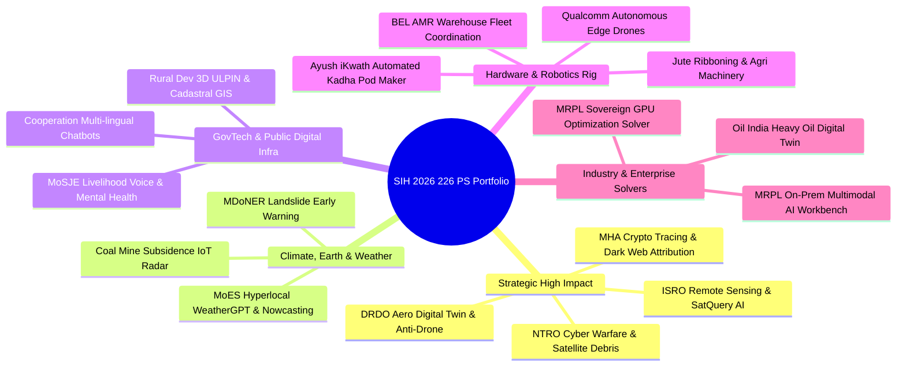

# SIH 2026: Problem Statement Selection & Strategic Architecture Guide

[🏠 Home](../README.md) > [📁 SIH 2026 Intelligence](./rules.md) > [📋 All 226 Problem Statements](./problem_statements.md) > **PS Selection Strategy**

> **Document Status**: `[STRATEGIC RECOMMENDATION]`  
> **Target Audience**: Student Developer Teams & Faculty SPOCs  
> **Source Base**: Analysis of 226 Official SIH 2026 Problem Statements (`SIH26001` to `SIH26226`) vs Historical Winner Archetypes (2017–2025)

---

## 🎯 Strategic Categorization of SIH 2026 Challenges

The 226 Problem Statements in SIH 2026 fall into **5 distinct architectural archetypes**. Understanding your chosen archetype is critical to building a winning technical defense.

---

## 🏆 Top 10 High-Yield Software Problem Statements for SIH 2026

These problem statements offer the highest probability of winning when paired with rigorous, demonstrable software engineering:

### 1. `SIH26167`: SatQuery AI — Vision-Language Assistant for Multimodal Remote Sensing (ISRO)
* **Theme**: Space Technology | **Category**: Software
* **Core Bottleneck**: ISRO processes petabytes of satellite imagery (Cartosat, RISAT, Chandrayaan). Scientists need to query imagery in natural language (e.g. *"Show urban flood inundation progression in Patna between July 10-15"*).
* **Winning Tech Stack**:
  - **Vision-Language Model**: Fine-tuned RemoteCLIP / GeoChat / Qwen-VL with quantized ONNX runtime.
  - **Backend & GIS**: FastAPI + PostGIS + Rasterio + GDAL cloud-optimized GeoTIFF streaming.
  - **DPI Integration**: ISRO Bhuvan map tiles & OpenStreetMap.

### 2. `SIH26182` & `SIH26183`: Automated Cryptocurrency Wallet Attribution & Fraud Analytics (MHA)
* **Theme**: Blockchain & Cybersecurity | **Category**: Software
* **Core Bottleneck**: Cybercrime police lack real-time forensic tools to map scammer crypto wallet addresses to KYC-compliant Virtual Asset Service Providers (VASPs/Exchanges) before stolen funds are laundered via mixers.
* **Winning Tech Stack**:
  - **Graph DB & Analytics**: Neo4j / Memgraph for multi-hop transaction graph traversal.
  - **Blockchain Ingestion**: Etherscan/Blockstream Webhook APIs, clustering algorithms (common-input-ownership heuristic).
  - **Frontend**: Cytoscape.js / D3 force-directed visual evidence graphs with Section 65B PDF certificate generation.

### 3. `SIH26068`: WeatherGPT — Conversational AI for Weather Alerts & Forecasting (MoES)
* **Theme**: Disaster Management | **Category**: Software
* **Core Bottleneck**: Complex numerical weather predictions (NWP) fail to reach rural farmers and local disaster managers in actionable, conversational vernacular language.
* **Winning Tech Stack**:
  - **RAG & Indic NLP**: Bhashini IndicTTS/ASR + Llama-3-Quantized running locally on IMD grid forecasts.
  - **Multi-channel Bot**: WhatsApp Business webhook + PWA with zero internet offline caching.

### 4. `SIH26011` & `SIH26014`: 3D ULPIN Generation & Integrated GIS Digital Public Infrastructure (Rural Dev)
* **Theme**: Space Technology / Robotics & Drones | **Category**: Software
* **Core Bottleneck**: Unique Land Parcel Identification Number (ULPIN - "Aadhaar for Land") currently lacks 3D vertical elevation stratification for multi-storey urban buildings and mountainous terrain.
* **Winning Tech Stack**:
  - **3D Geospatial Engine**: CesiumJS / Three.js + PostGIS 3D PolyhedralSurface primitives.
  - **Smart Contract Provenance**: Polygon L2 immutable deed hashes.

### 5. `SIH26117`: Sovereign On-Premise Agentic AI Workbench for Industrial Work (MRPL)
* **Theme**: Smart Automation | **Category**: Software
* **Core Bottleneck**: Confidential refinery engineering schematics, P&IDs, and operational logs cannot be sent to commercial third-party LLM clouds (OpenAI/Anthropic).
* **Winning Tech Stack**:
  - **Air-Gapped LLM Server**: vLLM / Ollama running DeepSeek-R1 / Qwen-2.5 on local GPU workstation.
  - **RAG Pipeline**: Qdrant / Milvus vector store with LangGraph agentic reasoning.

---

## 🛠️ Top 5 Hardware Problem Statements with High Demo Impact

### 1. `SIH26177`: Deployable Autonomous Search-and-Rescue AI Drone (Qualcomm)
* **Theme**: Robotics & Drones | **Category**: Hardware
* **Hardware BOM**: Pixhawk 4 / PX4 flight controller, Raspberry Pi 5 / NVIDIA Jetson Orin Nano, Thermal IR & RGB Camera.
* **Edge Model**: YOLOv8-nano fine-tuned for human heat signature detection in dense vegetation.

### 2. `SIH26048`: iKwath — Smart Pod-Based Ayurvedic Kadha Maker (Ministry of Ayush)
* **Theme**: Fitness & Sports | **Category**: Hardware
* **Hardware BOM**: Food-grade stainless steel heating chamber, peristaltic dosing pumps, ESP32 microcontroller, AFI/API recipe profile cartridge RFID scanner.

### 3. `SIH26052`: AI/ML Embedded Adaptive Noise Cancellation for Defence (DRDO)
* **Theme**: Smart Vehicles | **Category**: Hardware
* **Hardware BOM**: STM32H7 / ARM Cortex-M7 DSP microcontroller with dual I2S MEMS microphone array running quantized DeepFilterNet.

### 4. `SIH26025`: Low-Cost Real-Time Mine Subsidence Early Warning System (Ministry of Coal)
* **Theme**: Disaster Management | **Category**: Hardware
* **Hardware BOM**: Tilt inclinometer, ultrasonic displacement sensor, LoRa mesh transceiver nodes operating in subterranean tunnels.

### 5. `SIH26005`: Solar-Powered Smart Mini Cold Storage for Fresh Vegetables (MDoNER)
* **Theme**: Smart Vehicles / Agriculture | **Category**: Hardware
* **Hardware BOM**: Peltier thermoelectric / micro-compressor cooling unit, MPPT solar charge controller, LiFePO4 battery pack, DHT22 temperature/humidity telemetry.

---

## 💡 The 3 Golden Rules for Final PS Selection

1. **Match Your Core Competence**: Don't pick an ISRO Satellite Embedding problem if no one in your team knows Python geospatial packages (`rasterio`, `gdal`, `shapely`).
2. **Prioritize Real Ministry Bottlenecks**: Problem statements from MHA, MoES, DRDO, and Rural Development receive intensive scrutiny from actual government officers who reward practical field deployability.
3. **Submit Early Before the 500-Idea Cap**: Popular problem statements (e.g., in Smart Education, Tourism, or AI chatbots) will reach the 500-submission cap within 10–14 days of portal opening. Lock your 6-slide deck by the first week of September!
