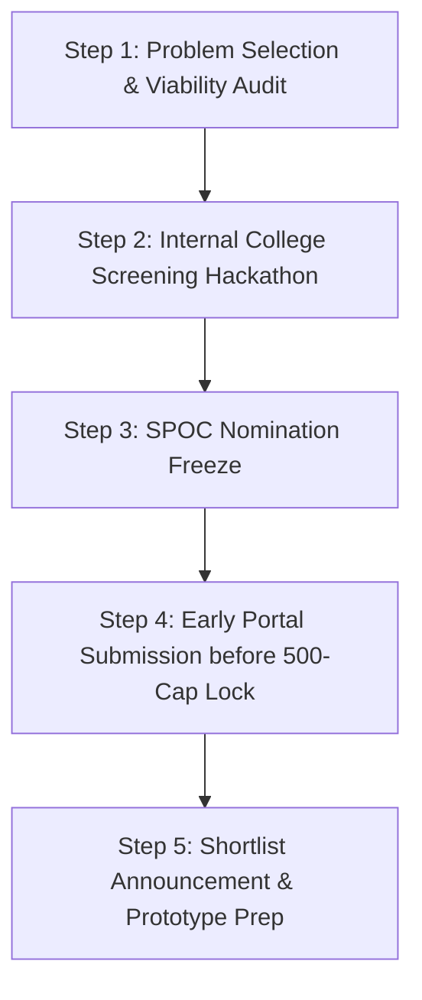

# SIH 2026: Idea Submission Strategy & Portal Freeze Defense

[🏠 Home](../README.md) > [📁 SIH 2026 Intelligence](./rules.md) > **Submission Strategy**

> **Document Status**: `[STRATEGIC RECOMMENDATION]`  
> **Target Deadline**: September 15, 2026 (Via College SPOC)  
> **Last Verified**: `2026-08-17`

---

## 🎯 1. Strategic Timeline & Portal Freeze Tactics



### ⚡ Beating the 500-Idea Submission Cap
1. **Target Uncontested Niche Problem Statements**:
   - Generic problem statements (e.g. *Simple Student Attendance Portal*) hit the 500-idea ceiling within 7–10 days of portal launch.
   - Deep domain-specific problem statements from specialized ministries (e.g. *Ministry of Tribal Affairs WebGIS*, *Central Wool Development Board*, *DRDO SASE Avalanche Radar*) receive significantly fewer submissions and higher evaluation quality.
2. **Compress Internal Hackathon Cycle**:
   - Complete your college internal hackathon by **August 25 – September 02, 2026** so your SPOC can submit your PDF well before the final rush.

---

## 📑 2. The 6-Slide Idea Submission Blueprint

All submissions must be compiled into a single `.pdf` file under **10 MB** with strictly **6 slides**:

```
┌───────────────────────────────────────┬───────────────────────────────────────┐
│ SLIDE 1: COVER & TEAM DETAILS         │ SLIDE 2: PROBLEM & PROPOSED SOLUTION  │
│ • Official PS ID & Exact Ministry     │ • Core acute bottlenecks & statistics │
│ • Team Name, Leader & 5 Members       │ • 3-Pillar solution executive summary │
│ • Institute AICTE Code + State        │ • Unique Selling Proposition (USP)    │
├───────────────────────────────────────┼───────────────────────────────────────┤
│ SLIDE 3: TECHNICAL ARCHITECTURE       │ SLIDE 4: FEASIBILITY & RISK MITIGATION│
│ • End-to-end System Block Diagram     │ • Technical proof-of-concept latency  │
│ • Full Tech Stack (Frontend, API, DB) │ • Hardware BOM (if hardware track)    │
│ • Data flow sequence (1 ➔ 2 ➔ 3)      │ • 3 Critical operational risks & fixes│
├───────────────────────────────────────┼───────────────────────────────────────┤
│ SLIDE 5: IMPACT, SCALE & OPEX DEFENSE │ SLIDE 6: RESEARCH & TEAM COMPETENCE   │
│ • Direct beneficiaries & impact stats │ • 3-4 Academic IEEE / Gov Citations   │
│ • 10,000 Outpost Scale OpEx Formula   │ • Clear role division for all 6 devs  │
│ • Competitive teardown vs ERP / Forms │ • Preliminary repository baseline     │
└───────────────────────────────────────┴───────────────────────────────────────┘
```

---

## 👥 3. Team Composition & Role Architecture

Ensure your 6-member team covers all critical competencies:

```
┌───────────────────────────────────────┬───────────────────────────────────────┐
│ 1. TEAM LEAD & SYSTEMS ARCHITECT      │ 4. AI / ML / HARDWARE SPECIALIST      │
│ • Slides 1–3, Overall Coordination    │ • Model quantization, ONNX, Sensors   │
├───────────────────────────────────────┼───────────────────────────────────────┤
│ 2. BACKEND & DATABASE LEAD            │ 5. INTEGRATION & SECURITY SPECIALIST  │
│ • REST/FastAPI endpoints & PostgreSQL │ • India Stack (Bhashini, DigiLocker)  │
├───────────────────────────────────────┼───────────────────────────────────────┤
│ 3. FRONTEND & UI/UX LEAD              │ 6. TESTING, PITCH & TIMEKEEPER        │
│ • React/Flutter UI & Accessibility    │ • Rehearsals, data seeding, backup vid│
└───────────────────────────────────────┴───────────────────────────────────────┘
```

---

## ✅ Pre-Upload Final Checklist

- [ ] **Slide Count**: Exactly 6 slides (No appendix or 7th slide).
- [ ] **File Size**: Single compiled `.pdf` under **10 MB**.
- [ ] **PS ID Accuracy**: Problem statement ID matches the SIH portal verbatim.
- [ ] **Mandatory Diversity**: Exactly 6 members from the same college with $\ge 1$ female member.
- [ ] **Offline Resilience Explicitly Mentioned**: Slide 4 explains how the app operates without internet.
- [ ] **OpEx Formula Included**: Slide 5 contains mathematical cost-per-transaction defense.
