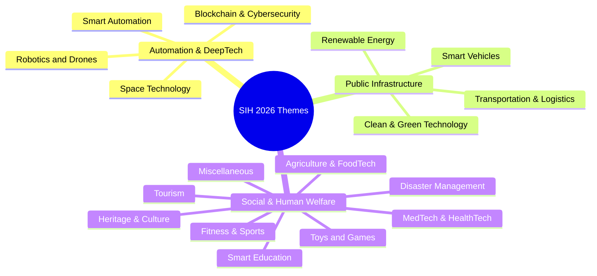

# SIH 2026: Official 17 Themes & Opportunity Mapping

[🏠 Home](../README.md) > [📁 SIH 2026 Intelligence](./rules.md) > **Themes**

> **Document Status**: `[OFFICIAL FACT]`  
> **Source Basis**: Ministry of Education's Innovation Cell (MIC) & AICTE Themes Catalogue  
> **Last Verified**: `2026-08-17`  
> **Source Citation**: [`SRC-OFF-002`](../sources/official_sources.md#src-off-002-sih-2026-official-17-themes-master-catalogue)

---

## 🎨 The 17 Official Themes for SIH 2026

---

### Detailed Domain Breakdown & Architectural Focus

| # | Official Theme | Focus Areas & Ministry Problems | High-Scoring Architectural Opportunities |
| :-: | :--- | :--- | :--- |
| **1** | **Smart Automation** | Workflow automation, document parsing, triage intelligence | Semantic vector embeddings, automated OCR, rule engines |
| **2** | **Fitness & Sports** | Grassroots athlete scouting, biomechanical video analysis | Pose estimation (MediaPipe/YOLO-Pose), edge telematics |
| **3** | **Heritage & Culture** | Monument digital twins, indigenous language preservation | AR/VR WebXR, NeRF / 3D photogrammetry, Bhashini speech |
| **4** | **MedTech / BioTech / HealthTech** | Disease triage, botanical classification, telemedicine | Quantized edge classification (ONNX), offline-first sync |
| **5** | **Agriculture, FoodTech & Rural Dev** | Mandi produce grading, crop disease AI, farm traceability | Multispectral sensors, BLE telematics, supply chain hashes |
| **6** | **Smart Vehicles** | EV battery telemetry, ADAS safety, dynamic traffic signals | CAN-bus/OBD-II stream clustering, edge vision |
| **7** | **Transportation & Logistics** | Transit voice enquiry, counter queue analytics, routing | Acoustic denoising, ByteTrack queue vision, DPDP privacy |
| **8** | **Robotics and Drones** | Disaster relief UAVs, autonomous sewer/cleaning robots | Embedded ROS / Micro-ROS, computer vision end-effectors |
| **9** | **Clean & Green Technology** | Effluent tracing, solid waste sorting, circular economy | Plume inversion models, pneumatic actuator rigs, IoT probes |
| **10** | **Tourism** | Vernacular tour guides, artisan marketplaces | Multilingual voice agents, offline PWA audio guides |
| **11** | **Renewable / Sustainable Energy** | Smart solar tracking, micro-hydro generators, grid load | Closed-loop PID controllers, MATLAB/Simulink digital twins |
| **12** | **Blockchain & Cybersecurity** | Digital evidence custody, tamper-proof logs, zero-trust | Client-side AES-256 GCM, IPFS, Polygon L2 gasless relayers |
| **13** | **Smart Education** | Syllabus harmonization, Indic classrooms, AI quizzes | Knowledge graphs (Neo4j), sentence-transformers RAG |
| **14** | **Disaster Management** | Avalanche early warning, landslide alerts, flood tracking | Infrasound/seismic TinyML, LoRa long-range mesh networks |
| **15** | **Toys and Games** | Pedagogical toys inspired by Indian history & science | Low-cost interactive electronics, physical-digital hybrid |
| **16** | **Miscellaneous** | Financial services, legal informatics, public governance | Constraint satisfaction schedulers, sovereign government portals |
| **17** | **Space Technology** | Satellite imagery analysis, GIS boundary vectorization | PostGIS, Sentinel-2 / ISRO Bhuvan STAC API ingestion |
