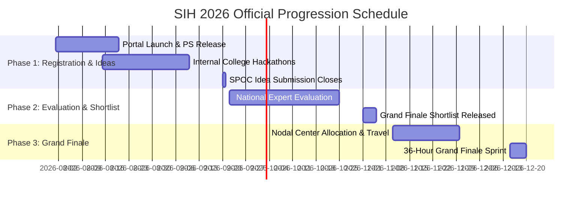

# SIH 2026: Official Timeline, Milestones & Verification Log

[🏠 Home](../README.md) > [📁 SIH 2026 Intelligence](./rules.md) > **Timeline**

> **Document Status**: `[OFFICIAL FACT]`  
> **Source Basis**: Ministry of Education's Innovation Cell (MIC) & AICTE Master Schedule  
> **Last Verified**: `2026-08-17`  
> **Source Citation**: [`SRC-OFF-001`](../sources/official_sources.md#src-off-001-sih-2026-official-process-flow--guidelines)

---

## 📅 Master Milestone Timeline

---

## 📋 Granular Milestone Breakdown

| Milestone Stage | Target Window / Deadline | Responsible Entity | Key Deliverables & Action Items |
| :--- | :--- | :--- | :--- |
| **Problem Statement Release** | August 2026 | MIC / AICTE & Ministries | 226 official problem statements released on portal (`SIH26001` to `SIH26226`). |
| **Internal College Hackathons** | August 15 – Sept 10, 2026 | College SPOC / Faculty | Screen top 50 teams per campus with external jury. |
| **Official Idea Submission** | **September 20, 2026** *(Official Deadline)* | College SPOC | Upload 6-slide PDF before 500-idea cap freeze. |
| **National Expert Screening** | September 22 – October 25, 2026 | AICTE Review Panels | Central evaluation of submitted idea proposals. |
| **Grand Finale Shortlist** | Early November 2026 | MIC / AICTE | Publication of finalist teams per Problem Statement. |
| **Mentoring & Nodal Logistics** | November 2026 | Finalist Teams & Nodal Centers | Travel booking, hardware BOM procurement, baseline repo setup. |
| **36-Hour Grand Finale** | **December 2026** | All Finalists & Ministries | Continuous 36-hour physical hackathon at designated nodal centers. |

---

## 🔍 Verification & Stale Date Log

| Field / Milestone | Verification Status | Verified Date | Authority Source |
| :--- | :--- | :--- | :--- |
| **Prize Money (₹1.5 Lakhs)** | Verified | `2026-08-17` | AICTE / MIC Guidelines |
| **500-Idea Submission Cap** | Verified | `2026-08-17` | AICTE / MIC Guidelines |
| **Team Gender Mandate ($\ge 1$ Female)** | Verified | `2026-08-17` | AICTE / MIC Guidelines |
| **Idea Submission Deadline** | Verified | `2026-08-17` | SIH Portal Schedule |
| **Grand Finale Month** | Proposed / Active | `2026-08-17` | AICTE / MIC Guidelines |
