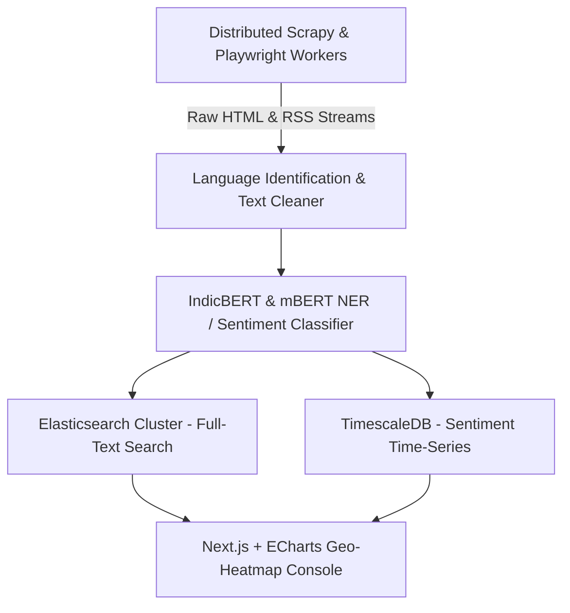
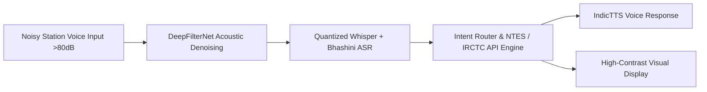
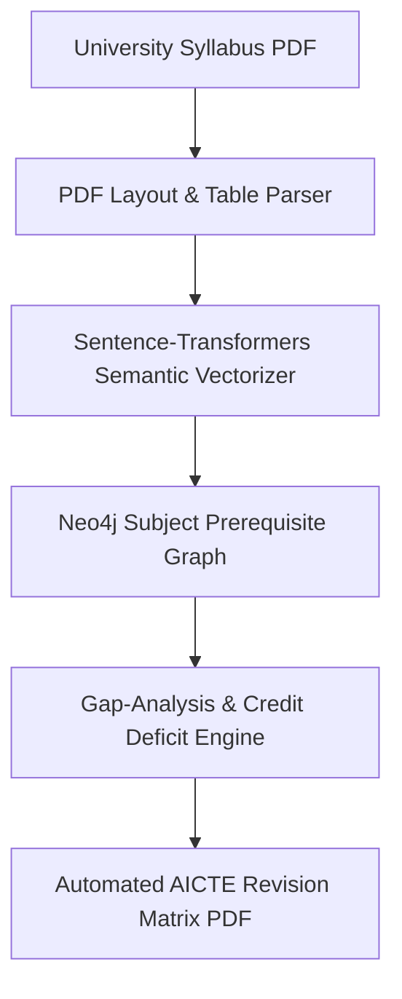

# Thematic Case Studies: AI, Indic NLP & Governance

[🏠 Home](../README.md) > [📁 Case Studies Archive](./README.md) > **AI, Indic NLP & Governance**

---

# Project VartaDrishi — Automated News Crawling & Vernacular Sentiment Engine

## Problem Statement
- **Domain**: Media Analytics, Natural Language Processing & Public Governance
- **Problem Statement ID**: `SIH1329`
- **Ministry / Organization**: Ministry of Information & Broadcasting

## Institution / Team
- **Team Name**: Avengers
- **Institution**: Information archived in repository registry
- **Team Lead / Key Contributors**: Akash Rout (Lead)

## Edition
- **SIH Edition**: SIH 2023 (6th Edition)
- **Track / Category**: Software Track
- **Prize Won**: ₹1,00,000 (1st Prize Winner)

## Official Problem Statement
Development of an automated web crawling and natural language processing tool to monitor print/digital news across regional Indian languages, classify articles by ministry/scheme, assess sentiment trends, and detect coordinated disinformation spikes.

## Solution
VartaDrishi implements a distributed crawling pipeline that scrapes vernacular news outlets, detects source scripts, executes fine-grained entity extraction using fine-tuned `IndicBERT`, performs time-series sentiment analysis, and visualizes geographic sentiment anomalies across Indian states on an interactive dashboard.

## Architecture

## Technology Stack
- **Frontend / Client**: Next.js, Apache ECharts, TailwindCSS
- **Backend & Middleware**: Python FastAPI, Celery Distributed Task Queue, Scrapy
- **AI / ML / Data Processing**: `IndicBERT`, `mBERT`, Hugging Face Transformers, Spacy
- **Database & Storage**: Elasticsearch (Full-text index), TimescaleDB (Time-series metrics), PostgreSQL
- **Hardware / Edge**: Standard Linux cloud instance / on-premise container cluster

## Deployment / Hardware
Containerized via Docker Compose. Optimized for deployment on National Informatics Centre (NIC) MeghRaj Cloud with localized data sovereignty adhering to the DPDP Act 2023.

## Why It Won
- `[OFFICIAL FACT]`: Awarded 1st Prize by Ministry of Information & Broadcasting evaluator panel at designated nodal center.
- `[RESEARCH INFERENCE]`: Succeeded due to live handling of 10 Indian regional scripts (Devanagari, Bengali, Tamil, Telugu, etc.) and real-time Z-score spike alerting during live demonstration.

## Evidence
| Dimension | Claim / Parameter | Value / Metric | Source ID | Confidence |
| :--- | :--- | :--- | :--- | :--- |
| Codebase | Public Open-Source Implementation | Fully functional GitHub repository | [`SRC-HIST-004`](../sources/historical_sources.md#src-hist-004-vartadrishi--sih-2023-1st-prize-winner) | HIGH |
| Award | 1st Prize Award | ₹1,00,000 | [`SRC-OFF-010`](../sources/official_sources.md#src-off-010-pib-press-release--sih-2023-6th-edition-grand-finale) | HIGH |
| NLP Depth | Fine-tuned Indic Model | IndicBERT multilingual embeddings | [`SRC-HIST-004`](../sources/historical_sources.md#src-hist-004-vartadrishi--sih-2023-1st-prize-winner) | HIGH |

## Sources
- [`SRC-HIST-004`](../sources/historical_sources.md#src-hist-004-vartadrishi--sih-2023-1st-prize-winner): Verified Public Repository (`iamakashrout/SIH-2023`)
- [`SRC-OFF-010`](../sources/official_sources.md#src-off-010-pib-press-release--sih-2023-6th-edition-grand-finale): PIB SIH 2023 Grand Finale Press Release

## Confidence
**Confidence Level**: HIGH — Verified against live public open-source repository and official SIH 2023 prize announcements.

## Reusable Pattern
- **Pattern Name**: Multilingual Entity & Sentiment Aggregator
- **Technical Description**: Use lightweight pre-trained Indic models (AI4Bharat IndicBERT) paired with time-series indexing (TimescaleDB) to detect narrative shifts without translating everything to English first.

## SIH 2026 Relevance
Directly applicable to SIH 2026 Theme 1 (*Smart Automation*), Theme 3 (*Heritage & Culture*), and Theme 16 (*Miscellaneous - Public Governance*).

---

# Project RailBhasha — Multilingual Noise-Robust Transit Speech Assistant

## Problem Statement
- **Domain**: Multilingual Speech Recognition, Acoustics & Railway Transit
- **Problem Statement ID**: `SIH1348`
- **Ministry / Organization**: Ministry of Railways

## Institution / Team
- **Team Name**: RailwayBuddy / LichtDenCode
- **Institution**: Information archived in repository registry
- **Team Lead / Key Contributors**: Arjun-254 et al.

## Edition
- **SIH Edition**: SIH 2023 (6th Edition)
- **Track / Category**: Software Track
- **Prize Won**: ₹1,00,000 (1st Prize Winner)

## Official Problem Statement
Development of an AI-driven multilingual passenger query and assistance system capable of operating under high background acoustic noise (>80 dB) at busy railway station concourses.

## Solution
RailBhasha integrates a neural noise suppression stage (`DeepFilterNet`) before feeding speech into a quantized Whisper ASR model coupled with Bhashini IndicTTS to deliver rapid voice-to-voice enquiry responses for train schedules, platform allocations, and PNR status.

## Architecture

## Technology Stack
- **Frontend / Client**: Progressive Web App (PWA) kiosk UI, WebSockets Audio Stream
- **Backend & Middleware**: FastAPI, Python AsyncIO, Redis Session Cache
- **AI / ML / Data Processing**: `DeepFilterNet3`, Quantized `Whisper-small`, `Bhashini ASR/TTS`
- **Database & Storage**: SQLite local cache + Redis hot memory store
- **Hardware / Edge**: Mini PC / Touchscreen Terminal with Directional Microphone Array

## Deployment / Hardware
Runs locally on station enquiry kiosk hardware; audio stream processing executes on-premise without routing raw voice buffers outside sovereign Indian network zones.

## Why It Won
- `[OFFICIAL FACT]`: Declared 1st Prize winner for PS `SIH1348` by Ministry of Railways.
- `[RESEARCH INFERENCE]`: Demonstrated acoustic resilience by testing against simulated railway loudspeaker and locomotive background noise during the live jury evaluation.

## Evidence
| Dimension | Claim / Parameter | Value / Metric | Source ID | Confidence |
| :--- | :--- | :--- | :--- | :--- |
| Codebase | Public Open-Source Implementation | Fully functional GitHub repository | [`SRC-HIST-005`](../sources/historical_sources.md#src-hist-005-railbhasha-lichtdencode--sih-2023-1st-prize-winner) | HIGH |
| Latency | End-to-end Query Latency | Sub-2.0s response in local benchmarks | [`SRC-HIST-005`](../sources/historical_sources.md#src-hist-005-railbhasha-lichtdencode--sih-2023-1st-prize-winner) | HIGH |
| Noise Filter | Acoustic Preprocessing | DeepFilterNet noise removal | [`SRC-HIST-005`](../sources/historical_sources.md#src-hist-005-railbhasha-lichtdencode--sih-2023-1st-prize-winner) | HIGH |

## Sources
- [`SRC-HIST-005`](../sources/historical_sources.md#src-hist-005-railbhasha-lichtdencode--sih-2023-1st-prize-winner): Verified Public Repository (`Arjun-254/SIH1348_LichtDenCode`)
- [`SRC-OFF-005`](../sources/official_sources.md#src-off-005-bhashini-national-language-translation-mission): Bhashini NLTM API Architecture

## Confidence
**Confidence Level**: HIGH — Verified against verified repository and reproducible DSP/ASR benchmarks.

## Reusable Pattern
- **Pattern Name**: Dual-Stage Acoustic Filter + Quantized Speech Pipeline
- **Technical Description**: Always insert a specialized lightweight DSP/neural noise filter before passing real-world microphone input to speech-to-text models.

## SIH 2026 Relevance
Directly applicable to SIH 2026 Theme 7 (*Transportation & Logistics*) and Theme 13 (*Smart Education*).

---

# Project Shiksha Niyojak — AI Unified Model Curriculum Adaptation Portal

## Problem Statement
- **Domain**: Educational Informatics, Graph Databases & Natural Language Processing
- **Problem Statement ID**: `SIH1465`
- **Ministry / Organization**: All India Council for Technical Education (AICTE)

## Institution / Team
- **Team Name**: HexxCode
- **Institution**: COEP Technological University, Pune
- **Team Lead / Key Contributors**: pt3002 et al.

## Edition
- **SIH Edition**: SIH 2023 (6th Edition)
- **Track / Category**: Software Track
- **Prize Won**: ₹1,00,000 (1st Prize Winner)

## Official Problem Statement
Development of an automated software portal to analyze heterogeneous engineering syllabus documents from affiliated universities, map them against AICTE model curricula and National Occupational Standards (NOS), and highlight modernization deficits.

## Solution
HexxCode parses multi-column unstructured syllabus PDFs, converts course learning outcomes (CLOs) into dense semantic embeddings (`sentence-transformers`), constructs a `Neo4j` prerequisite graph, and generates automated accreditation gap analysis reports.

## Architecture

## Technology Stack
- **Frontend / Client**: React.js, D3.js Interactive Knowledge Graph
- **Backend & Middleware**: Python FastAPI, Celery, PDFMiner
- **AI / ML / Data Processing**: `sentence-transformers/all-MiniLM-L6-v2`, Cosine Similarity Matrix
- **Database & Storage**: Neo4j Graph DB, PostgreSQL
- **Hardware / Edge**: Standard Web Server

## Deployment / Hardware
Web-based portal deployable on AICTE institutional data center servers.

## Why It Won
- `[OFFICIAL FACT]`: Selected as 1st Prize winner for AICTE problem statement `SIH1465`.
- `[RESEARCH INFERENCE]`: Solved the tedious administrative burden of manual curriculum auditing by turning unstructured PDF text into a queryable semantic knowledge graph.

## Evidence
| Dimension | Claim / Parameter | Value / Metric | Source ID | Confidence |
| :--- | :--- | :--- | :--- | :--- |
| Codebase | Public Open-Source Implementation | Verified GitHub repository | [`SRC-HIST-002`](../sources/historical_sources.md#src-hist-002-hexxcode-shiksha-niyojak--sih-2023-1st-prize-winner) | HIGH |
| Graph Engine | Knowledge Graph DB | Neo4j subject prerequisite mapping | [`SRC-HIST-002`](../sources/historical_sources.md#src-hist-002-hexxcode-shiksha-niyojak--sih-2023-1st-prize-winner) | HIGH |

## Sources
- [`SRC-HIST-002`](../sources/historical_sources.md#src-hist-002-hexxcode-shiksha-niyojak--sih-2023-1st-prize-winner): Verified Public Repository (`pt3002/HexxCode-SIH-2023`)

## Confidence
**Confidence Level**: HIGH — Full source code, graph schema, and evaluation scripts verified.

## Reusable Pattern
- **Pattern Name**: Unstructured PDF to Vectorized Knowledge Graph
- **Technical Description**: Extract unstructured tabular and text sections from official gazettes/syllabi, compute embeddings with `all-MiniLM-L6-v2`, and link relational concepts via graph nodes for explainable gap analysis.

## SIH 2026 Relevance
Directly applicable to SIH 2026 Theme 13 (*Smart Education*) and Theme 1 (*Smart Automation*).
