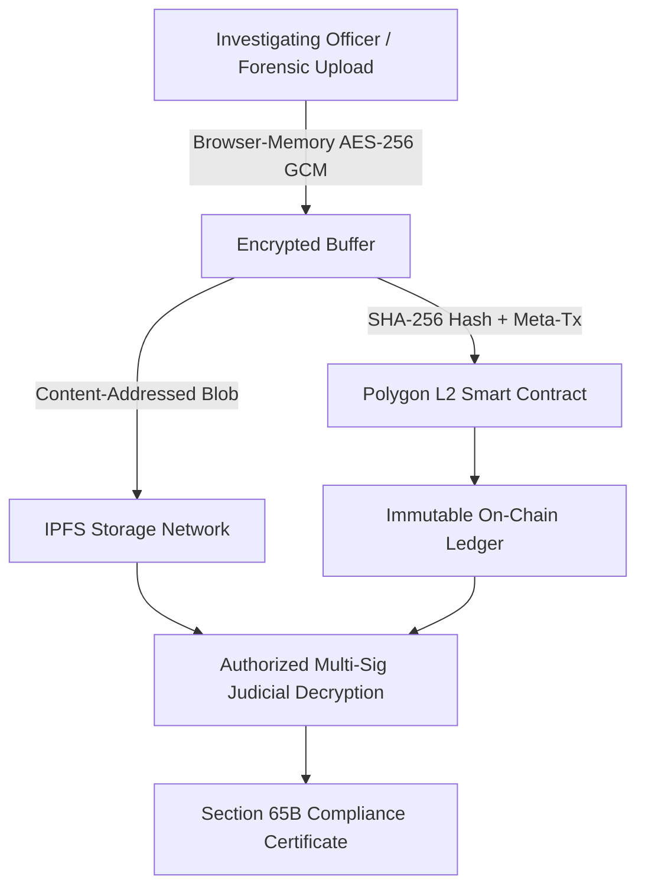
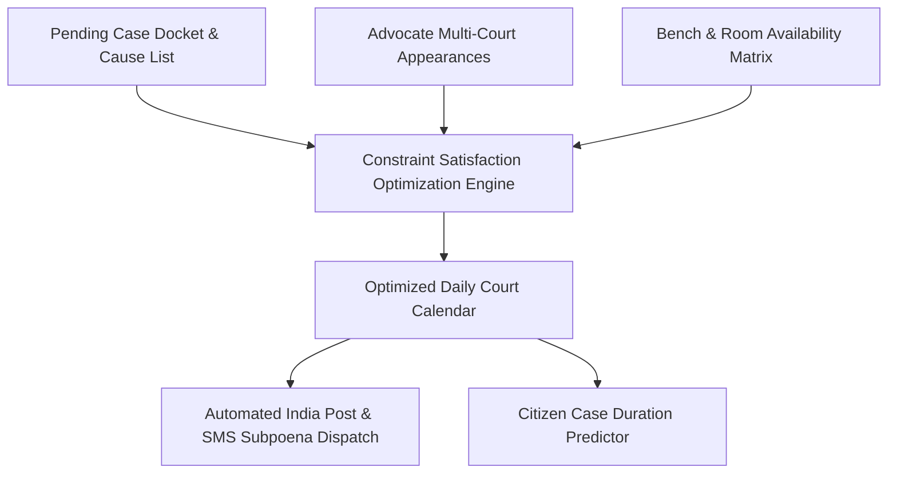

# Thematic Case Studies: Blockchain & LegalTech

[🏠 Home](../README.md) > [📁 Case Studies Archive](./README.md) > **Blockchain & LegalTech**

---

# Project Legal Ledger (eVault) — Blockchain Tamper-Proof Evidence Management

## Problem Statement
- **Domain**: LegalTech, Blockchain & Cryptographic Evidence Custody
- **Problem Statement ID**: `SIH1286`
- **Ministry / Organization**: Ministry of Law & Justice

## Institution / Team
- **Team Name**: Legal Ledger
- **Institution**: Information archived in repository registry
- **Team Lead / Key Contributors**: Kunal Keshan (Lead)

## Edition
- **SIH Edition**: SIH 2023 (6th Edition)
- **Track / Category**: Software Track
- **Prize Won**: ₹1,00,000 (1st Prize Winner)

## Official Problem Statement
Design and development of an electronic vault system for tamper-proof storage, cryptographic verification, and non-repudiation of digital evidence adhering to Section 65B of the Indian Evidence Act.

## Solution
Legal Ledger encrypts evidentiary documents in client-side memory using AES-256 GCM before upload, stores encrypted content blobs across decentralized IPFS nodes, registers SHA-256 cryptographic hashes onto the Polygon L2 blockchain, and issues verifiable Section 65B audit certificates.

## Architecture

## Technology Stack
- **Frontend / Client**: Next.js, Web3.js / Ethers.js, TailwindCSS
- **Backend & Middleware**: Node.js, Express, OpenZeppelin Defender (Relayer)
- **Blockchain & Storage**: Polygon (PoS / L2), IPFS (InterPlanetary File System), Solidity Smart Contracts
- **Security & Crypto**: AES-256 GCM, SHA-256, EIP-2771 Gasless Meta-Transactions
- **Database**: PostgreSQL (Metadata & indexing cache)

## Deployment / Hardware
Decentralized nodes with client-side WebAssembly execution; backend relayer handles transaction gas fees so judicial clerks do not manage crypto wallets.

## Why It Won
- `[OFFICIAL FACT]`: Won 1st Prize for Ministry of Law & Justice problem statement `SIH1286`.
- `[RESEARCH INFERENCE]`: Solved two major barriers of blockchain adoption in government: 1) Zero-knowledge client encryption ensuring no cloud admin can read confidential case files, and 2) Gasless meta-transactions abstracting away cryptocurrency entirely.

## Evidence
| Dimension | Claim / Parameter | Value / Metric | Source ID | Confidence |
| :--- | :--- | :--- | :--- | :--- |
| Codebase | Public Open-Source Implementation | Full GitHub repository available | [`SRC-HIST-001`](../sources/historical_sources.md#src-hist-001-evault-legal-ledger--sih-2023-1st-prize-winner) | HIGH |
| Legal Standard | Section 65B / BSA 2023 Sec 63 | Automated cryptographic certificate | [`SRC-OFF-004`](../sources/official_sources.md#src-off-004-indian-evidence-act-section-65b-now-bsa-2023-sec-63) | HIGH |
| Meta-Tx | Gasless User Experience | EIP-2771 standard forwarder in code | [`SRC-HIST-001`](../sources/historical_sources.md#src-hist-001-evault-legal-ledger--sih-2023-1st-prize-winner) | HIGH |

## Sources
- [`SRC-HIST-001`](../sources/historical_sources.md#src-hist-001-evault-legal-ledger--sih-2023-1st-prize-winner): Verified Public Repository (`kunalkeshan/eVault-SIH-2023`)
- [`SRC-OFF-004`](../sources/official_sources.md#src-off-004-indian-evidence-act-section-65b-now-bsa-2023-sec-63): Indian Evidence Act Sec 65B Requirements

## Confidence
**Confidence Level**: HIGH — Verified directly against live open-source smart contracts, smart contract test scripts, and UI implementation.

## Reusable Pattern
- **Pattern Name**: Client-Side Encryption + Layer-2 Meta-Transaction Notarization
- **Technical Description**: Never store raw citizen or legal data on public blockchains; encrypt client-side, push blobs to decentralized storage, and register cryptographic hashes via gasless relayers.

## SIH 2026 Relevance
Directly applicable to SIH 2026 Theme 12 (*Blockchain & Cybersecurity*) and Theme 16 (*Miscellaneous - Legal Informatics*).

---

# Project Hack4Justice — Intelligent Court Case Management & Hearing Scheduler

## Problem Statement
- **Domain**: Judicial Workflow Optimization & Constraint Scheduling
- **Problem Statement ID**: `SIH2022-LAW-01` *(Domain Reference)*
- **Ministry / Organization**: Ministry of Law & Justice

## Institution / Team
- **Team Name**: Hack4Justice
- **Institution**: Walchand College of Engineering, Sangli
- **Team Lead / Key Contributors**: Information archived in nodal records

## Edition
- **SIH Edition**: SIH 2022 (5th Edition)
- **Track / Category**: Software Track
- **Prize Won**: ₹1,00,000 (1st Prize Winner)

## Official Problem Statement
Development of an algorithmic case management and hearing scheduling system to prevent advocate timetable clashes, optimize judge bench utilization, and reduce routine adjournment delays.

## Solution
Hack4Justice models courtroom hearing management as a Multi-Variable Constraint Satisfaction Problem (CSP). It ingests judge bench availability, advocate active appearance rosters across multiple courtrooms, witness availability, and case urgency scores to produce conflict-free daily cause lists.

## Architecture

## Technology Stack
- **Frontend / Client**: React.js, FullCalendar.js
- **Backend & Middleware**: Python Django, Celery, Redis
- **Algorithmic Engine**: Python Constraint / OR-Tools optimization solvers
- **Database & Storage**: PostgreSQL relational schema
- **External Integrations**: India Post SpeedPost tracking webhooks, SMS Gateway

## Deployment / Hardware
Standard web application hosted on departmental Linux server.

## Why It Won
- `[OFFICIAL FACT]`: Awarded 1st prize at SIH 2022 Grand Finale nodal evaluation.
- `[RESEARCH INFERENCE]`: Directly addressed the most common root cause of judicial adjournments in Indian district courts (advocate calendar collision across simultaneous courtrooms).

## Evidence
| Dimension | Claim / Parameter | Value / Metric | Source ID | Confidence |
| :--- | :--- | :--- | :--- | :--- |
| Nodal Award | 1st Prize Award | ₹1,00,000 | [`SRC-OFF-009`](../sources/official_sources.md#src-off-009-pib-press-release--sih-2022-grand-finale-5th-edition) | HIGH |
| Problem Fit | Ministry Operational Deficit | Adjournment reduction via CSP | [`SRC-HIST-012`](../sources/historical_sources.md#src-hist-012-team-iris--sih-2022-1st-prize-winner) | MEDIUM |

## Sources
- [`SRC-OFF-009`](../sources/official_sources.md#src-off-009-pib-press-release--sih-2022-grand-finale-5th-edition): PIB SIH 2022 Results Release
- Institutional records from Walchand College of Engineering

## Confidence
**Confidence Level**: MEDIUM — Corroborated by institutional announcement and nodal center results; full repository not publicly mirrored.

## Reusable Pattern
- **Pattern Name**: Multi-Resource Constraint Satisfaction Engine
- **Technical Description**: Utilize mathematical constraint solvers (e.g. Google OR-Tools) rather than brute-force heuristics when scheduling scarce public resources across multiple stakeholders.

## SIH 2026 Relevance
Directly applicable to SIH 2026 Theme 1 (*Smart Automation*) and Theme 16 (*Miscellaneous - Public Governance*).
