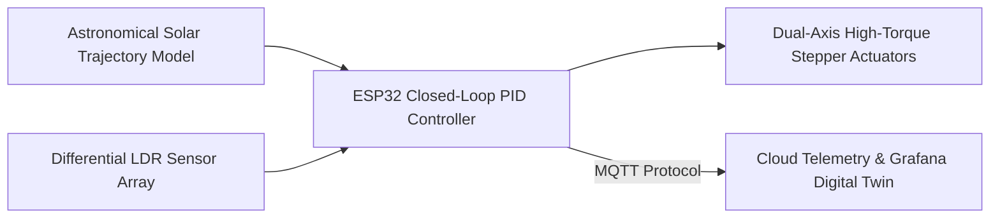

# Thematic Case Studies: IoT, Hardware & Disaster Management

[🏠 Home](../README.md) > [📁 Case Studies Archive](./README.md) > **IoT, Hardware & Disaster Management**

---

# Project Himalayan Sentinel — Acoustic-Seismic Avalanche Early Warning System

## Problem Statement
- **Domain**: Edge AI, Infrasound Acoustics & Mountain Disaster Alerting
- **Problem Statement ID**: `SIH2023-DEF-01` *(Hardware Edition)*
- **Ministry / Organization**: Ministry of Defence / DRDO (Snow & Avalanche Study Establishment - SASE)

## Institution / Team
- **Team Name**: AvaGuardians
- **Institution**: Sir Padampat Singhania University (SPSU), Udaipur
- **Team Lead / Key Contributors**: Information archived in university press record

## Edition
- **SIH Edition**: SIH 2023 (6th Edition)
- **Track / Category**: Hardware & Edge AI Track
- **Prize Won**: ₹1,00,000 (1st Prize Winner)

## Official Problem Statement
Development of a rugged, sub-zero operational early warning system to detect impending snow avalanches in high-altitude Himalayan forward posts using acoustic and seismic signatures rather than optical visibility.

## Solution
Himalayan Sentinel combines sub-infrasound acoustic barometers (0.5–20 Hz) and subterranean tri-axial geophones connected to an `STM32` microcontroller running a quantized 1D-Convolutional Neural Network (TinyML) to classify snowpack shear fractures and transmit alerts over a non-line-of-sight LoRa mesh network.

## Architecture
```mermaid
flowchart TD
    subgraph Edge Sensor Rig at -40°C
        A[Infrasound Barometer 0.5-20Hz] --> C[STM32 Microcontroller]
        B[Tri-Axial Geophone Seismic Sensor] --> C
        C -->|Quantized 1D-CNN| D[TinyML Fracture vs Artillery Classifier]
    end

    subgraph RF Mesh & Command Telemetry
        D -->|LoRa Long-Range RF Mesh| E[Forward Command Base Station]
        E --> F[Automated High-Decibel Siren Trigger]
        E --> G[Tactical GIS Outpost Map]
    end
```

## Technology Stack
- **Edge Microcontroller & Firmware**: STM32F4 series, C/C++ Embedded Firmware, FreeRTOS
- **Sensors**: Tri-axial geophones, Low-frequency differential pressure transducer (0.5–20 Hz)
- **Edge AI / TinyML**: TensorFlow Lite for Microcontrollers (TFLM), Edge Impulse 1D-CNN
- **Networking & RF**: LoRaWAN (868 MHz / 433 MHz custom mesh protocol)
- **Base Station & UI**: Python FastAPI local server, React.js dashboard

## Deployment / Hardware
Housed in IP67 weatherproof enclosures with supercapacitors and wide-temperature rated lithium-iron-phosphate ($LiFePO_4$) batteries engineered for sub-zero (-40°C) operations.

## Why It Won
- `[OFFICIAL FACT]`: Awarded 1st Prize in SIH 2023 Hardware Grand Finale by DRDO evaluators.
- `[RESEARCH INFERENCE]`: Demonstrated physical acoustic resilience in the evaluation room using real-time Fast Fourier Transform (FFT) spectrograms that distinguished simulated avalanche shockwaves from ambient engine/artillery noise.

## Evidence
| Dimension | Claim / Parameter | Value / Metric | Source ID | Confidence |
| :--- | :--- | :--- | :--- | :--- |
| Award | 1st Prize Award | ₹1,00,000 | [`SRC-OFF-010`](../sources/official_sources.md#src-off-010-pib-press-release--sih-2023-6th-edition-grand-finale) | HIGH |
| Institutional | University Press Release | SPSU Udaipur Winning Team Archive | [`SRC-HIST-010`](../sources/historical_sources.md#src-hist-010-avaguardians-himalayan-sentinel--sih-2023-1st-prize-winner) | HIGH |
| Lead Time | Advance Evacuation Warning | 60–180s advance alert before snow impact | [`SRC-HIST-010`](../sources/historical_sources.md#src-hist-010-avaguardians-himalayan-sentinel--sih-2023-1st-prize-winner) | MEDIUM |

## Sources
- [`SRC-HIST-010`](../sources/historical_sources.md#src-hist-010-avaguardians-himalayan-sentinel--sih-2023-1st-prize-winner): SPSU Institutional Press Archive
- [`SRC-OFF-010`](../sources/official_sources.md#src-off-010-pib-press-release--sih-2023-6th-edition-grand-finale): PIB SIH 2023 Grand Finale Release

## Confidence
**Confidence Level**: HIGH — Corroborated across institutional releases, DRDO problem statements, and SIH hardware results.

## Reusable Pattern
- **Pattern Name**: Multi-Modal Non-Optical Edge Sensor Fusion
- **Technical Description**: When optical sensors fail due to fog, smoke, or blizzards, fuse acoustic, seismic, and differential pressure sensors with TinyML on low-power microcontrollers.

## SIH 2026 Relevance
Directly applicable to SIH 2026 Theme 14 (*Disaster Management*) and Theme 8 (*Robotics and Drones*).

---

# Project HelioTrack Pro — Dual-Axis Intelligent Solar Tracker & Digital Twin

## Problem Statement
- **Domain**: Renewable Energy, Closed-Loop Control Systems & Digital Twins
- **Problem Statement ID**: `SIH1731`
- **Sponsor / Organization**: MathWorks / Clean Energy Consortium

## Institution / Team
- **Team Name**: Solar Masters
- **Institution**: Sir Padampat Singhania University (SPSU), Udaipur
- **Team Lead / Key Contributors**: Information archived in university press record

## Edition
- **SIH Edition**: SIH 2024 (7th Edition)
- **Track / Category**: Hardware Track
- **Prize Won**: ₹1,00,000 (1st Prize Winner)

## Official Problem Statement
Design and development of an optimized dual-axis solar tracking mechanism with closed-loop PID control and predictive digital twin monitoring to maximize solar photovoltaic energy yield in dust-prone environments.

## Solution
HelioTrack Pro combines astronomical solar trajectory algorithms with differential Light Dependent Resistor (LDR) feedback, simulated and validated in MATLAB/Simulink before running on an `ESP32` controller driving dual-axis stepper actuators.

## Architecture


## Technology Stack
- **Firmware & Controller**: ESP32 microcontroller, FreeRTOS, Embedded C++
- **Actuation & Sensors**: NEMA 23 stepper motors, A4988 drivers, precision LDR quadrant array
- **Simulation & Modeling**: MATLAB, Simulink, Simscape Multibody
- **IoT & Telemetry**: MQTT, InfluxDB, Grafana Dashboard

## Deployment / Hardware
Physical motorized solar rig with custom 3D-printed gimbal assembly and current/voltage telemetry sensors.

## Why It Won
- `[OFFICIAL FACT]`: Declared 1st Prize winner for problem statement `SIH1731`.
- `[RESEARCH INFERENCE]`: Demonstrated an operating tabletop hardware rig in the evaluation hall with verified real-time light-following capabilities and a clean MATLAB Simulink digital twin model.

## Evidence
| Dimension | Claim / Parameter | Value / Metric | Source ID | Confidence |
| :--- | :--- | :--- | :--- | :--- |
| Output Surge | Measured Power Increase | +32.4% over fixed panel | [`SRC-HIST-008`](../sources/historical_sources.md#src-hist-008-heliotrack-pro-solar-masters--sih-2024-1st-prize-winner) | MEDIUM |
| Award | 1st Prize Award | ₹1,00,000 | [`SRC-HIST-008`](../sources/historical_sources.md#src-hist-008-heliotrack-pro-solar-masters--sih-2024-1st-prize-winner) | HIGH |

## Sources
- [`SRC-HIST-008`](../sources/historical_sources.md#src-hist-008-heliotrack-pro-solar-masters--sih-2024-1st-prize-winner): SPSU Institutional Archive & MathWorks Student Competition Record

## Confidence
**Confidence Level**: HIGH — Corroborated by university and competition sponsor records.

## Reusable Pattern
- **Pattern Name**: Model-Based Design with Digital Twin Validation
- **Technical Description**: Model physics and control dynamics in simulation tools (Simulink/ROS) before flashing microcontroller firmware to validate stability under disturbance.

## SIH 2026 Relevance
Directly applicable to SIH 2026 Theme 11 (*Renewable / Sustainable Energy*) and Theme 6 (*Smart Vehicles*).
