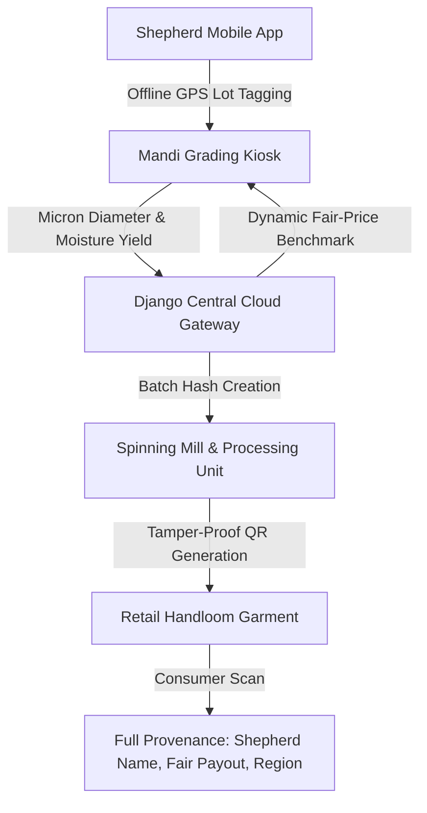

# Thematic Case Studies: AgriTech & Supply Chain Traceability

[🏠 Home](../README.md) > [📁 Case Studies Archive](./README.md) > **AgriTech & Supply Chain Traceability**

---

# Project KnitKraft — Farm-to-Fabric Wool Supply Chain & Quality Grading Ecosystem

## Problem Statement
- **Domain**: Agricultural Supply Chain, Quality Grading & Blockchain Provenance
- **Problem Statement ID**: `SIH1309`
- **Ministry / Organization**: Central Wool Development Board (CWDB), Ministry of Textiles

## Institution / Team
- **Team Name**: Vision
- **Institution**: Information archived in repository registry
- **Team Lead / Key Contributors**: uzibytes et al.

## Edition
- **SIH Edition**: SIH 2023 (6th Edition)
- **Track / Category**: Software Track
- **Prize Won**: ₹1,00,000 (1st Prize Winner)

## Official Problem Statement
Development of an integrated digital platform for wool lot tracking, objective fleece micron grading at mandis, transparent fair price discovery for pastoralist shepherds, and end-to-end provenance verification for handloom buyers.

## Solution
KnitKraft provides an offline-first mobile application for pastoralist shepherds in remote pastures, an automated dynamic fair-pricing benchmark engine based on fiber diameter and staple length at mandi terminals, and a cryptographic QR provenance ledger for finished garments.

## Architecture

## Technology Stack
- **Frontend / Mobile**: Flutter (Dart) with offline SQLite caching, Next.js Web Portal
- **Backend & Middleware**: Python Django, Django REST Framework, Celery
- **Blockchain / Cryptography**: Polygon PoS smart contracts, SHA-256 batch lot hashes
- **Database & Storage**: SQLite (Local mobile cache), PostgreSQL (Central database)
- **Hardware / Edge**: Handheld Bluetooth optical micron calipers / Mandi grading tablets

## Deployment / Hardware
Mobile application with offline bidirectional synchronization; runs on sub-₹8,000 Android devices in high-altitude pastures without active cellular connectivity.

## Why It Won
- `[OFFICIAL FACT]`: Won 1st Prize for Ministry of Textiles / CWDB problem statement `SIH1309`.
- `[RESEARCH INFERENCE]`: Demonstrated a complete three-persona workflow during live judging: 1) Hindi voice-assisted Shepherd mobile UI, 2) Mandi inspector tablet UI in Gujarati, and 3) Consumer QR verification portal.

## Evidence
| Dimension | Claim / Parameter | Value / Metric | Source ID | Confidence |
| :--- | :--- | :--- | :--- | :--- |
| Codebase | Public Open-Source Implementation | Verified GitHub repository | [`SRC-HIST-003`](../sources/historical_sources.md#src-hist-003-knitkraft--sih-2023-1st-prize-winner) | HIGH |
| Award | 1st Prize Award | ₹1,00,000 | [`SRC-OFF-010`](../sources/official_sources.md#src-off-010-pib-press-release--sih-2023-6th-edition-grand-finale) | HIGH |
| Offline Cache | Local SQLite Sync | Mobile local storage with conflict resolution | [`SRC-HIST-003`](../sources/historical_sources.md#src-hist-003-knitkraft--sih-2023-1st-prize-winner) | HIGH |

## Sources
- [`SRC-HIST-003`](../sources/historical_sources.md#src-hist-003-knitkraft--sih-2023-1st-prize-winner): Verified Public Repository (`uzibytes/KnitKraft`)
- [`SRC-OFF-010`](../sources/official_sources.md#src-off-010-pib-press-release--sih-2023-6th-edition-grand-finale): PIB SIH 2023 Grand Finale Press Release

## Confidence
**Confidence Level**: HIGH — Verified against live public source repository and official SIH 2023 award listings.

## Reusable Pattern
- **Pattern Name**: 3-Tier Supply Chain Role Orchestration with Offline Cache
- **Technical Description**: For public sector supply chains, isolate data entry into three discrete persona experiences (Grassroots Producer, Middle Inspector, End Auditor) backed by offline local storage and asynchronous batch sync.

## SIH 2026 Relevance
Directly applicable to SIH 2026 Theme 5 (*Agriculture, FoodTech & Rural Development*) and Theme 12 (*Blockchain & Cybersecurity*).
