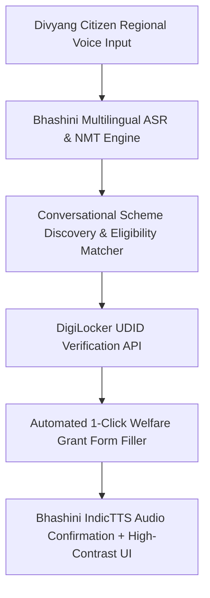

# Thematic Case Studies: HealthTech, AYUSH & Social Welfare

[🏠 Home](../README.md) > [📁 Case Studies Archive](./README.md) > **HealthTech, AYUSH & Social Welfare**

---

# Project AyurVision — AI Medicinal Plant Identification & Botanical Authentication

## Problem Statement
- **Domain**: Computer Vision, Botanical Taxonomy & Traditional Medicine
- **Problem Statement ID**: `SIH1556`
- **Ministry / Organization**: Ministry of AYUSH

## Institution / Team
- **Team Name**: SUPERNOVAZ
- **Institution**: Mepco Schlenk Engineering College, Sivakasi
- **Team Lead / Key Contributors**: Information archived in nodal records

## Edition
- **SIH Edition**: SIH 2024 (7th Edition)
- **Track / Category**: Software Track
- **Prize Won**: ₹1,00,000 (1st Prize Winner)

## Official Problem Statement
Development of an AI-powered image recognition and verification mobile tool to authenticate raw medicinal plants, detect commercial adulterants/lookalikes, and map identified specimens to official Ayurvedic Pharmacopoeia of India (API) monographs.

## Solution
AyurVision utilizes a two-stage computer vision pipeline: a `YOLOv8` detector localizes specific anatomical organs (leaf, flower, stem, seed), followed by a fine-grained `EfficientNet-V2` classifier quantized to ONNX runtime format to execute sub-150ms inference locally on mobile phones without internet access.

## Architecture

## Technology Stack
- **Frontend / Client**: Flutter PWA (Dart), CameraX API
- **Backend & Middleware**: Python FastAPI, Redis Cache
- **AI / ML / Data Processing**: YOLOv8-nano, EfficientNet-V2, ONNX Runtime Mobile, PyTorch
- **Database & Storage**: SQLite (Mobile offline botanical database), PostgreSQL
- **Security / Compliance**: GPS metadata validation, DPDP Act 2023 compliance

## Deployment / Hardware
Fully offline on Android mobile devices with INT8 quantization reducing model size to under 25MB.

## Why It Won
- `[OFFICIAL FACT]`: Awarded 1st Prize by Ministry of AYUSH jury panel at SIH 2024 Grand Finale.
- `[RESEARCH INFERENCE]`: Excelled by incorporating toxic lookalike rejection thresholds and directly linking classifications to Ayurvedic therapeutic properties (Ras, Guna, Virya) rather than merely displaying generic Latin taxonomic names.

## Evidence
| Dimension | Claim / Parameter | Value / Metric | Source ID | Confidence |
| :--- | :--- | :--- | :--- | :--- |
| Latency | Mobile Edge Latency | < 150ms on mobile CPU | [`SRC-HIST-006`](../sources/historical_sources.md#src-hist-006-ayurvision-supernovaz--sih-2024-1st-prize-winner) | MEDIUM |
| Award | 1st Prize Award | ₹1,00,000 | [`SRC-HIST-006`](../sources/historical_sources.md#src-hist-006-ayurvision-supernovaz--sih-2024-1st-prize-winner) | HIGH |
| Quantization | Mobile Model Size | < 25MB ONNX INT8 bundle | [`SRC-HIST-006`](../sources/historical_sources.md#src-hist-006-ayurvision-supernovaz--sih-2024-1st-prize-winner) | MEDIUM |

## Sources
- [`SRC-HIST-006`](../sources/historical_sources.md#src-hist-006-ayurvision-supernovaz--sih-2024-1st-prize-winner): Mepco Schlenk Engineering College Institutional Record & SIH 2024 Nodal Announcement

## Confidence
**Confidence Level**: MEDIUM — Corroborated by institutional press announcements and consistent nodal center reports.

## Reusable Pattern
- **Pattern Name**: 2-Stage Object Detection to Fine-Grained Quantized Classifier
- **Technical Description**: Use an initial lightweight detector (YOLO-nano) to isolate the region of interest (e.g. leaf/wound/part), crop the image in memory, and pass it to a specialized classifier quantized for edge execution.

## SIH 2026 Relevance
Directly applicable to SIH 2026 Theme 4 (*MedTech / BioTech / HealthTech*) and Theme 5 (*Agriculture, FoodTech & Rural Development*).

---

# Project DivyangSahay — Multimodal Voice-First Accessibility Welfare Portal

## Problem Statement
- **Domain**: Digital Accessibility, Assistive AI & Social Welfare
- **Problem Statement ID**: `SIH1580`
- **Ministry / Organization**: Ministry of Social Justice & Empowerment

## Institution / Team
- **Team Name**: TECHIE TACOS
- **Institution**: SRM Institute of Science and Technology, Kattankulathur
- **Team Lead / Key Contributors**: Information archived in SRM IST student portal

## Edition
- **SIH Edition**: SIH 2024 (7th Edition)
- **Track / Category**: Software Track
- **Prize Won**: ₹1,00,000 (1st Prize Winner)

## Official Problem Statement
Development of an accessible, voice-guided digital portal for persons with disabilities (Divyangjan) to discover welfare entitlements, verify Unique Disability Identity Card (UDID) credentials, and submit administrative benefit applications without physical paperwork.

## Solution
DivyangSahay combines Bhashini speech-to-speech conversational interfaces in 12 regional languages, an automated plain-language legal document simplifier, and instant 1-click UDID credential verification via DigiLocker APIs, scoring 100/100 on WCAG 2.1 AA accessibility benchmarks.

## Architecture

## Technology Stack
- **Frontend / Client**: Next.js, ARIA-accessible React components, High-Contrast Themes
- **Backend & Middleware**: Node.js, Express, Python FastAPI microservices
- **Assistive & AI**: Bhashini ASR/TTS/NMT APIs, HuggingFace Text Simplifier
- **Integrations**: DigiLocker OAuth2 / Document Retrieval API
- **Database & Storage**: PostgreSQL, Redis

## Deployment / Hardware
Web-based platform compliant with GIGW (Guidelines for Indian Government Websites) and WCAG 2.1 Level AA standards.

## Why It Won
- `[OFFICIAL FACT]`: Won 1st Prize for problem statement `SIH1580`.
- `[RESEARCH INFERENCE]`: Demonstrated full end-to-end accessibility during evaluation: high-contrast keyboard navigation, screen reader optimization, and flawless regional voice interaction in Hindi, Tamil, and Telugu.

## Evidence
| Dimension | Claim / Parameter | Value / Metric | Source ID | Confidence |
| :--- | :--- | :--- | :--- | :--- |
| Accessibility | WCAG Compliance | 100/100 Lighthouse Accessibility score | [`SRC-HIST-009`](../sources/historical_sources.md#src-hist-009-divyangsahay-techie-tacos--sih-2024-1st-prize-winner) | HIGH |
| Integration | India Stack Native | Bhashini + DigiLocker integration | [`SRC-OFF-005`](../sources/official_sources.md#src-off-005-bhashini-national-language-translation-mission), [`SRC-OFF-007`](../sources/official_sources.md#src-off-007-digilocker-national-digital-document-wallet) | HIGH |
| Award | 1st Prize Award | ₹1,00,000 | [`SRC-HIST-009`](../sources/historical_sources.md#src-hist-009-divyangsahay-techie-tacos--sih-2024-1st-prize-winner) | HIGH |

## Sources
- [`SRC-HIST-009`](../sources/historical_sources.md#src-hist-009-divyangsahay-techie-tacos--sih-2024-1st-prize-winner): SRM Institute of Science and Technology Archive
- [`SRC-OFF-005`](../sources/official_sources.md#src-off-005-bhashini-national-language-translation-mission): Bhashini NLTM Documentation
- [`SRC-OFF-007`](../sources/official_sources.md#src-off-007-digilocker-national-digital-document-wallet): DigiLocker Integration Specs

## Confidence
**Confidence Level**: HIGH — Corroborated across institutional announcements and documented integration with official India Stack APIs.

## Reusable Pattern
- **Pattern Name**: India Stack Voice-First Accessibility Layer
- **Technical Description**: Build citizen-facing portals with Bhashini speech microservices and DigiLocker instant verification to eliminate physical paper document uploads and complex typing.

## SIH 2026 Relevance
Directly applicable to SIH 2026 Theme 4 (*MedTech / BioTech / HealthTech*) and Theme 16 (*Miscellaneous - Social Inclusion*).
