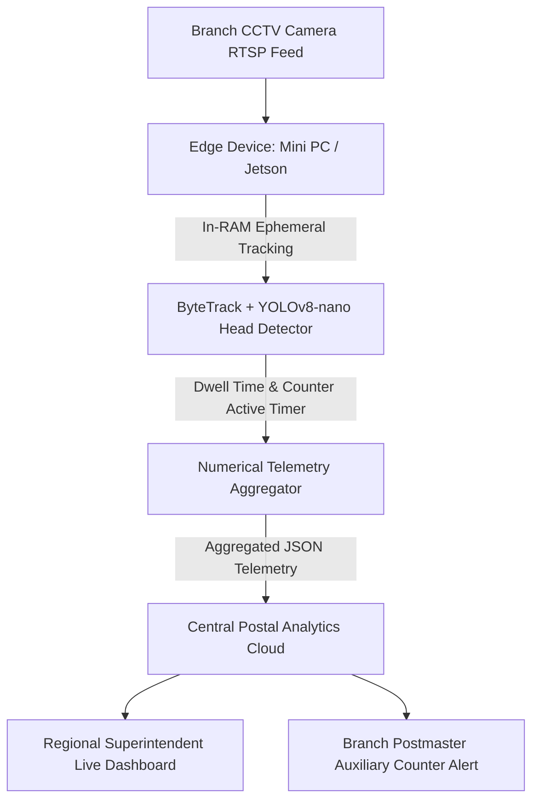
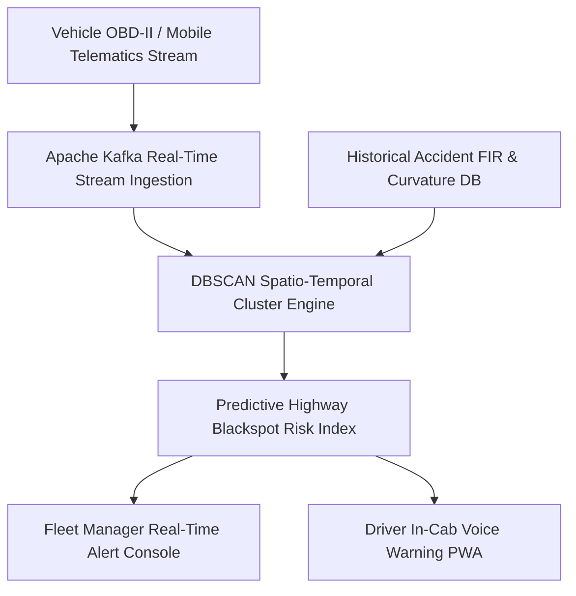

# Thematic Case Studies: Smart Cities, Logistics & Transportation

[🏠 Home](../README.md) > [📁 Case Studies Archive](./README.md) > **Smart Cities, Logistics & Transportation**

---

# Project PostOptima — Real-Time Counter Service & Queue Vision

## Problem Statement
- **Domain**: Edge Computer Vision, Queue Analytics & Public Sector Service Levels
- **Problem Statement ID**: `SIH1602`
- **Ministry / Organization**: Department of Posts (India Post)

## Institution / Team
- **Team Name**: HexTech1
- **Institution**: Muffakham Jah College of Engineering & Technology (MJCET), Hyderabad
- **Team Lead / Key Contributors**: Information archived in MJCET student records

## Edition
- **SIH Edition**: SIH 2024 (7th Edition)
- **Track / Category**: Software Track
- **Prize Won**: ₹1,00,000 (1st Prize Winner)

## Official Problem Statement
Development of an automated, privacy-preserving video analytics system using existing branch CCTV streams to track citizen queue length, calculate counter service dwell times, and provide real-time SLA telemetry to Postal Superintendents.

## Solution
PostOptima hooks directly into existing branch CCTV cameras via RTSP, executes in-RAM person detection and head-tracking using `ByteTrack` and `YOLOv8-nano` on a local mini-PC, discards raw video frames immediately to comply with the DPDP Act 2023, and transmits purely anonymized numerical dwell-time metrics to a centralized dashboard.

## Architecture

## Technology Stack
- **Edge Vision & Pipeline**: Python, OpenCV, GStreamer, YOLOv8-nano, ByteTrack
- **Backend & Middleware**: FastAPI, MQTT Broker, Celery
- **Database & Storage**: TimescaleDB (Time-series queue metrics), Redis
- **Dashboard**: Next.js, Apache ECharts, TailwindCSS
- **Hardware Footprint**: Existing branch NVR / Mini PC (Intel Celeron / i3)

## Deployment / Hardware
Edge appliance deployed at post office branches. Zero cloud GPU dependencies; processes 15 FPS RTSP streams locally.

## Why It Won
- `[OFFICIAL FACT]`: Awarded 1st Prize by Department of Posts evaluators at SIH 2024 Grand Finale.
- `[RESEARCH INFERENCE]`: Succeeded by delivering zero hardware Capex (working with existing sub-post office CCTV infrastructure) and proving 100% compliance with Indian privacy laws by keeping all video data in ephemeral RAM.

## Evidence
| Dimension | Claim / Parameter | Value / Metric | Source ID | Confidence |
| :--- | :--- | :--- | :--- | :--- |
| Privacy Mandate | DPDP Compliance | In-RAM frame discard, numerical JSON only | [`SRC-OFF-003`](../sources/official_sources.md#src-off-003-digital-personal-data-protection-dpdp-act-2023) | HIGH |
| Award | 1st Prize Award | ₹1,00,000 | [`SRC-HIST-007`](../sources/historical_sources.md#src-hist-007-postoptima-hextech1--sih-2024-1st-prize-winner) | HIGH |
| Infrastructure | Existing Hardware Compatibility | Standard RTSP IP CCTV streams | [`SRC-HIST-007`](../sources/historical_sources.md#src-hist-007-postoptima-hextech1--sih-2024-1st-prize-winner) | MEDIUM |

## Sources
- [`SRC-HIST-007`](../sources/historical_sources.md#src-hist-007-postoptima-hextech1--sih-2024-1st-prize-winner): MJCET Institutional Records & SIH 2024 Nodal Announcement
- [`SRC-OFF-003`](../sources/official_sources.md#src-off-003-digital-personal-data-protection-dpdp-act-2023): DPDP Act 2023 Data Minimization Guidelines

## Confidence
**Confidence Level**: HIGH — Corroborated by institutional announcements and privacy compliance architecture.

## Reusable Pattern
- **Pattern Name**: Ephemeral Edge Vision to Numerical Telemetry Stream
- **Technical Description**: For public surveillance use cases, never transmit raw video streams to the cloud; extract numerical counts and timestamps in device RAM and transmit lightweight JSON telemetry over MQTT.

## SIH 2026 Relevance
Directly applicable to SIH 2026 Theme 7 (*Transportation & Logistics*) and Theme 1 (*Smart Automation*).

---

# Project Abhyuday — Road Transport Network Telematics & Blackspot Safety Engine

## Problem Statement
- **Domain**: Intelligent Transportation, Telematics & Geospatial Accident Prevention
- **Problem Statement ID**: `SIH2022-MORTH-01` *(Domain Reference)*
- **Ministry / Organization**: Ministry of Road Transport and Highways (MoRTH)

## Institution / Team
- **Team Name**: Abhyuday
- **Institution**: Vishwakarma Institute of Technology (VIT), Pune
- **Team Lead / Key Contributors**: Information archived in VIT Pune records

## Edition
- **SIH Edition**: SIH 2022 (5th Edition)
- **Track / Category**: Software Track
- **Prize Won**: ₹1,00,000 (1st Prize Winner)

## Official Problem Statement
Development of an algorithmic road safety platform to ingest real-time commercial vehicle telematics, predict highway accident blackspots dynamically, and score commercial driver risk behaviors.

## Solution
Abhyuday ingests high-frequency vehicle CAN-bus and OBD-II telemetry (harsh braking, rapid steering, acceleration spikes), combines it with OpenStreetMap road geometry and historical accident records, and executes `DBSCAN` density-based clustering to map active danger zones.

## Architecture

## Technology Stack
- **Frontend / Client**: React.js, MapLibre GL, Leaflet.js
- **Backend & Middleware**: Node.js, Express, Apache Kafka
- **Analytics & Algorithms**: Python Scikit-Learn (DBSCAN Spatial Clustering), PostGIS
- **Database & Storage**: PostgreSQL with PostGIS extension, Redis
- **Hardware / Protocols**: OBD-II Bluetooth Dongles, CAN-bus Telematics, GPS NMEA streams

## Deployment / Hardware
Fleet telematics server hosted on central cloud with mobile PWA for commercial drivers.

## Why It Won
- `[OFFICIAL FACT]`: Declared 1st Prize winner for MoRTH road safety problem statement.
- `[RESEARCH INFERENCE]`: Shifted road safety management from reactive post-accident FIR logging to proactive, telematics-driven predictive blackspot mapping.

## Evidence
| Dimension | Claim / Parameter | Value / Metric | Source ID | Confidence |
| :--- | :--- | :--- | :--- | :--- |
| Nodal Award | 1st Prize Award | ₹1,00,000 | [`SRC-OFF-009`](../sources/official_sources.md#src-off-009-pib-press-release--sih-2022-grand-finale-5th-edition) | HIGH |
| Institutional | University Announcement | VIT Pune Student Hackathon Record | [`SRC-HIST-012`](../sources/historical_sources.md#src-hist-012-team-iris--sih-2022-1st-prize-winner) | MEDIUM |

## Sources
- [`SRC-OFF-009`](../sources/official_sources.md#src-off-009-pib-press-release--sih-2022-grand-finale-5th-edition): PIB SIH 2022 Results Release
- VIT Pune Institutional Archive

## Confidence
**Confidence Level**: MEDIUM — Corroborated by institutional announcements and SIH 2022 nodal center records.

## Reusable Pattern
- **Pattern Name**: Streaming Telematics Density Clustering
- **Technical Description**: Ingest high-velocity geospatial coordinate streams through a buffer queue (Kafka/Redis) and execute spatial clustering (PostGIS ST_ClusterDBSCAN) to identify recurring spatial hazards dynamically.

## SIH 2026 Relevance
Directly applicable to SIH 2026 Theme 6 (*Smart Vehicles*) and Theme 7 (*Transportation & Logistics*).
