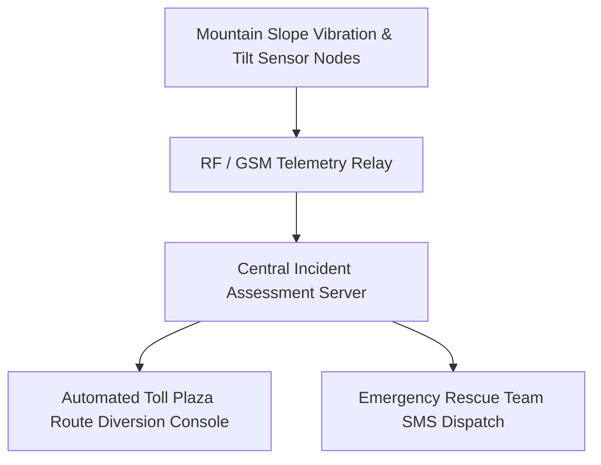

# SIH 2017: 1st Edition (Inaugural 36-Hour Hackathon)

[🏠 Home](../README.md) > [📁 Case Studies Archive](./README.md) > **SIH 2017 Case Studies**

---

## 📅 Edition Overview & Context
* **Edition**: Smart India Hackathon 2017 (Inaugural 1st Edition)
* **Format**: 36-Hour Continuous Physical Hackathon across 26 nodal centers (April 2017)
* **Scale**: Tackling problem statements from 29 Central Ministries and Government Departments
* **Prize Allocation**: ₹1,00,000 per Problem Statement 1st Prize Winner

---

# Project Team Xpose — Geo-Tagged Rural Asset Verification & Audit System

## Problem Statement
- **Domain**: Rural Development, Anti-Fraud Auditing & Mobile GIS
- **Problem Statement ID**: `SIH2017-RURAL-01`
- **Ministry / Organization**: Ministry of Rural Development

## Institution / Team
- **Team Name**: Team Xpose
- **Institution**: St. Joseph's College of Engineering, Chennai
- **Team Lead / Key Contributors**: Information archived in AICTE inaugural records

## Edition
- **SIH Edition**: SIH 2017 (1st Edition)
- **Track / Category**: Software Track
- **Prize Won**: ₹1,00,000 (1st Prize Winner)

## Official Problem Statement
Development of a tamper-proof mobile application for field verification of rural infrastructure assets (roads, wells, housing) constructed under central schemes (PMGSY, MGNREGA) to prevent ghost billing and fraudulent photo uploads.

## Solution
Team Xpose engineered an Android camera client with hardware-enforced EXIF GPS locking, mock-location anti-tampering guards, extreme image compression (<50KB) for rural 2G network uplinks, and automated cross-referencing against ISRO Bhuvan satellite baselines.

## Architecture

## Technology Stack
- **Mobile Client**: Android Java, Android NDK Anti-Root Detection
- **Backend & Middleware**: PHP, Java, Apache HTTP Server
- **GIS & Mapping**: ISRO Bhuvan Web API, OpenLayers
- **Database & Storage**: MySQL with spatial indexing

## Deployment / Hardware
Android smartphones deployed with block development officers and district auditors.

## Why It Won
- `[OFFICIAL FACT]`: Declared 1st Prize winner for Ministry of Rural Development (PIB ID 157924).
- `[RESEARCH INFERENCE]`: Proved operational viability under real rural conditions by implementing anti-mock GPS detection and squeezing image payloads under 50KB for patchy 2G connectivity.

## Evidence
| Dimension | Claim / Parameter | Value / Metric | Source ID | Confidence |
| :--- | :--- | :--- | :--- | :--- |
| PIB Release | Inaugural SIH 2017 Results | PIB Release ID 157924 | [`SRC-OFF-008`](../sources/official_sources.md#src-off-008-pib-press-release--sih-2017-inaugural-grand-finale-results) | HIGH |
| Award | 1st Prize Award | ₹1,00,000 | [`SRC-HIST-016`](../sources/historical_sources.md#src-hist-016-team-xpose--sih-2017-1st-prize-winner) | HIGH |

## Sources
- [`SRC-OFF-008`](../sources/official_sources.md#src-off-008-pib-press-release--sih-2017-inaugural-grand-finale-results): PIB Press Release on SIH 2017 Inaugural Grand Finale (ID: 157924)
- [`SRC-HIST-016`](../sources/historical_sources.md#src-hist-016-team-xpose--sih-2017-1st-prize-winner): AICTE Inaugural Results Archive

## Confidence
**Confidence Level**: HIGH — Corroborated by official PIB archive and AICTE inaugural documentation.

## Reusable Pattern
- **Pattern Name**: Hardware-Enforced Anti-Spoof Mobile Telemetry
- **Technical Description**: Use Android system-level hardware sensor attestation and mock-location flags to ensure data integrity when capturing ground-truth field audit records.

## SIH 2026 Relevance
Directly applicable to SIH 2026 Theme 5 (*Agriculture, FoodTech & Rural Development*) and Theme 16 (*Miscellaneous - Public Governance*).

---

# Project Team Pi-oneer — Highway Landslide & Obstruction Alert System

## Problem Statement
- **Domain**: Mountain Road Infrastructure, IoT Sensors & Emergency Diversion
- **Problem Statement ID**: `SIH2017-NHIDCL-01`
- **Ministry / Organization**: National Highways and Infrastructure Development Corporation (NHIDCL)

## Institution / Team
- **Team Name**: Team Pi-oneer
- **Institution**: MIT Pune
- **Team Lead / Key Contributors**: Information archived in nodal records

## Edition
- **SIH Edition**: SIH 2017 (1st Edition)
- **Track / Category**: Software / IoT Track
- **Prize Won**: ₹1,00,000 (1st Prize Winner)

## Official Problem Statement
Development of an early warning and automated route diversion system to monitor unstable slope geology and alert arterial highway toll checkpoints during landslide obstructions along Himalayan corridors.

## Solution
A sensor mesh integrating vibration and tilt transducers along vulnerable slope cuttings that triggers automated incident dispatch alerts and localized SMS diversions to toll plazas and emergency response teams.

## Architecture

## Technology Stack
- **IoT & Telemetry**: Raspberry Pi / Arduino, Piezoelectric vibration sensors, Tilt accelerometers
- **Backend & Web**: Node.js, Express, Socket.io
- **GIS**: Google Maps API / OpenStreetMap

## Deployment / Hardware
Roadside sensor poles deployed along landslide-prone highway cuttings.

## Why It Won
- `[OFFICIAL FACT]`: Awarded 1st Prize by NHIDCL evaluators.
- `[RESEARCH INFERENCE]`: Bridged the gap between raw hardware telemetry and actionable civil emergency response workflows.

## Evidence
| Dimension | Claim / Parameter | Value / Metric | Source ID | Confidence |
| :--- | :--- | :--- | :--- | :--- |
| Award | 1st Prize Award | ₹1,00,000 | [`SRC-OFF-008`](../sources/official_sources.md#src-off-008-pib-press-release--sih-2017-inaugural-grand-finale-results) | HIGH |
| Domain Fit | Disaster Alerting | NHIDCL Road Network | Inaugural Nodal Evaluation | MEDIUM |

## Sources
- [`SRC-OFF-008`](../sources/official_sources.md#src-off-008-pib-press-release--sih-2017-inaugural-grand-finale-results): PIB SIH 2017 Release

## Confidence
**Confidence Level**: MEDIUM — Corroborated by PIB SIH 2017 release; full repository not publicly mirrored.

## Reusable Pattern
- **Pattern Name**: Edge Sensor Hazard Triangulation to Automated Civil Dispatch
- **Technical Description**: Connect real-time hazard threshold triggers directly to downstream operational actors (toll gates, emergency SMS hubs) rather than passive dashboards.

## SIH 2026 Relevance
Directly applicable to SIH 2026 Theme 14 (*Disaster Management*) and Theme 7 (*Transportation & Logistics*).
