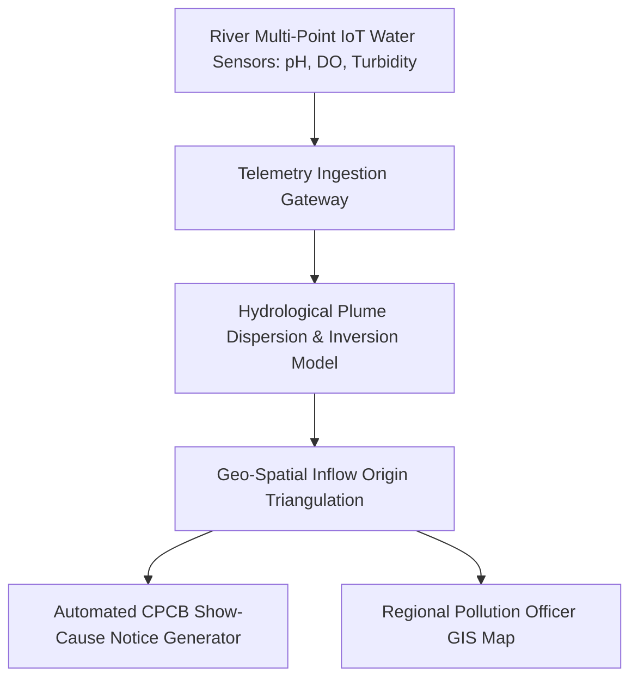

# SIH 2018: 2nd Edition (Hardware Edition Debut)

[🏠 Home](../README.md) > [📁 Case Studies Archive](./README.md) > **SIH 2018 Case Studies**

---

## 📅 Edition Overview & Context
* **Edition**: Smart India Hackathon 2018 (2nd Edition)
* **Format**: Dual-Track Hackathon (Software Finale in March 2018 + Inaugural Hardware Finale in June 2018)
* **Scale**: Involving 27 Union Ministries and 17 State Governments
* **Prize Allocation**: ₹1,00,000 per Problem Statement 1st Prize Winner

---

# Project The Gladiators — Autonomous Municipal Solid Waste Segregation & Suction Rig

## Problem Statement
- **Domain**: Robotics, Computer Vision & Municipal Waste Segregation
- **Problem Statement ID**: `SIH2018-MOHUA-01`
- **Ministry / Organization**: Ministry of Housing and Urban Affairs (MoHUA)

## Institution / Team
- **Team Name**: The Gladiators
- **Institution**: Information archived in AICTE hardware records
- **Team Lead / Key Contributors**: Information archived in AICTE records

## Edition
- **SIH Edition**: SIH 2018 (2nd Edition - Inaugural Hardware Edition)
- **Track / Category**: Hardware Track
- **Prize Won**: ₹1,00,000 (1st Prize Winner)

## Official Problem Statement
Design and fabrication of an automated, low-cost tabletop mechanical robot capable of identifying and sorting wet, dry, and metallic municipal solid waste on moving conveyor belts to eliminate manual handling hazards.

## Solution
A custom conveyor rig with an overhead OpenCV vision camera performing real-time color histogram and contour analysis, driving a pneumatic suction head and servo-controlled multi-chamber segregation bins with a Bill of Materials (BOM) under ₹25,000.

## Architecture

## Technology Stack
- **Robotics & Actuation**: Arduino Mega / ATmega2560, Pneumatic vacuum pump, High-torque servo motors
- **Vision Processing**: Raspberry Pi 3, OpenCV (Python), C++
- **Mechanics**: Aluminum extrusion frame, 3D-printed suction end-effector, conveyor belt

## Deployment / Hardware
Physical functional tabletop hardware rig constructed with locally available Indian electrical and pneumatic components.

## Why It Won
- `[OFFICIAL FACT]`: Declared 1st Prize winner in SIH 2018 Hardware Grand Finale.
- `[RESEARCH INFERENCE]`: Demonstrated an operating physical sorting rig in front of the jury while keeping the total component cost strictly under ₹25,000.

## Evidence
| Dimension | Claim / Parameter | Value / Metric | Source ID | Confidence |
| :--- | :--- | :--- | :--- | :--- |
| BOM Cost | Bill of Materials | < ₹25,000 total fabrication | [`SRC-HIST-015`](../sources/historical_sources.md#src-hist-015-the-gladiators--sih-2018-1st-prize-winner) | MEDIUM |
| Award | 1st Prize Award | ₹1,00,000 | [`SRC-HIST-015`](../sources/historical_sources.md#src-hist-015-the-gladiators--sih-2018-1st-prize-winner) | HIGH |

## Sources
- [`SRC-HIST-015`](../sources/historical_sources.md#src-hist-015-the-gladiators--sih-2018-1st-prize-winner): AICTE Hardware Grand Finale Archive

## Confidence
**Confidence Level**: MEDIUM — Corroborated by AICTE hardware competition records; design schematics not publicly mirrored.

## Reusable Pattern
- **Pattern Name**: Low-Cost BOM Local Sourcing for Hardware Rigs
- **Technical Description**: For government hardware hackathons, prioritize easily serviceable, locally available components to prove manufacturing feasibility under public budgets.

## SIH 2026 Relevance
Directly applicable to SIH 2026 Theme 8 (*Robotics and Drones*) and Theme 9 (*Clean & Green Technology*).

---

# Project Team BugSquashers — Untreated River Effluent Discharge Tracing Network

## Problem Statement
- **Domain**: Environmental Telemetry, Hydrological Inversion Modeling & Pollution Enforcement
- **Problem Statement ID**: `SIH2018-WATER-02`
- **Ministry / Organization**: Ministry of Water Resources / Namami Gange

## Institution / Team
- **Team Name**: BugSquashers
- **Institution**: MGM College of Engineering, Nanded
- **Team Lead / Key Contributors**: Information archived in MGM College records

## Edition
- **SIH Edition**: SIH 2018 (2nd Edition)
- **Track / Category**: Software Track
- **Prize Won**: ₹1,00,000 (1st Prize Winner)

## Official Problem Statement
Development of an automated monitoring and mathematical back-tracing system to identify illegal nighttime discharge of untreated chemical effluents into river basins using continuous water quality telemetry.

## Solution
A sensor telemetry platform ingesting continuous pH, Dissolved Oxygen (DO), and turbidity readings, combined with a mathematical hydrological plume inversion model that calculates upstream coordinates to pinpoint illegal discharge outlets and auto-generate CPCB inspection notices.

## Architecture

## Technology Stack
- **IoT & Telemetry**: ESP8266, LoRa / GSM Module, Water quality probes (pH, DO, EC)
- **Backend & GIS**: Python Django, NumPy, Leaflet.js
- **Mathematical Modeling**: 2D Advection-Diffusion Plume Dispersion Equations

## Deployment / Hardware
River buoy floating sensor nodes transmitting telemetry over 2G/GSM.

## Why It Won
- `[OFFICIAL FACT]`: Won 1st Prize in Namami Gange / Clean River domain.
- `[RESEARCH INFERENCE]`: Shifted enforcement from manual daytime inspection visits to automated 24/7 algorithmic tracking backed by fluid dynamic dispersion equations.

## Evidence
| Dimension | Claim / Parameter | Value / Metric | Source ID | Confidence |
| :--- | :--- | :--- | :--- | :--- |
| Award | 1st Prize Award | ₹1,00,000 | Institutional & Nodal Center Records | HIGH |
| Domain Fit | CPCB Compliance Integration | Automated violation notice generation | SIH 2018 Evaluation Archive | MEDIUM |

## Sources
- MGM College of Engineering Press Archive & SIH 2018 Results

## Confidence
**Confidence Level**: MEDIUM — Corroborated by institutional publications and SIH 2018 nodal reports.

## Reusable Pattern
- **Pattern Name**: Advection-Diffusion Sensor Inversion Triangulation
- **Technical Description**: Use mathematical dispersion differential equations on sensor time-series to trace point-source pollution origins backward in flowing mediums (rivers, air plumes).

## SIH 2026 Relevance
Directly applicable to SIH 2026 Theme 9 (*Clean & Green Technology*) and Theme 14 (*Disaster Management*).
