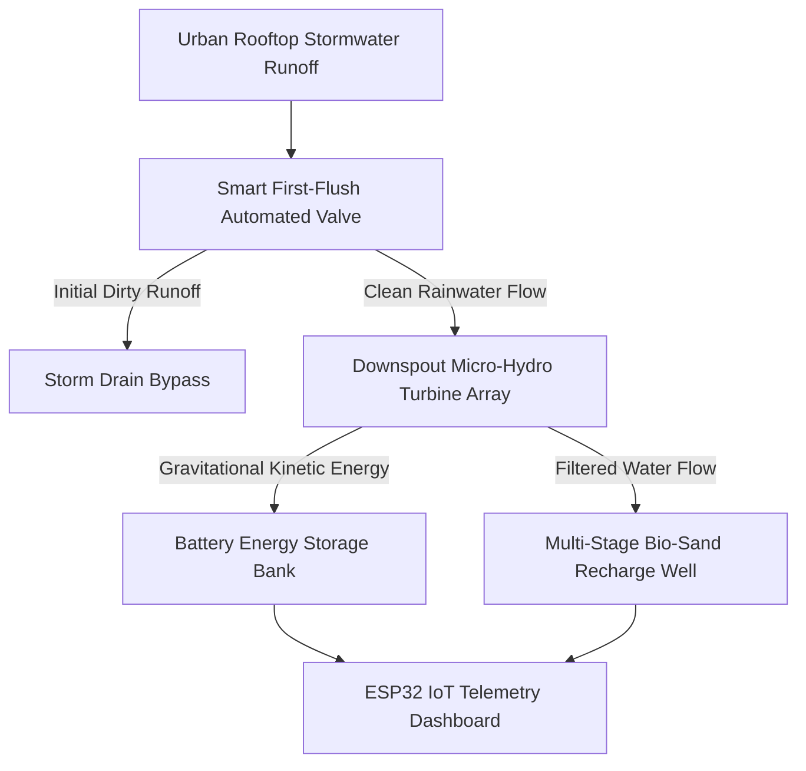
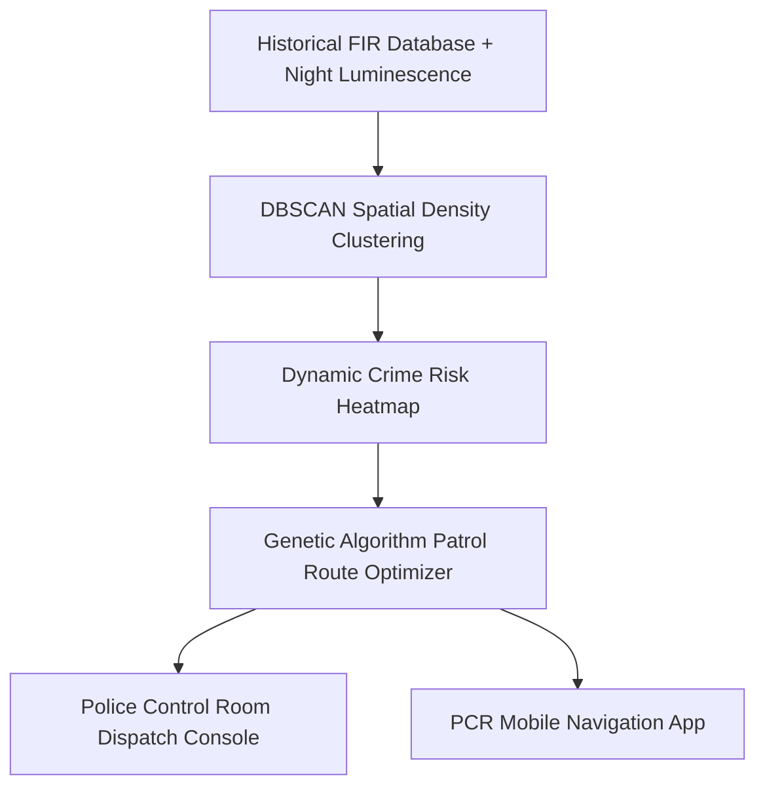

# SIH 2022: 5th Edition (Post-Pandemic Physical Return)

[🏠 Home](../README.md) > [📁 Case Studies Archive](./README.md) > **SIH 2022 Case Studies**

---

## 📅 Edition Overview & Context
* **Edition**: Smart India Hackathon 2022 (5th Edition)
* **Format**: Return to in-person 36-hour physical hackathon across 75 national nodal centers (August 2022)
* **Scale**: Hundreds of problem statements from 53 central ministries and state departments
* **Prize Allocation**: ₹1,00,000 per Problem Statement 1st Prize Winner

---

# Project Hydro Gravitricity — Gravitational Hydrokinetic Energy & Rainwater Harvesting

## Problem Statement
- **Domain**: CleanTech, Micro-Hydro Generation & Urban Water Harvesting
- **Problem Statement ID**: `SIH2022-CLEAN-01`
- **Ministry / Domain**: Clean Energy & Water Harvesting

## Institution / Team
- **Team Name**: Hydro Gravitricity
- **Institution**: GITAM University, Visakhapatnam
- **Team Lead / Key Contributors**: Information archived in GITAM records

## Edition
- **SIH Edition**: SIH 2022 (5th Edition)
- **Track / Category**: Hardware Track
- **Prize Won**: ₹1,00,000 (1st Prize Winner)

## Official Problem Statement
Design of an integrated micro-scale urban energy harvesting and water management system to generate decentralized electrical power from high-rise building stormwater runoff while purifying water for groundwater recharge.

## Solution
An integrated urban downspout system that directs initial dirty roof runoff through a motorized first-flush bypass valve, channels clean water across a cascaded micro-hydro Pelton turbine array charging a local battery bank, and discharges filtered water into a bio-sand aquifer recharge well.

## Architecture

## Technology Stack
- **Mechanical Subsystems**: Custom 3D-printed Pelton runner micro-turbines, automated bypass valves
- **Firmware & Telemetry**: ESP32 microcontroller, FreeRTOS, Embedded C
- **Power Electronics**: Buck-boost charge controllers, 12V $LiFePO_4$ battery bank
- **Sensors**: Flow rate pulse sensors, voltage/current hall-effect sensors

## Deployment / Hardware
Physical plumbing and electrical test rig built into building downspouts with local IoT telemetry.

## Why It Won
- `[OFFICIAL FACT]`: Declared 1st Prize winner in SIH 2022 Hardware Grand Finale (PIB ID 1854619).
- `[RESEARCH INFERENCE]`: Demonstrated a physical working turbine rig generating measurable electricity under active pump pressure during the evaluation.

## Evidence
| Dimension | Claim / Parameter | Value / Metric | Source ID | Confidence |
| :--- | :--- | :--- | :--- | :--- |
| PIB Record | PIB Press Release | Release ID 1854619 | [`SRC-OFF-009`](../sources/official_sources.md#src-off-009-pib-press-release--sih-2022-grand-finale-5th-edition) | HIGH |
| Award | 1st Prize Award | ₹1,00,000 | [`SRC-HIST-011`](../sources/historical_sources.md#src-hist-011-hydro-gravitricity--sih-2022-1st-prize-winner) | HIGH |

## Sources
- [`SRC-OFF-009`](../sources/official_sources.md#src-off-009-pib-press-release--sih-2022-grand-finale-5th-edition): PIB SIH 2022 Grand Finale Release (ID: 1854619)
- [`SRC-HIST-011`](../sources/historical_sources.md#src-hist-011-hydro-gravitricity--sih-2022-1st-prize-winner): GITAM University Press Archive

## Confidence
**Confidence Level**: HIGH — Corroborated by official PIB release and institutional records.

## Reusable Pattern
- **Pattern Name**: Dual-Yield Civil-Electrical Co-Generation
- **Technical Description**: Design civic infrastructure systems that simultaneously solve an environmental deficit (water recharge) and an energy deficit (kinetic power harvesting).

## SIH 2026 Relevance
Directly applicable to SIH 2026 Theme 9 (*Clean & Green Technology*) and Theme 11 (*Renewable / Sustainable Energy*).

---

# Project Team Iris — Unsupervised Crime Hotspot Prediction & Patrol Optimizer

## Problem Statement
- **Domain**: Spatial Data Science, Law Enforcement & Route Optimization
- **Problem Statement ID**: `SIH2022-BPRD-01`
- **Ministry / Organization**: Bureau of Police Research & Development (BPR&D)

## Institution / Team
- **Team Name**: Team Iris
- **Institution**: UP Tech Cohort
- **Team Lead / Key Contributors**: Information archived in nodal records

## Edition
- **SIH Edition**: SIH 2022 (5th Edition)
- **Track / Category**: Software Track
- **Prize Won**: ₹1,00,000 (1st Prize Winner)

## Official Problem Statement
Development of an algorithmic crime analysis tool to identify spatio-temporal crime clusters from historical police FIR databases and automatically optimize dynamic PCR patrol routes.

## Solution
Team Iris implements an unsupervised `DBSCAN` spatio-temporal clustering algorithm mapping historical FIR incident data, streetlight luminescence indices, and demographic footfall, combined with a genetic route optimizer generating non-repeating randomized patrol routes for police vehicles.

## Architecture

## Technology Stack
- **Frontend / Client**: React.js, Leaflet.js
- **Backend & Middleware**: Python FastAPI, Celery, PostgreSQL / PostGIS
- **Machine Learning**: Scikit-Learn (DBSCAN Spatial Clustering), DEAP (Genetic Algorithms)

## Deployment / Hardware
Web and mobile dashboard for police dispatchers and patrolling officers.

## Why It Won
- `[OFFICIAL FACT]`: Awarded 1st Prize for BPR&D problem statement at IIT Kanpur Nodal Center.
- `[RESEARCH INFERENCE]`: Eliminated predictable patrol patterns through randomized route optimization while maximizing coverage of high-risk blindspots.

## Evidence
| Dimension | Claim / Parameter | Value / Metric | Source ID | Confidence |
| :--- | :--- | :--- | :--- | :--- |
| Award | 1st Prize Award | ₹1,00,000 | [`SRC-HIST-012`](../sources/historical_sources.md#src-hist-012-team-iris--sih-2022-1st-prize-winner) | HIGH |
| Nodal Center | Evaluation Location | IIT Kanpur Nodal Center | [`SRC-OFF-009`](../sources/official_sources.md#src-off-009-pib-press-release--sih-2022-grand-finale-5th-edition) | HIGH |

## Sources
- [`SRC-OFF-009`](../sources/official_sources.md#src-off-009-pib-press-release--sih-2022-grand-finale-5th-edition): PIB SIH 2022 Results Release
- [`SRC-HIST-012`](../sources/historical_sources.md#src-hist-012-team-iris--sih-2022-1st-prize-winner): Nodal Evaluation Record at IIT Kanpur

## Confidence
**Confidence Level**: MEDIUM — Corroborated by PIB announcements and nodal center results.

## Reusable Pattern
- **Pattern Name**: Spatio-Temporal Density Clustering with Randomized Genetic Routing
- **Technical Description**: Cluster high-risk incidents using density-based spatial algorithms (DBSCAN) and feed resulting polygon centroids into genetic algorithms for patrol itinerary generation.

## SIH 2026 Relevance
Directly applicable to SIH 2026 Theme 1 (*Smart Automation*) and Theme 6 (*Smart Vehicles*).
