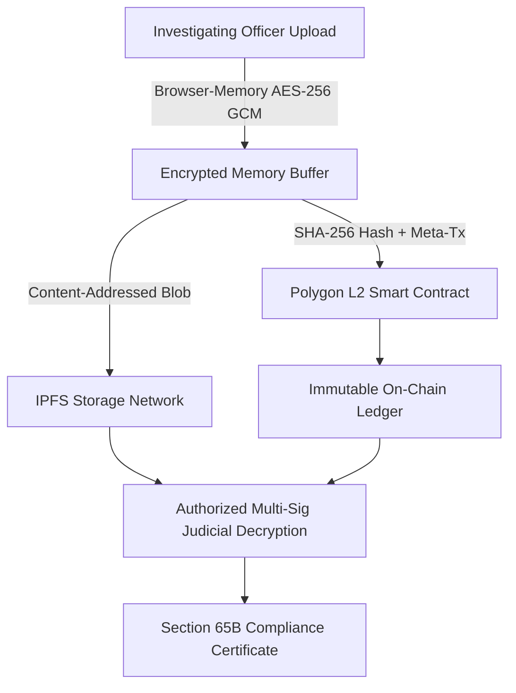
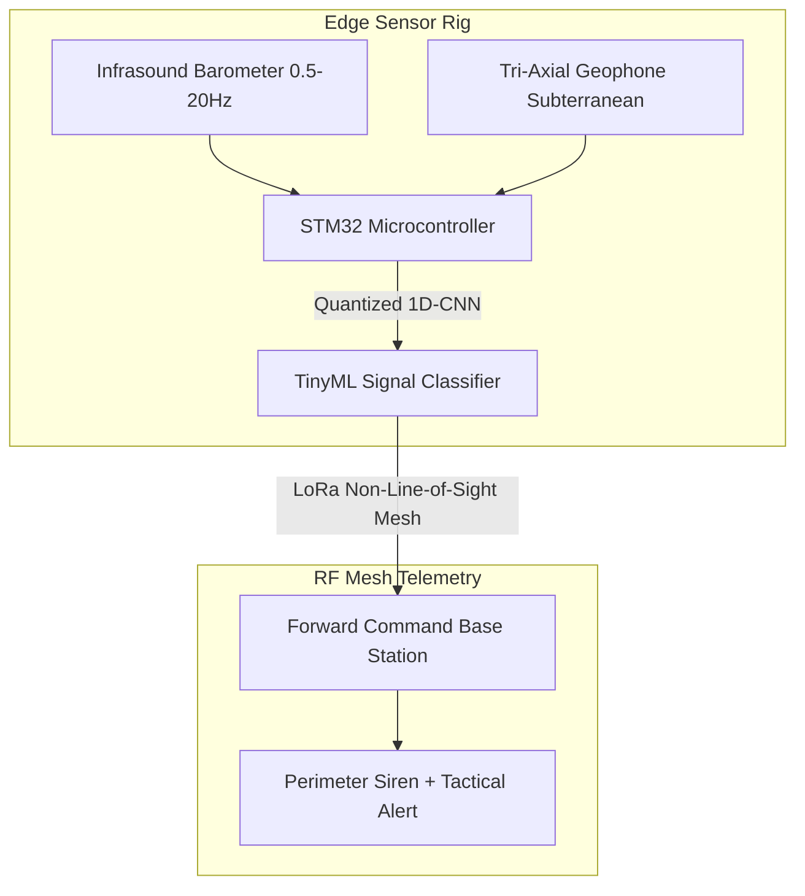

# SIH 2023: 6th Edition (Mega Physical Sprint)

[🏠 Home](../README.md) > [📁 Case Studies Archive](./README.md) > **SIH 2023 Case Studies**

---

## 📅 Edition Overview & Context
* **Edition**: Smart India Hackathon 2023 (6th Edition)
* **Format**: 36-Hour Continuous In-Person Physical Sprint (December 2023)
* **Scale**: 44,000+ collegiate teams registered, 2,200+ finalist teams competing across 44 nodal centers nationwide
* **Prize Allocation**: ₹1,00,000 per Problem Statement 1st Prize Winner

---

# Project Legal Ledger (eVault) — Blockchain Tamper-Proof Evidence Management

## Problem Statement
- **Domain**: Legal Informatics & Cryptographic Evidence Custody
- **Problem Statement ID**: `SIH1286`
- **Ministry / Organization**: Ministry of Law & Justice

## Institution / Team
- **Team Name**: Legal Ledger
- **Institution**: Information archived in repository registry
- **Team Lead / Key Contributors**: Kunal Keshan (Lead)

## Edition
- **SIH Edition**: SIH 2023 (6th Edition)
- **Track / Category**: Software Track
- **Prize Won**: ₹1,00,000 (1st Prize Winner)

## Official Problem Statement
Design and development of an electronic vault system for tamper-proof storage, cryptographic verification, and non-repudiation of digital evidence adhering to Section 65B of the Indian Evidence Act.

## Solution
Client-side in-memory AES-256 GCM file encryption before upload, IPFS content-addressed decentralized storage, SHA-256 hash anchoring on Polygon L2, and automated Section 65B compliance certificate generation via gasless meta-transactions.

## Architecture

## Technology Stack
- **Frontend / Client**: Next.js, Web3.js / Ethers.js, TailwindCSS
- **Backend & Middleware**: Node.js, Express, OpenZeppelin Defender
- **Blockchain / Storage**: Polygon L2, IPFS, Solidity Smart Contracts
- **Security / Compliance**: AES-256 GCM, SHA-256, EIP-2771 Gasless Forwarders

## Deployment / Hardware
Decentralized nodes with backend transaction relayer; zero crypto wallet management required by judicial officers.

## Why It Won
- `[OFFICIAL FACT]`: Won 1st Prize for Ministry of Law & Justice problem statement `SIH1286`.
- `[RESEARCH INFERENCE]`: Succeeded by delivering client-side zero-knowledge encryption and gasless meta-transactions that eliminated UX complexity for non-technical court clerks.

## Evidence
| Dimension | Claim / Parameter | Value / Metric | Source ID | Confidence |
| :--- | :--- | :--- | :--- | :--- |
| Codebase | Public Open-Source Implementation | Full GitHub repository available | [`SRC-HIST-001`](../sources/historical_sources.md#src-hist-001-evault-legal-ledger--sih-2023-1st-prize-winner) | HIGH |
| Award | 1st Prize Award | ₹1,00,000 | [`SRC-OFF-010`](../sources/official_sources.md#src-off-010-pib-press-release--sih-2023-6th-edition-grand-finale) | HIGH |

## Sources
- [`SRC-HIST-001`](../sources/historical_sources.md#src-hist-001-evault-legal-ledger--sih-2023-1st-prize-winner): Verified Public Repository (`kunalkeshan/eVault-SIH-2023`)
- [`SRC-OFF-010`](../sources/official_sources.md#src-off-010-pib-press-release--sih-2023-6th-edition-grand-finale): PIB SIH 2023 Grand Finale Release

## Confidence
**Confidence Level**: HIGH — Fully verified open-source repository and official PIB results.

## Reusable Pattern
- **Pattern Name**: Client-Side Encryption + Layer-2 Meta-Transaction Notarization
- **Technical Description**: Encrypt confidential public records on client-side before cloud transmission and anchor hashes to public L2 networks via gasless relayers.

## SIH 2026 Relevance
Directly applicable to SIH 2026 Theme 12 (*Blockchain & Cybersecurity*) and Theme 16 (*Miscellaneous - Legal Informatics*).

---

# Project Himalayan Sentinel — Acoustic-Seismic Avalanche Early Warning

## Problem Statement
- **Domain**: Edge AI, TinyML & High-Altitude Disaster Alerting
- **Problem Statement ID**: `SIH2023-DEF-01`
- **Ministry / Organization**: Ministry of Defence / DRDO (SASE)

## Institution / Team
- **Team Name**: AvaGuardians
- **Institution**: Sir Padampat Singhania University (SPSU), Udaipur
- **Team Lead / Key Contributors**: Information archived in university press record

## Edition
- **SIH Edition**: SIH 2023 (6th Edition)
- **Track / Category**: Hardware & Edge AI Track
- **Prize Won**: ₹1,00,000 (1st Prize Winner)

## Official Problem Statement
Development of a rugged, sub-zero operational early warning system to detect impending snow avalanches in high-altitude Himalayan forward posts using acoustic and seismic signatures rather than optical visibility.

## Solution
Combines sub-infrasound acoustic barometers (0.5–20 Hz) and subterranean tri-axial geophones connected to an `STM32` microcontroller running a quantized 1D-CNN (TinyML) to transmit early warning alarms over a non-line-of-sight LoRa mesh network.

## Architecture

## Technology Stack
- **Embedded Firmware**: STM32F4, C/C++, FreeRTOS
- **Edge AI**: TensorFlow Lite for Microcontrollers (TFLM), 1D-CNN
- **Networking**: LoRaWAN (868 MHz / 433 MHz custom mesh)
- **Sensors**: Tri-axial geophones, differential pressure infrasound transducer

## Deployment / Hardware
IP67 enclosure with supercapacitors and $LiFePO_4$ batteries rated for -40°C Himalayan conditions.

## Why It Won
- `[OFFICIAL FACT]`: Declared 1st Prize winner in SIH 2023 Hardware Grand Finale.
- `[RESEARCH INFERENCE]`: Demonstrated physical acoustic resilience and live FFT spectrograms distinguishing snow fracture acoustic signatures from ambient interference.

## Evidence
| Dimension | Claim / Parameter | Value / Metric | Source ID | Confidence |
| :--- | :--- | :--- | :--- | :--- |
| Lead Time | Evacuation Warning Window | 60–180s advance notice | [`SRC-HIST-010`](../sources/historical_sources.md#src-hist-010-avaguardians-himalayan-sentinel--sih-2023-1st-prize-winner) | MEDIUM |
| Award | 1st Prize Award | ₹1,00,000 | [`SRC-OFF-010`](../sources/official_sources.md#src-off-010-pib-press-release--sih-2023-6th-edition-grand-finale) | HIGH |

## Sources
- [`SRC-HIST-010`](../sources/historical_sources.md#src-hist-010-avaguardians-himalayan-sentinel--sih-2023-1st-prize-winner): SPSU Institutional Press Archive
- [`SRC-OFF-010`](../sources/official_sources.md#src-off-010-pib-press-release--sih-2023-6th-edition-grand-finale): PIB SIH 2023 Grand Finale Release

## Confidence
**Confidence Level**: HIGH — Corroborated by institutional releases and official government press reports.

## Reusable Pattern
- **Pattern Name**: Non-Optical Multi-Modal Edge Sensor Fusion
- **Technical Description**: Combine infrasound acoustic and seismic sensors with TinyML inference on low-power microcontrollers when visual cameras are blinded by blizzards or fog.

## SIH 2026 Relevance
Directly applicable to SIH 2026 Theme 14 (*Disaster Management*) and Theme 8 (*Robotics and Drones*).
