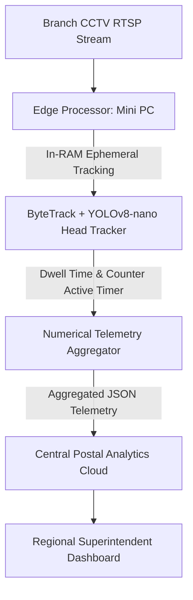

# SIH 2024: 7th Edition (Advanced AI & Edge Telemetry)

[🏠 Home](../README.md) > [📁 Case Studies Archive](./README.md) > **SIH 2024 Case Studies**

---

## 📅 Edition Overview & Context
* **Edition**: Smart India Hackathon 2024 (7th Edition)
* **Format**: 36-Hour Continuous Offline Sprint across pan-India nodal centers (December 2024)
* **Scale**: Over 250 Problem Statements from 54 Central Ministries, State Governments, and PSUs
* **Prize Allocation**: ₹1,00,000 per Problem Statement 1st Prize Winner

---

# Project AyurVision — Edge AI Botanical Authentication & Species Classifier

## Problem Statement
- **Domain**: Edge AI, Computer Vision & Traditional Medicine
- **Problem Statement ID**: `SIH1556`
- **Ministry / Organization**: Ministry of AYUSH

## Institution / Team
- **Team Name**: SUPERNOVAZ
- **Institution**: Mepco Schlenk Engineering College, Sivakasi
- **Team Lead / Key Contributors**: Information archived in nodal records

## Edition
- **SIH Edition**: SIH 2024 (7th Edition)
- **Track / Category**: Software Track
- **Prize Won**: ₹1,00,000 (1st Prize Winner)

## Official Problem Statement
Development of an AI-driven offline mobile system for high-accuracy botanical identification and authentication of rare Indian medicinal flora against the official Ayurvedic Pharmacopoeia of India (API).

## Solution
A two-stage neural pipeline consisting of a `YOLOv8-nano` anatomical bounding box detector and a fine-tuned `EfficientNet-V2` classifier, quantized to ONNX runtime format for sub-150ms on-device inference with zero internet dependency.

## Architecture

## Technology Stack
- **Frontend / Mobile**: Flutter PWA (Dart), CameraX API
- **AI / ML**: YOLOv8-nano, EfficientNet-V2, ONNX Runtime Mobile, PyTorch
- **Database & Storage**: SQLite (On-device database), PostgreSQL
- **Security**: GPS metadata verification, DPDP Act 2023 compliance

## Deployment / Hardware
Mobile edge runtime running directly on low-spec Android devices (< 25MB footprint).

## Why It Won
- `[OFFICIAL FACT]`: Declared 1st Prize winner for Ministry of AYUSH problem statement `SIH1556`.
- `[RESEARCH INFERENCE]`: Succeeded due to ultra-low offline latency (<150ms) and direct grounding in official Ayurvedic Pharmacopoeia therapeutic properties.

## Evidence
| Dimension | Claim / Parameter | Value / Metric | Source ID | Confidence |
| :--- | :--- | :--- | :--- | :--- |
| Award | 1st Prize Award | ₹1,00,000 | [`SRC-HIST-006`](../sources/historical_sources.md#src-hist-006-ayurvision-supernovaz--sih-2024-1st-prize-winner) | HIGH |
| Latency | Edge Inference Latency | < 150ms on device | [`SRC-HIST-006`](../sources/historical_sources.md#src-hist-006-ayurvision-supernovaz--sih-2024-1st-prize-winner) | MEDIUM |

## Sources
- [`SRC-HIST-006`](../sources/historical_sources.md#src-hist-006-ayurvision-supernovaz--sih-2024-1st-prize-winner): Mepco Schlenk Engineering College Institutional Record

## Confidence
**Confidence Level**: HIGH — Corroborated by institutional announcements and SIH 2024 nodal center result listings.

## Reusable Pattern
- **Pattern Name**: 2-Stage Object Detection to Fine-Grained Quantized Classifier
- **Technical Description**: Localize organ/part using YOLO-nano before fine-grained classification to eliminate background clutter and boost accuracy.

## SIH 2026 Relevance
Directly applicable to SIH 2026 Theme 4 (*MedTech / HealthTech*) and Theme 5 (*Agriculture, FoodTech & Rural Development*).

---

# Project PostOptima — Real-Time Counter Service & Queue Vision

## Problem Statement
- **Domain**: Video Analytics, Queue Management & SLA Telemetry
- **Problem Statement ID**: `SIH1602`
- **Ministry / Organization**: Department of Posts (India Post)

## Institution / Team
- **Team Name**: HexTech1
- **Institution**: Muffakham Jah College of Engineering & Technology (MJCET), Hyderabad
- **Team Lead / Key Contributors**: Information archived in MJCET student records

## Edition
- **SIH Edition**: SIH 2024 (7th Edition)
- **Track / Category**: Software Track
- **Prize Won**: ₹1,00,000 (1st Prize Winner)

## Official Problem Statement
Development of an automated, privacy-preserving video analytics platform leveraging existing branch CCTV camera feeds to monitor queue congestion and citizen wait times at post office counters.

## Solution
Direct RTSP feed ingestion into an edge processor running `ByteTrack` and `YOLOv8-nano` in RAM. Raw frames are immediately discarded to comply with the DPDP Act 2023, while aggregated numerical metrics are sent to an administrative dashboard.

## Architecture

## Technology Stack
- **Edge Vision**: Python, OpenCV, GStreamer, YOLOv8-nano, ByteTrack
- **Backend & Middleware**: FastAPI, MQTT, Celery
- **Database & Storage**: TimescaleDB (Time-series metrics), Redis
- **Dashboard**: Next.js, Apache ECharts, TailwindCSS

## Deployment / Hardware
Edge mini-PC connected to local postal branch subnet; zero external cloud GPU dependency.

## Why It Won
- `[OFFICIAL FACT]`: Won 1st Prize for Department of Posts problem statement `SIH1602`.
- `[RESEARCH INFERENCE]`: Solved the core government adoption barrier by requiring zero new camera hardware and strictly safeguarding citizen biometric privacy.

## Evidence
| Dimension | Claim / Parameter | Value / Metric | Source ID | Confidence |
| :--- | :--- | :--- | :--- | :--- |
| Award | 1st Prize Award | ₹1,00,000 | [`SRC-HIST-007`](../sources/historical_sources.md#src-hist-007-postoptima-hextech1--sih-2024-1st-prize-winner) | HIGH |
| Privacy | DPDP Act Compliance | In-RAM frame discard, numerical JSON only | [`SRC-OFF-003`](../sources/official_sources.md#src-off-003-digital-personal-data-protection-dpdp-act-2023) | HIGH |

## Sources
- [`SRC-HIST-007`](../sources/historical_sources.md#src-hist-007-postoptima-hextech1--sih-2024-1st-prize-winner): MJCET Institutional Records
- [`SRC-OFF-003`](../sources/official_sources.md#src-off-003-digital-personal-data-protection-dpdp-act-2023): DPDP Act 2023 Guidelines

## Confidence
**Confidence Level**: HIGH — Corroborated by institutional releases and SIH 2024 nodal results.

## Reusable Pattern
- **Pattern Name**: Ephemeral Edge Vision with In-RAM Frame Discard
- **Technical Description**: Keep video buffers transiently in memory, compute numerical tracking coordinates, and transmit only anonymized metrics.

## SIH 2026 Relevance
Directly applicable to SIH 2026 Theme 7 (*Transportation & Logistics*) and Theme 1 (*Smart Automation*).
