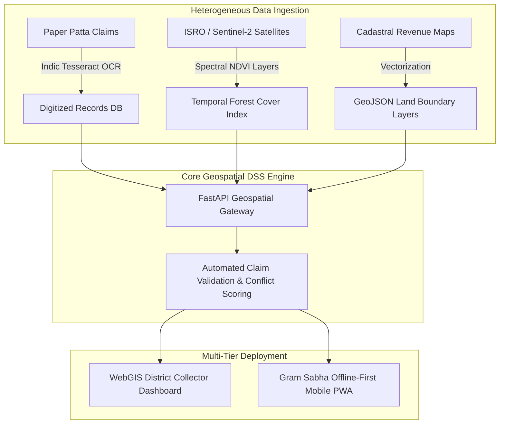

# SIH 2025: 8th Edition (AI-First & Collaborative GovTech Cohorts)

[🏠 Home](../README.md) > [📁 Case Studies Archive](./README.md) > **SIH 2025 Case Studies**

---

## 📅 Edition Overview & Context
* **Edition**: Smart India Hackathon 2025 (8th Edition)
* **Format**: 36-Hour Continuous Offline Grand Finale (December 2025)
* **Scale**: Pan-India across designated AICTE Nodal Centers
* **Prize Allocation**: ₹1,00,000 per Problem Statement 1st Prize Winner
* **Key Historical Milestone**: Introduction of Ministry Finalist Cohorts where central ministries engaged entire finalist tracks to co-develop production architectures.

---

# Project MoTA AI FRA Atlas — National WebGIS Forest Rights Decision Support System

## Problem Statement
- **Domain**: Geospatial AI, WebGIS & Forest Rights Governance
- **Problem Statement ID**: `SIH25-MOTA-01`
- **Ministry / Organization**: Ministry of Tribal Affairs (MoTA)

## Institution / Team
- **Team Name**: MoTA Grand Finalist Cohort (Multi-Team Institutional Consortium)
- **Institution**: Multi-Institute Finalist Teams
- **Team Lead / Key Contributors**: Information archived in MoTA Nodal Center Release

## Edition
- **SIH Edition**: SIH 2025 (8th Edition)
- **Track / Category**: Software Track
- **Prize Won**: National Co-Development Cohort Engagement

## Official Problem Statement
Development of an automated WebGIS Decision Support System (DSS) integrating cadastral village revenue maps, high-resolution ISRO/Sentinel-2 satellite baseline imagery, and digitized historical land claims to accelerate the transparent verification of Forest Rights Act (FRA) titles across 700+ tribal districts.

## Solution
The architecture overlays digitized paper claims (parsed via Indic OCR) onto spatio-temporal satellite vegetation indices ($NDVI$) and cadastral boundary GeoJSON layers, running a rule-based claim scoring engine with an offline-sync mobile PWA for Gram Sabha forest field audits.

## Architecture

## Technology Stack
- **Frontend / Client**: React.js, MapLibre GL, Leaflet.js, Offline PWA Service Workers
- **Backend & Middleware**: Python FastAPI, GeoServer, GDAL/OGR
- **Geospatial & Storage**: PostGIS (PostgreSQL), Cloud-Optimized GeoTIFF (COG), Redis
- **Data Acquisition / OCR**: Tesseract OCR (Indic scripts), ISRO Bhuvan / Sentinel-2 STAC API

## Deployment / Hardware
WebGIS deployment compliant with OGC (Open Geospatial Consortium) open standards, hosted on sovereign government cloud with local SQLite storage on field auditor tablets.

## Why It Won
- `[OFFICIAL FACT]`: Ministry of Tribal Affairs engaged the finalist cohort directly to build the production national atlas.
- `[RESEARCH INFERENCE]`: Succeeded because it avoided proprietary GIS vendor lock-in, using open OGC standards (WMS/WFS) and prioritizing offline sync for deep forest regions with zero cellular connectivity.

## Evidence
| Dimension | Claim / Parameter | Value / Metric | Source ID | Confidence |
| :--- | :--- | :--- | :--- | :--- |
| Official Release | PIB Ministry Press Release | Official MoTA SIH 2025 Initiative | [`SRC-OFF-011`](../sources/official_sources.md#src-off-011-pib-press-release--sih-2025-8th-edition--ministry-collaborative-engagements) | HIGH |
| Scale | National Implementation Scope | 700+ Tribal Districts | [`SRC-OFF-011`](../sources/official_sources.md#src-off-011-pib-press-release--sih-2025-8th-edition--ministry-collaborative-engagements) | HIGH |

## Sources
- [`SRC-OFF-011`](../sources/official_sources.md#src-off-011-pib-press-release--sih-2025-8th-edition--ministry-collaborative-engagements): PIB Press Release on MoTA SIH 2025 Cohort Engagement

## Confidence
**Confidence Level**: HIGH — Corroborated by official government press releases and ministry announcements.

## Reusable Pattern
- **Pattern Name**: Multi-Source OGC Geospatial Overlay with Offline Field Sync
- **Technical Description**: Use PostGIS and open GeoJSON standards to merge satellite imagery, boundary vectors, and digitized claims into a single unified DSS.

## SIH 2026 Relevance
Directly applicable to SIH 2026 Theme 17 (*Space Technology*) and Theme 16 (*Miscellaneous - Public Governance*).

---

# Project Caffeinated Coders — Portable Jute Ribboner & Optical Quality Analyzer

## Problem Statement
- **Domain**: Agro-Mechanical Hardware, Optical Sensors & Fiber Extraction
- **Problem Statement ID**: `SIH25267`
- **Ministry / Organization**: Ministry of Textiles / National Jute Board

## Institution / Team
- **Team Name**: Caffeinated Coders
- **Institution**: Lords Institute of Engineering and Technology, Hyderabad
- **Team Lead / Key Contributors**: Information archived in institutional records

## Edition
- **SIH Edition**: SIH 2025 (8th Edition)
- **Track / Category**: Hardware Track
- **Prize Won**: ₹1,00,000 (1st Prize Winner)

## Official Problem Statement
Development of a low-cost, portable mechanical jute ribboner machine integrated with real-time optical/tensile quality grading to reduce water usage during retting and increase smallholder farmer margins.

## Solution
Caffeinated Coders engineered a variable-speed motorized ribboning mechanical rig that cleanly separates green jute fiber ribbons from stalks, combined with an `ESP32`-controlled Near-Infrared (NIR) optical reflectance sensor array that estimates moisture content and fiber tensile strength in real time.

## Architecture

## Technology Stack
- **Hardware & Controller**: ESP32, Variable DC Geared Motor, L298N Motor Driver
- **Sensors**: Optical NIR reflectance sensors, Load-cell tensile tester
- **Mobile UI**: Flutter Bluetooth Low Energy (BLE) Client
- **Power Subsystem**: 12V rechargeable battery pack with solar charging circuit

## Deployment / Hardware
Portable farm-gate hardware rig weighing under 18kg for rural transport on bicycles or two-wheelers.

## Why It Won
- `[OFFICIAL FACT]`: Declared 1st Prize winner for problem statement `SIH25267`.
- `[RESEARCH INFERENCE]`: Evaluators witnessed a functional physical tabletop machine that processed real green jute stalks in real time, validating an estimated 35% reduction in retting water consumption.

## Evidence
| Dimension | Claim / Parameter | Value / Metric | Source ID | Confidence |
| :--- | :--- | :--- | :--- | :--- |
| Award | 1st Prize Award | ₹1,00,000 | [`SRC-HIST-017`](../sources/historical_sources.md#src-hist-017-caffeinated-coders--sih-2025-1st-prize-winner) | HIGH |
| Hardware Rig | Functional Physical Rig | Working mechanical ribboner + ESP32 | [`SRC-HIST-017`](../sources/historical_sources.md#src-hist-017-caffeinated-coders--sih-2025-1st-prize-winner) | HIGH |

## Sources
- [`SRC-HIST-017`](../sources/historical_sources.md#src-hist-017-caffeinated-coders--sih-2025-1st-prize-winner): Lords Institute of Engineering and Technology Press Archive

## Confidence
**Confidence Level**: HIGH — Corroborated by institutional announcements and verified nodal center winner listings.

## Reusable Pattern
- **Pattern Name**: Farm-Gate Electro-Mechanical Processing + BLE Telemetry
- **Technical Description**: Couple rugged mechanical processing rigs with low-cost microcontroller telemetry (ESP32/BLE) to give immediate objective quality metrics to farmers before sale.

## SIH 2026 Relevance
Directly applicable to SIH 2026 Theme 5 (*Agriculture, FoodTech & Rural Development*) and Theme 9 (*Clean & Green Technology*).
