# Competitive Teardown, Commercial Replacement & Stress-Defense Matrix

[🏠 Home](./README.md) > **Competitive Matrix & Commercial Defense**

> **Purpose**: A rigorous defense framework to systematically address the most formidable jury questions: *"Why can't the ministry just buy Salesforce/SAP or use Google Forms/PowerBI?"* and *"Why does this software need to exist?"*

---

## 🎯 1. The 12 Foundational Stress-Defense Inquiries

To earn full marks on **Solution Novelty & Technical Feasibility (20 Points)** on Slide 5 of your pitch deck, your team must prepare concrete, data-backed answers to these 12 critical questions:

```mermaid
flowchart TD
    subgraph Strategic Foundation
        Q1["1. Why this?"] --- Q2["2. Why now?"]
        Q2 --- Q3["3. Why government?"]
        Q3 --- Q4["4. Why does this need to exist?"]
    end

    subgraph Commercial Differentiation
        Q5["5. Why not Google Forms?"] --- Q6["6. Why not commercial ERP (SAP)?"]
        Q6 --- Q7["7. Why not existing AI (OpenAI API)?"]
        Q7 --- Q8["8. What is genuinely novel?"]
    end

    subgraph Failure & Stress Testing
        Q9["9. What if internet disappears?"] --- Q10["10. What happens at 10x scale?"]
        Q10 --- Q11["11. What happens with dirty/bad data?"]
        Q11 --- Q12["12. What is the true OpEx per transaction?"]
    end
```

---

### Detailed Inquiry Breakdown & Defense Blueprints

| # | Critical Inquiry | 🚫 Weak Answer (Points Lost) | ✅ Defensible Evidence-Backed Answer (Full Points) |
| :-: | :--- | :--- | :--- |
| **1** | **Why this?** | *"Because we built a cool web app with modern frameworks."* | *"Because the ministry has an acute operational bottleneck ($X$ days verification delay, $Y$% fraud rate) that manual paperwork cannot resolve."* |
| **2** | **Why now?** | *"Because hackathon submissions opened this month."* | *"Because recent statutory mandates (DPDP Act 2023, Bhashini NLTM APIs) now make sovereign, voice-first edge deployment technically and legally feasible."* |
| **3** | **Why government?** | *"Because it is an SIH problem statement."* | *"Because this involves public goods, sovereign citizen data, and statutory enforcement that private commercial vendors have no economic incentive to solve for low-income populations."* |
| **4** | **Why does this need to exist?** | *"To digitalize manual paperwork."* | *"Existing commercial tools require continuous high-speed broadband, expensive user seat licenses, and English literacy—failing completely across 10,000+ grassroots Indian field offices."* |
| **5** | **Why not Google Forms?** | *"Google Forms is too simple for our project."* | *"Google Forms lacks relational schemas, biometric validation, offline SQLite conflict resolution, automated Section 65B legal audit hashing, and local on-premise data sovereignty."* |
| **6** | **Why not an enterprise ERP (SAP/Salesforce)?** | *"Commercial ERPs are built by private companies."* | *"Enterprise ERPs cost ₹2,000–₹6,000/user/month (requiring ₹24+ Crores annually for 10,000 outposts), require high-spec workstations, and route citizen telemetry through overseas multi-tenant clouds."* |
| **7** | **Why not an existing generic AI model (e.g. OpenAI API)?** | *"We can call the ChatGPT API for everything."* | *"Cloud LLM APIs cost ~$0.03/query, suffer 3–5s latency, fail completely without broadband, hallucinate statutory legal provisions, and violate Indian data localization mandates."* |
| **8** | **What is genuinely novel?** | *"Our UI is clean and built using Next.js."* | *"Our novelty lies in our [quantized on-device ONNX pipeline / multi-modal infrasound sensor fusion / gasless smart contract relayer] delivering sub-150ms execution at near-zero OpEx."* |
| **9** | **What happens if internet disappears?** | *"The app displays an error message asking the user to reconnect."* | *"The application continues operating 100% offline via encrypted local SQLite, logging transactions locally and auto-resolving merge conflicts via deterministic timestamps when network resumes."* |
| **10** | **What happens at 10x scale?** | *"We will turn on AWS autoscaling."* | *"Our backend is stateless with Redis caching for read-heavy routes, database partitioning by district, and edge offloading of 70% of compute to client devices, maintaining <50ms API response under 10x load."* |
| **11** | **What happens with bad / dirty data?** | *"Our ML model is accurate and will handle it."* | *"We enforce a 3-layer validation pipeline: 1) Strict JSON-schema constraints, 2) Cryptographic payload HMAC attestation, and 3) An anomaly isolation quarantine layer flagging inputs exceeding 3 standard deviations."* |
| **12** | **What is the true OpEx per transaction?** | *"Hosting will cost a few thousand rupees per month."* | *"Our mathematical model proves an operational cost of less than **₹0.05 per active transaction** using serverless edge compute."* |

---

## 📊 2. Comprehensive Comparison Matrix Template

Use this table on **Slide 5** of your presentation to deliver a side-by-side comparison:

| Critical Dimension | Commercial Enterprise SaaS *(SAP, Salesforce)* | Low-Code / Generic *(Google Forms, Zoho, PowerBI)* | 🚀 Custom Proposed Architecture |
| :--- | :--- | :--- | :--- |
| **Recurring User Licensing** | ₹1,500 – ₹6,000 / user / month *(₹24+ Cr/yr for 10,000 offices)* | ₹400 – ₹1,200 / user / month + storage tiers | **₹0.02 – ₹0.05 per transaction** *(Serverless + Quantized Edge Compute)* |
| **Offline Resilience** | ❌ Hard crash without persistent high-speed broadband | ⚠️ Basic form cache; no relational database sync | **✅ 100% Offline-First**: Local encrypted SQLite with automated bidirectional conflict sync |
| **Data Sovereignty & DPDP** | ❌ Citizen telemetry routed through overseas clouds | ❌ Third-party telemetry tracking and foreign hosting | **✅ 100% Sovereign**: On-premise / Gov Cloud deployable; zero telemetry leakage |
| **India Stack Native** | ❌ Requires costly custom SOAP/REST enterprise wrappers | ❌ Closed sandbox; no direct Aadhaar/DigiLocker webhooks | **✅ Native Connectors**: Bhashini IndicTTS/ASR, DigiLocker e-Sign, ISRO Bhuvan GIS |
| **Accessibility & Literacy** | ❌ Dense English menus requiring weeks of staff training | ⚠️ Basic text forms; no conversational voice UI | **✅ Voice-First Indic UI**: 22 regional languages with zero prior onboarding needed |
| **Hardware Footprint** | ❌ Requires modern Core i5/i7 PCs ($800+) | ❌ Heavy browser DOM rendering on budget devices | **✅ Runs on legacy hardware**: Sub-₹8,000 Android phones (512MB RAM), Raspberry Pi, existing CCTVs |

---

## 💰 3. Public Sector Mathematical OpEx Formula

When defending economic viability on Slide 5, present this concrete formulation:

$$\text{Annual Operational Expenditure (OpEx)} = (N_{\text{branches}} \times C_{\text{edge}}) + (V_{\text{annual\_tx}} \times C_{\text{cloud\_compute}})$$

Where:
* $N_{\text{branches}}$ = Total number of deployed public field offices (e.g. 10,000 outposts).
* $C_{\text{edge}}$ = Annual maintenance cost of local open-source edge runtime (₹0 software license).
* $V_{\text{annual\_tx}}$ = Total annual transaction volume (e.g. 10,000,000 citizen requests).
* $C_{\text{cloud\_compute}}$ = Centralized serverless sync compute cost (₹0.048 per batch sync).

### 📈 Concrete Case Study: 10,000 Government Field Outposts
* **Commercial Enterprise SaaS Option**:
  $$10,000 \text{ outposts} \times ₹2,000/\text{user/month} \times 12 \text{ months} = \mathbf{₹24 \text{ Crores / year}}$$
* **Your Custom Edge Architecture**:
  $$\text{Open-Source Edge Software (₹0)} + (10,000,000 \times ₹0.048) = \mathbf{₹4.8 \text{ Lakhs / year}}$$
* **Net Projected Taxpayer Savings**: **> 98% Reduction in Recurring Public Expenditure**.
