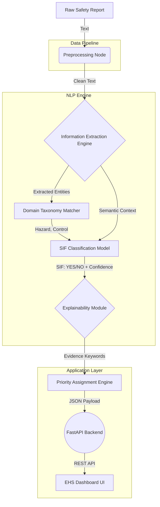

# System Architecture & Technical Risk Register

## 1. System Architecture Diagram

## 2. Technical Risk Register

| Risk | Why It Matters | Proposed Mitigation | Severity |
| :--- | :--- | :--- | :--- |
| **Class Imbalance (Rare SIFs)** | Model may achieve 95% accuracy by simply predicting "NO" for everything, missing the actual SIFs. | Use SMOTE, class weighting, or Focal Loss. Evaluate using Recall/F1, not Accuracy. | Critical |
| **Few SIF Training Examples** | Deep learning models will overfit on a tiny positive class. | Use a simpler baseline (TF-IDF+LR) or transfer learning (few-shot LLM) until data grows. | High |
| **Noisy / Vague Labels** | If annotators disagree on what a SIF is, the model will learn confused boundaries. | Implement strict annotation guidelines and adjudicate disagreements. | High |
| **Short Reports (Insufficient Context)** | "Pump broke" gives the model nothing to analyze. | Model should flag reports as "Insufficient Info" rather than guessing. | Medium |
| **Domain-Specific Vocabulary** | Generic models (BERT) don't understand terms like "LOTO", "SIMOPS", "H2S". | Fine-tune the language model on unsupervised O&G manuals/reports first (Domain Adaptation). | High |
| **False Negatives** | Missing a genuinely dangerous report defeats the purpose of the system. | Tune the decision threshold to favor High Recall; accept some false positives. | Critical |
| **False Positives (Alert Fatigue)** | If the system flags every minor issue as CRITICAL, EHS will ignore it. | Implement an active-learning feedback loop where EHS overrides adjust the model. | High |
| **Data Leakage** | Near-duplicate reports across train/test splits artificially inflate performance metrics. | Implement strict exact and fuzzy deduplication before splitting the dataset. | Critical |
| **Synthetic Data Contamination** | Evaluating the model on synthetic data gives a false sense of real-world readiness. | The final Test set must be 100% human-written, real-world reports. | Critical |
| **Explainability Gap** | EHS officers will not act on a black-box 98% probability score. | Output top influential keywords (TF-IDF weights) or use SHAP for complex models. | High |
| **Negation Handling** | "LOTO was applied" vs "LOTO was bypassed" — TF-IDF treats "LOTO" identically. | Rely on bi-grams/n-grams in TF-IDF, or transition to contextual embeddings (BERT). | High |
| **Code-Mixing / Typos** | Reports often contain misspellings or regional slang. | Use subword tokenization (BPE/WordPiece) and robust text cleaning. | Medium |

## 3. Evaluation Strategy
* **Primary Metric:** Recall on the SIF (Positive) Class. We must minimize False Negatives.
* **Secondary Metric:** F1-Score on the SIF Class (balances Recall against Precision).
* **Rule:** Overall Accuracy is explicitly banned as a primary metric due to the 95/5 class imbalance.

## 4. MVP Technical Pipeline
1. **Data Ingestion**: Cleaned CSV reports (1100+ items).
2. **Preprocessing**: BeautifulSoup HTML stripping, lowercase, exact+near deduplication.
3. **Embeddings/Features**: TF-IDF (1000 features, bigrams) + optional SentenceTransformers for contextual baseline.
4. **Model Engine**: Logistic Regression with `class_weight='balanced'` for Task 1 (SIF Prediction).
5. **Explainability**: Extraction of top positive coefficient keywords from TF-IDF vector mapping.
6. **API Layer**: FastAPI endpoint `/analyze` accepting text and returning `ModelPrediction` schema (SIF, confidence, priority, evidence_keywords).
