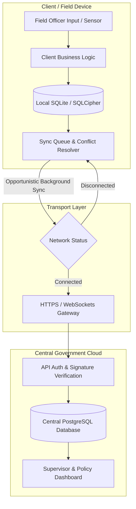
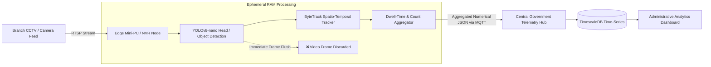
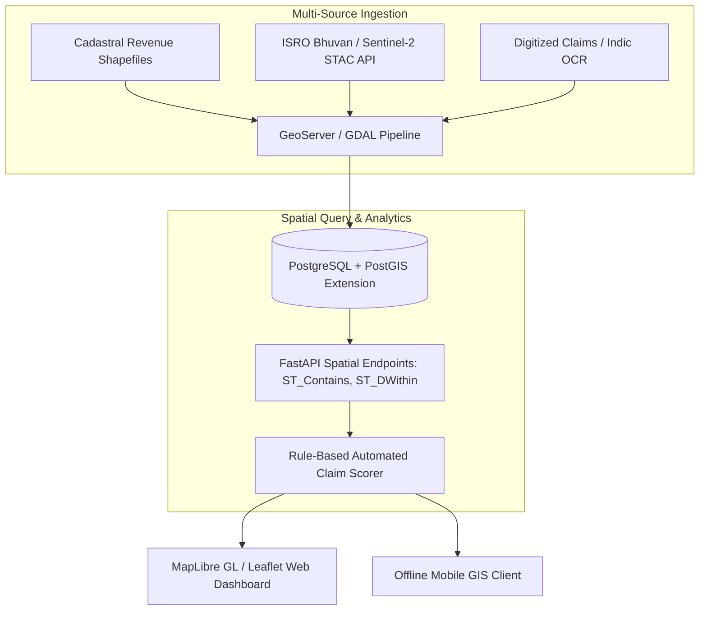
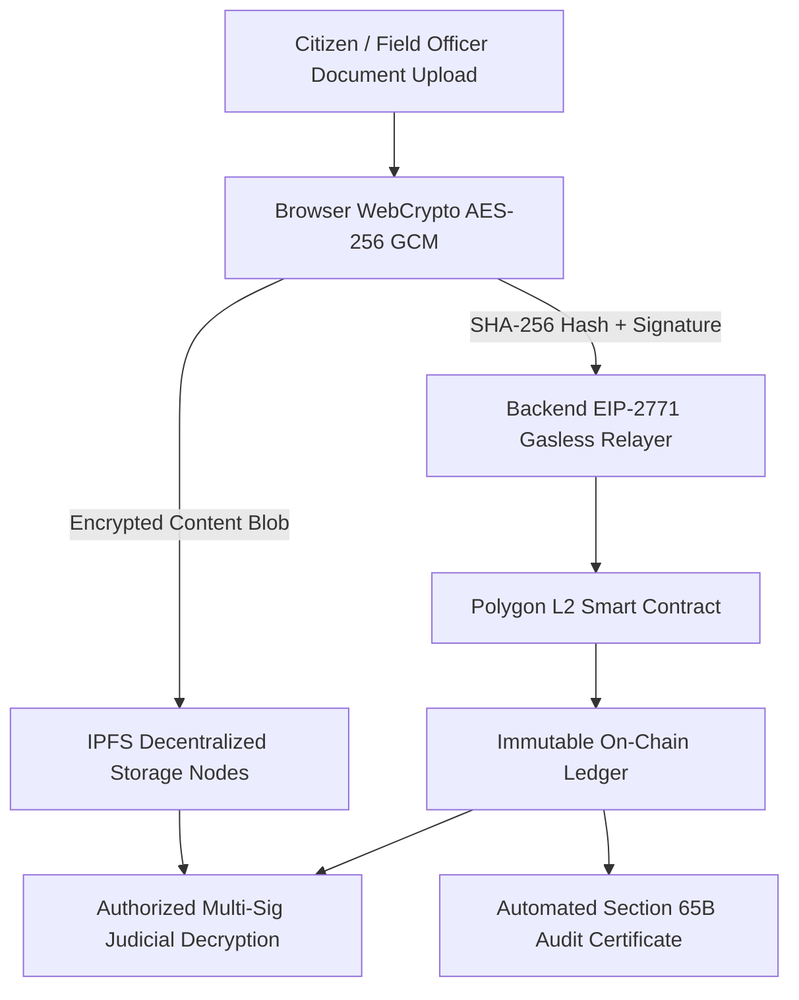

# Foundational System Architecture Archetypes

[🏠 Home](../README.md) > [📁 Intelligence Layer](./README.md) > **Architecture Patterns**

> **Overview**: Analysis of winning SIH entries reveals 5 recurring, battle-tested system architecture archetypes that consistently satisfy government constraints, bandwidth limitations, data privacy laws, and jury technical audits.

---

## 🏛️ Archetype 1: Offline-First Bidirectional Sync (Grassroots & Field Operations)



### Key Technical Properties
* **Storage**: Local encrypted SQLite database with atomic transaction journals.
* **Conflict Resolution**: Deterministic Last-Write-Wins (LWW) with cryptographic sequence nonces or state-based CRDTs.
* **Bandwidth Optimization**: Binary protocol buffers or gzip-compressed batch payloads under 50KB.
* **Applicable Case Studies**: *KnitKraft (2023)*, *Team Xpose (2017)*, *SNAAPP (2019)*, *MoTA FRA Atlas (2025)*.

---

## 👁️ Archetype 2: Ephemeral Edge Vision with In-RAM Privacy Discard (DPDP Compliant)



### Key Technical Properties
* **Zero Video Leakage**: Video frames never leave transient memory (RAM); only non-PII numerical counts and durations are stored or transmitted.
* **Compliance**: 100% adherence to **Digital Personal Data Protection (DPDP) Act 2023** data minimization principles.
* **Compute**: Runs on sub-₹15,000 edge hardware (Intel Celeron / Raspberry Pi 4).
* **Applicable Case Studies**: *PostOptima (2024)*, *DRISHTI (2020)*.

---

## 🏔️ Archetype 3: Rugged Infrasound / Acoustic-Seismic Sensor Mesh

```mermaid
flowchart TD
    subgraph Autonomous Sensor Pod -40°C
        A[Infrasound / Piezoelectric Transducers] --> C[STM32 / ESP32 MCU]
        B[Tri-Axial Geophone Subterranean] --> C
        C --> D[TinyML 1D-CNN Feature Classifier]
    end

    D -->|LoRa Non-Line-of-Sight RF 868MHz| E[Relay Mesh Node]
    E -->|LoRa Mesh Hop| F[Command Base Station Gateway]
    F --> G[Physical Automated Perimeter Siren]
    F --> H[Tactical Command Post GIS Map]
```

### Key Technical Properties
* **Zero Optical Reliance**: Operates during blizzards, dense fog, smoke, and nighttime.
* **Power Subsystem**: Ultra-low-power sleep modes ($<15 \mu A$) charged via solar/supercapacitors.
* **Long-Range Telemetry**: Multi-hop LoRa mesh covering 5–25 km without cellular or satellite dependency.
* **Applicable Case Studies**: *Himalayan Sentinel (2023)*, *Team Pi-oneer (2017)*.

---

## 🗺️ Archetype 4: Sovereign WebGIS Decision Support System (OGC Open Standards)



### Key Technical Properties
* **Interoperability**: Strict compliance with Open Geospatial Consortium (OGC) standards (WMS, WFS, GeoJSON, COG).
* **Sovereignty**: Self-hosted map tiles and spatial database avoiding costly third-party commercial mapping API quotas.
* **Applicable Case Studies**: *MoTA AI FRA Atlas (2025)*, *Team Iris (2022)*, *Abhyuday (2022)*.

---

## ⚖️ Archetype 5: Client-Side Encrypted Public Ledger & Notarization



### Key Technical Properties
* **Zero-Knowledge Security**: Cloud administrators and database operators have zero access to plaintext files.
* **Gasless UX**: Meta-transactions abstract away crypto wallets, seed phrases, and gas tokens.
* **Statutory Compliance**: Generates automated Section 65B (BSA Sec 63) digital admissibility certificates.
* **Applicable Case Studies**: *Legal Ledger eVault (2023)*, *KnitKraft (2023)*.
