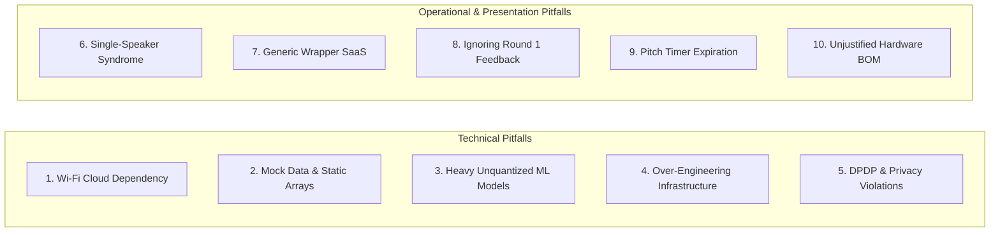

# Catalog of 10 Common SIH Failure Modes & Technical Root Causes

[🏠 Home](../README.md) > [📁 Intelligence Layer](./README.md) > **Common Failure Modes**

> **Overview**: Analysis of non-winning and disqualified teams across past SIH editions reveals 10 recurring failure modes. Understanding these empirical pitfalls allows teams to implement proactive engineering guardrails during preparation and sprint execution.

---

## ⚠️ The 10 Critical Failure Modes

---

### 1. The "Wi-Fi Cloud Dependency" Collapse
* **Root Cause**: Team hosts the backend or database exclusively on remote cloud platforms (AWS, Vercel, Render) without configuring local Docker containers.
* **Failure Point**: When venue Wi-Fi becomes congested during final judging, API calls time out, loading spinners freeze, and the live demo crashes.
* **Proactive Guardrail**: Enforce a mandatory `localhost` test at Hour 28 with laptop Wi-Fi switched completely off.

---

### 2. The "Hardcoded Mock Data" Trap
* **Root Cause**: Team displays pre-rendered graphs or hardcoded JSON arrays instead of executing live database queries.
* **Failure Point**: In Round 2, industry evaluators ask the team to insert a custom string into a form and verify if it appears in the database table. The team cannot demonstrate live persistence and loses up to 35 points immediately.
* **Proactive Guardrail**: Connect all frontend forms to real local database endpoints (`PostgreSQL` / `SQLite`) from Hour 10 onward.

---

### 3. The "Heavy Unquantized ML" Fantasy
* **Root Cause**: Team imports full-precision float32 models (e.g. 7B parameter LLMs or unquantized Whisper) assuming high-end GPU infrastructure is available.
* **Failure Point**: Evaluators ask how the system will scale across 10,000 rural government offices without multimillion-rupee cloud GPU budgets.
* **Proactive Guardrail**: Quantize all models to INT8/ONNX or TFLite format and demonstrate sub-150ms execution on standard laptop CPUs.

---

### 4. Over-Engineering Without Core Functionality
* **Root Cause**: Team spends the first 20 hours configuring Kubernetes clusters, microservice meshes, and complex CI/CD pipelines while the core business logic remains half-implemented.
* **Failure Point**: Round 2 judges find an elegant infrastructure scaffold that does not actually solve the ministry's problem statement.
* **Proactive Guardrail**: Build the minimal end-to-end user loop (Input $\rightarrow$ Processing $\rightarrow$ DB $\rightarrow$ Output) by Hour 14 before adding advanced telemetry or caching layers.

---

### 5. Data Privacy & DPDP Non-Compliance
* **Root Cause**: System transmits raw CCTV video streams, citizen facial biometrics, or Aadhaar numbers to third-party public cloud endpoints.
* **Failure Point**: Ministry evaluators flag direct violation of the **Digital Personal Data Protection (DPDP) Act 2023** and disqualify the architecture on legal deployability grounds.
* **Proactive Guardrail**: Process video/biometrics in ephemeral device RAM, discard raw frames immediately, and transmit only anonymized numerical counts.

---

### 6. Single-Speaker Syndrome
* **Root Cause**: The team leader monopolizes 100% of the 7-minute pitch while the remaining 5 members stand silently.
* **Failure Point**: Evaluators heavily penalize team cohesion and suspect that only one student built the project.
* **Proactive Guardrail**: Assign every member an explicit 45-to-90 second presentation segment (Problem, Architecture, Live Demo, Cost Defense, Q&A).

---

### 7. The Generic SaaS / API Wrapper Blunder
* **Root Cause**: Team presents a generic form builder or simple ChatGPT API wrapper without domain-specific government logic.
* **Failure Point**: Judges challenge the team with: *"Why shouldn't the ministry just buy Salesforce or use Google Forms?"* The team has no technical defense.
* **Proactive Guardrail**: Use the [Competitive Matrix Template](../competitive_matrix_template.md) to engineer deep public sector differentiators (offline sync, Bhashini voice, zero OpEx).

---

### 8. Ignoring Round 1 Mentor Directives
* **Root Cause**: Team receives explicit edge-case feedback from ministry mentors in Round 1 but continues building their original slide deck without incorporating changes.
* **Failure Point**: Round 2 evaluators check their Round 1 notes and penalize the team for failing to respond to domain guidance.
* **Proactive Guardrail**: Maintain a dedicated "Mentor Feedback Action Log" updated immediately after Round 1.

---

### 9. Pitch Timer Expiration Before Live Demo
* **Root Cause**: Team spends 5 minutes reading problem statement bullet points from Slides 1 and 2, causing the jury to call "Time's up!" before the live demo starts.
* **Failure Point**: The team scores 0 out of 35 points on Working Prototype because the jury never saw working code.
* **Proactive Guardrail**: Transition to the live demo within **90 seconds** of starting the pitch (by 01:30).

---

### 10. Unjustified Hardware Bill of Materials (BOM)
* **Root Cause**: Hardware track teams import expensive proprietary industrial kits without providing component-level cost breakdowns in INR.
* **Failure Point**: Evaluators reject the prototype as commercially unviable for mass public deployment.
* **Proactive Guardrail**: Prepare a granular Bill of Materials (BOM) listing every microcontroller, sensor, and fastener with local Indian market pricing proving a total cost under ₹25,000.
