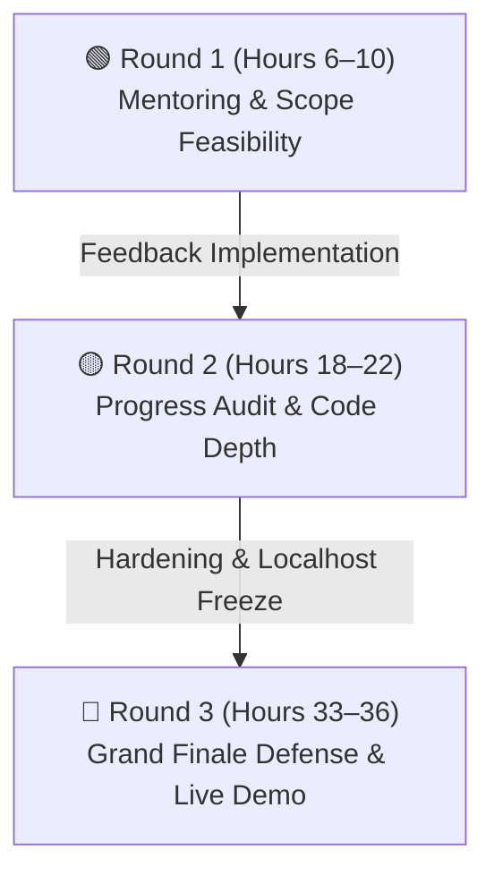
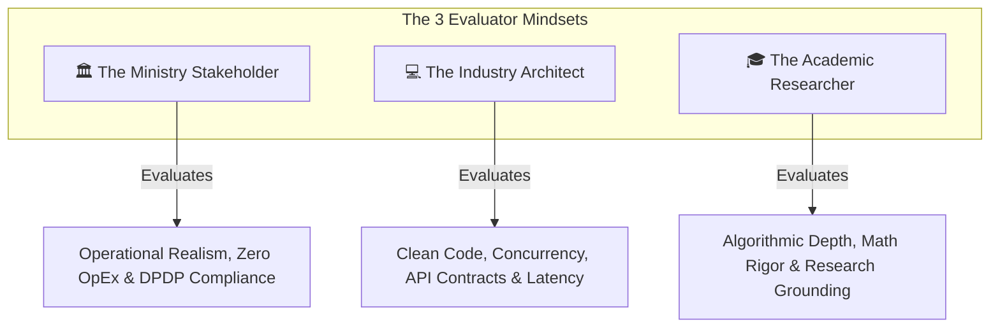

# Jury Dynamics, Evaluator Personas & Defense Strategy

[🏠 Home](../README.md) > [📁 Intelligence Layer](./README.md) > **Jury Patterns**

> **Overview**: SIH Grand Finale evaluation is a 3-stage progressive stress test conducted by an interdisciplinary panel comprising Ministry Stakeholders, Industry Tech Architects, and Academic Researchers. Understanding their distinct evaluation goals is essential to securing top scores across all judging rounds.

---

## 🔄 1. The 3-Round Evaluation Progression

### 🟢 Round 1: Mentoring & Scoping (Hours 6–10)
* **Jury Goal**: Verify whether the team comprehends the actual operational bottleneck of the ministry or is merely presenting generic slides.
* **Key Focus**: Architecture diagrams, database schemas, Figma mockups, and requirement boundaries.
* **Winning Action**: Ask mentors specific edge-case questions (*"How does your department currently handle power outages or manual paper records?"*). Write down every suggestion — evaluators explicitly check if you integrated their feedback in Round 2.

### 🟡 Round 2: Technical Depth & Code Audit (Hours 18–22)
* **Jury Goal**: Inspect genuine coding velocity, database write persistence, and model inference latency.
* **Key Focus**: Live Git commit log, REST API contracts, SQLite/PostgreSQL tables, and terminal logs.
* **Winning Action**: Open Swagger / Postman and trigger live API requests that write rows into a local database. Show quantized model inference latency metrics (e.g. ONNX sub-150ms logs). Never present static arrays.

### 🔴 Round 3: Grand Finale Defense & Stress Testing (Hours 33–36)
* **Jury Goal**: Challenge the commercial viability, data privacy compliance, and system stability under pressure.
* **Key Focus**: 7-minute pitch, live functional demonstration on `localhost`, and 3-minute Q&A rebuttal.
* **Winning Action**: Turn off Wi-Fi before judges sit down to prove 100% offline resilience; ensure all 6 team members deliver specific spoken segments.

---

## 🎭 2. The 3 Jury Personas & Alignment Matrix

### 🏛️ Persona 1: The Ministry Stakeholder
* **Core Question**: *"Will this actually work in our field offices without exceeding our budget? Does it follow Indian government compliance norms?"*
* **Defense Strategy**: Reference the DPDP Act 2023, IT Act Sec 65B, Bhashini Indic language integration, and zero-training voice navigation.

### 💻 Persona 2: The Industry Tech Architect
* **Core Question**: *"Did you write this code yourself? How does it handle network dropouts, memory leaks, and concurrency?"*
* **Defense Strategy**: Explain concrete technical tradeoffs (e.g. *why you picked PostgreSQL + PostGIS over raw MongoDB*), show Docker configs, and demonstrate live API error handling.

### 🎓 Persona 3: The Academic Researcher
* **Core Question**: *"Is there real mathematical or algorithmic depth here, or is it just basic CRUD?"*
* **Defense Strategy**: Present mathematical formulations (loss functions, constraint satisfaction equations, signal filtering algorithms) and cite 2–3 peer-reviewed IEEE/Springer papers backing your methodology.
