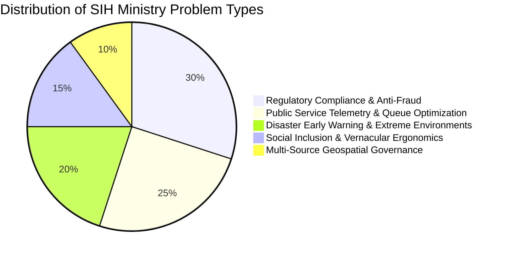

# Ministry Problem Statement Taxonomy & Latent Constraints

[🏠 Home](../README.md) > [📁 Intelligence Layer](./README.md) > **Problem Statement Patterns**

> **Overview**: Every year, central ministries, state departments, and PSUs release hundreds of problem statements for SIH. While they span various sectors, they invariably fall into 5 fundamental operational archetypes governed by critical unstated constraints.

---

## 🏛️ 1. The 5 Core Ministry Problem Statement Archetypes



---

### Archetype 1: Regulatory Compliance, Quality Grading & Anti-Fraud
* **Representative Problems**: Fake PMGSY asset photos, illegal industrial river dumping, adulterated Ayurvedic herbs, counterfeit Pashmina handlooms.
* **Core Pain Point**: The ministry has policies in place, but manual paper audits create fraud vectors, ghost beneficiaries, and multi-month verification backlogs.
* **What the Ministry Actually Wants**: Tamper-proof, cryptographic ground-truth verification that makes fraud mathematically and forensically detectable.

---

### Archetype 2: Public Service Telemetry & Citizen Wait-Time Reduction
* **Representative Problems**: Overcrowded post office counters, chaotic railway station enquiry booths, congested district court dockets.
* **Core Pain Point**: Central leadership lacks visibility into ground-level service level agreements (SLAs), while citizens suffer long queues.
* **What the Ministry Actually Wants**: Passive, automated telemetry that tracks operational throughput and triggers alerts without requiring staff to manually log data.

---

### Archetype 3: Extreme Environment & Disaster Early Warning
* **Representative Problems**: Himalayan avalanches, highway landslides, rural flash floods.
* **Core Pain Point**: Satellite observations and weather radars arrive too late or fail during blizzards/heavy clouds.
* **What the Ministry Actually Wants**: Autonomous, rugged edge sensor arrays that operate sub-zero and broadcast physical siren alerts locally before disasters strike.

---

### Archetype 4: Vernacular Empowerment & Digital Inclusion
* **Representative Problems**: Divyangjan welfare access, regional language syllabus harmonization, rural health advisories.
* **Core Pain Point**: Complex English-only government portals alienate non-English-speaking or illiterate citizens.
* **What the Ministry Actually Wants**: Voice-driven, multi-dialect conversational flows that eliminate paper forms and manual data entry.

---

### Archetype 5: Multi-Source Geospatial Land & Natural Resource Governance
* **Representative Problems**: Forest Rights Act (FRA) titles, crop area estimation, mining boundary audits.
* **Core Pain Point**: Cadastral village land records, satellite imagery, and physical claim paper files are siloed in different departments.
* **What the Ministry Actually Wants**: A unified, open-standard WebGIS Decision Support System (DSS) that overlays layers and automates conflict detection.

---

## 🔍 2. The 5 Unstated / Latent Government Constraints

Teams often fail because they design solutions for Silicon Valley startups rather than the Indian public sector. Evaluators test for these 5 unwritten constraints:

```
┌─────────────────────────────────────────────────────────────────────────────────┐
│                      UNWRITTEN PUBLIC SECTOR CONSTRAINTS                        │
├─────────────────────────────────────────────────────────────────────────────────┤
│ 1. 🚫 ZERO RECURRING SEAT LICENSES (No ₹2,000/user/mo commercial SaaS)          │
│ 2. 📴 ZERO BROADBAND ASSUMPTION (Must function on 2G or offline SQLite)        │
│ 3. 💻 LEGACY INFRASTRUCTURE REALITY (Must run on existing NVRs / 512MB phones)  │
│ 4. 🔒 RIGID DATA SOVEREIGNTY (DPDP Act 2023 compliance; zero foreign routing)   │
│ 5. 🗣️ ZERO-TRAINING ONBOARDING (Grassroots staff will not read 50-page manuals) │
└─────────────────────────────────────────────────────────────────────────────────┘
```
