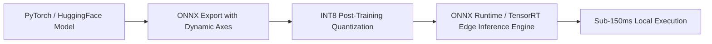
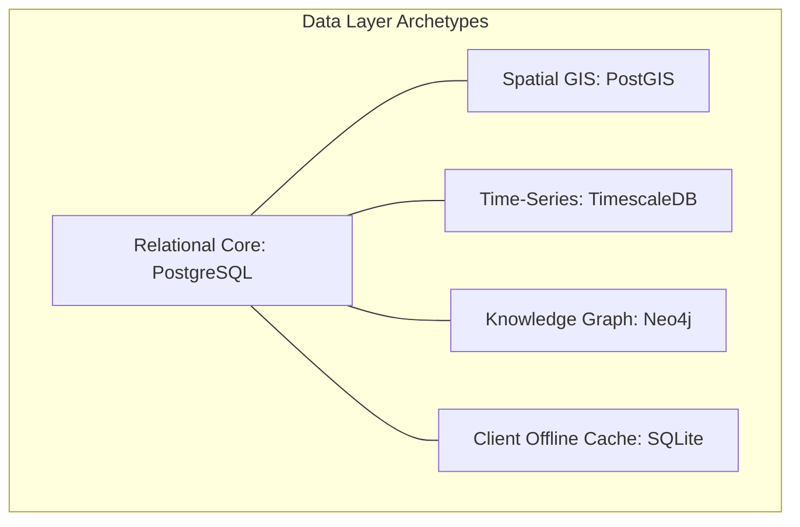
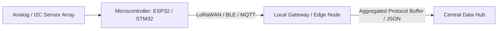

# Technological Stacks, Frameworks & Model Selection Patterns

[🏠 Home](../README.md) > [📁 Intelligence Layer](./README.md) > **Technology Patterns**

> **Research Rationale**: Selecting the correct framework and model quantization format is critical during the 36-hour sprint. This document details proven libraries, hardware platforms, and model architectures verified across winning SIH repositories.

---

## 🤖 1. AI, Machine Learning & Model Quantization

### High-Performance Model Recommendations

| Domain / Task | Recommended Foundation Model | Framework & Export Pipeline | Typical Quantized Size | Target Edge Latency |
| :--- | :--- | :--- | :--- | :--- |
| **Vernacular NLP / Classification** | `ai4bharat/indic-bert` | PyTorch $\rightarrow$ ONNX INT8 | ~35 MB | < 40 ms (CPU) |
| **Multilingual Speech-to-Text** | `openai/whisper-small` | CTranslate2 / ONNX | ~140 MB | < 600 ms (CPU) |
| **Acoustic Noise Suppression** | `DeepFilterNet3` | Rust / Python Bindings | ~15 MB | < 20 ms (Stream) |
| **Object / Organ Detection** | `Ultralytics YOLOv8-nano` | ONNX / OpenVINO / NCNN | ~6 MB | < 30 ms (Mobile/CPU) |
| **Fine-Grained Classification** | `EfficientNet-V2-S` | PyTorch $\rightarrow$ ONNX INT8 | ~22 MB | < 80 ms (Mobile) |
| **Semantic Text Search / RAG** | `all-MiniLM-L6-v2` | Sentence-Transformers $\rightarrow$ ONNX | ~25 MB | < 15 ms (CPU) |
| **Embedded Sensor Classification** | 1D-CNN / Random Forest | TensorFlow Lite for Microcontrollers | < 120 KB | < 10 ms (STM32/ESP32) |

---

## 🗄️ 2. Database & Data Architecture Patterns

### Database Selection Heuristic

1. **Relational + Geospatial**:
   - **Engine**: `PostgreSQL` + `PostGIS` extension.
   - **Use Case**: Forest land titling, cadastral revenue maps, vehicle GPS tracking, and spatial buffer queries (`ST_DWithin`, `ST_Contains`).
2. **High-Frequency Sensor / Telemetry Logging**:
   - **Engine**: `TimescaleDB` (PostgreSQL hypertable extension).
   - **Use Case**: River water quality time-series (pH, DO), queue dwell timers, road telematics streams.
3. **Complex Prerequisite & Ontology Modeling**:
   - **Engine**: `Neo4j` (Cypher Query Language).
   - **Use Case**: University curriculum mapping, supply chain multi-tier provenance, judicial precedent graphs.
4. **Offline Mobile & Edge Caching**:
   - **Engine**: `SQLite` / `IndexedDB` with cryptographic encryption (`SQLCipher`).
   - **Use Case**: Mobile field audits in zero-connectivity rural sectors.

---

## 📡 3. Hardware, Edge Microcontrollers & IoT Protocols

### Microcontroller Selection Matrix

| Hardware Platform | Architecture | Wireless Connectivity | Best Suited SIH Applications | Typical Unit Cost (INR) |
| :--- | :--- | :--- | :--- | :--- |
| **ESP32-WROOM-32** | Dual-core 32-bit Xtensa | Wi-Fi + BLE 4.2 | Mandi produce grading, solar dual-axis trackers, smart water sensors | ₹280 – ₹450 |
| **STM32F401 / F411** | ARM Cortex-M4 (with FPU) | None (pairs with external LoRa module) | TinyML vibration analysis, seismic avalanche acoustic sensors | ₹350 – ₹600 |
| **Raspberry Pi 4 / 5** | Quad-core ARM Cortex-A72/76 | Gigabit Ethernet + Wi-Fi | Edge computer vision, CCTV RTSP queue tracking, local Whisper inference | ₹4,500 – ₹7,500 |
| **Arduino Nano / Uno** | 8-bit ATmega328P | None | Basic mechanical rigs, motor actuation relays | ₹180 – ₹300 |

### Wireless Communication Protocol Heuristic

* **Short-Range Farmer / Field Interaction**: `Bluetooth Low Energy (BLE)` $\rightarrow$ Direct smartphone connection without router hardware.
* **Long-Range Rugged Terrains (Mountains/Forests)**: `LoRa / LoRaWAN (868 MHz / 433 MHz)` $\rightarrow$ 3–15 km non-line-of-sight range with milliwatt power consumption.
* **Lightweight Sensor Telemetry Ingestion**: `MQTT over WebSockets` $\rightarrow$ Minimal packet overhead compared to REST HTTP requests.

---

## 💻 4. Frontend & Presentation Engineering

* **Web Framework**: `Next.js` (App Router) or `React.js` + `Vite` for rapid build velocity and SSR/SSG.
* **Cross-Platform Mobile**: `Flutter` (Dart) — enables single-codebase compiling to Android, iOS, and Offline Progressive Web Apps (PWAs).
* **Data Visualization**: `Apache ECharts` or `Recharts` for reactive, high-density government dashboards.
* **Mapping & GIS**: `MapLibre GL` / `Leaflet.js` using OpenStreetMap / ISRO Bhuvan tile layers.
