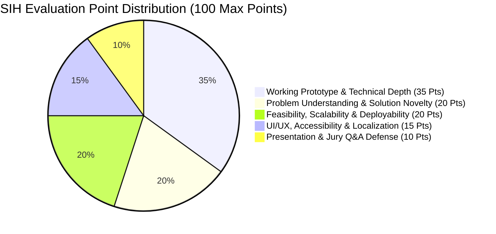

# Grand Finale Jury Evaluation Framework & Empirical Scoring Rubric

[🏠 Home](./README.md) > **Jury Evaluation Framework**

> **Epistemic Classification**: `[Heuristic Framework / Verified Evaluation Practice]`  
> **Source Basis**: Synthesized from official AICTE nodal evaluator scorecards, Ministry of Education Innovation Cell (MIC) mentor criteria, and empirical judging feedback across past SIH editions.

---

## 📊 1. The 100-Point Grand Finale Scoring Rubric

In the Smart India Hackathon Grand Finale, interdisciplinary jury panels evaluate competing teams across a **100-Point Scoring Model**:

### Granular Scoring Parameter Breakdown

| Evaluation Parameter | Max Points | 🔍 Evaluator Criteria & Scoring Triggers | 🚫 Penalties & Point Reductions |
| :--- | :---: | :--- | :--- |
| **Working Prototype & Technical Depth** | **35** | • Functional code interacting with live local database • Real API endpoints tested via Swagger / Postman • Measured model latency and active multi-author Git commits | • Hardcoded mock JSON arrays • Non-functional dummy UI buttons • Single-author Git commit history |
| **Problem Alignment & Solution Novelty** | **20** | • Direct resolution of ministry's primary operational bottleneck • Concrete, documented USP over existing commercial software • Deep comprehension of statutory and public-sector workflows | • Generic CRUD portal rebranding • Solving an unrequested theoretical problem • Inability to explain why SAP or Google Forms fail |
| **Scalability, Security & Deployability** | **20** | • Near-zero recurring OpEx (<₹0.05 per transaction) • Full compliance with **DPDP Act 2023** and data sovereignty • 100% offline-first capability during network blackouts | • Systems requiring multi-lakh monthly cloud GPU bills • Transmitting citizen biometric data overseas • Immediate system crash when Wi-Fi is disconnected |
| **UI/UX, Accessibility & Localization** | **15** | • Frictionless interface for non-technical grassroots operators • Native `Bhashini` regional language voice/text integration • High-contrast, WCAG 2.1 AA compliant UI tokens | • Dense English developer dashboards with tiny fonts • Complex navigation requiring extensive staff training • Inaccessible UI for screen readers or mobile screens |
| **Pitch Defense & Team Cohesion** | **10** | • Strict completion of 7-minute pitch timing • Active, confident speaking roles for all 6 team members • Calm, data-backed answers to adversarial jury questions | • 1 person speaking for the entire team • Timer expiration before reaching the live demo • Argumentative or defensive responses to feedback |

---

## 🎭 2. The 3 Evaluator Personas & Scoring Priorities

Jury panels at SIH nodal centers comprise three distinct evaluator mindsets. Teams must satisfy all three to win 1st prize:

### 🏛️ Persona 1: The Ministry Stakeholder (Department Officer)
* **Core Inquiry**: *"Will this actually work in our field offices without blowing our annual budget? Does it comply with government rules?"*
* **Scoring Triggers**:
  - Direct citations of Indian compliance frameworks (*DPDP Act 2023, IT Act Sec 65B, CPCB guidelines*).
  - Demonstrating **zero-training onboarding** for field operators.
  - Seamless webhook integration into existing NIC / department databases.

### 💻 Persona 2: The Industry Tech Architect (Private Sector Specialist)
* **Core Inquiry**: *"Did you write this code yourself? How does it handle concurrency, network drops, and memory leaks?"*
* **Scoring Triggers**:
  - Opening Postman / Swagger and demonstrating live API contracts with proper HTTP status codes.
  - Articulating architectural tradeoffs (e.g. *why you chose PostgreSQL + PostGIS over unindexed MongoDB*).
  - Demonstrating robust error-handling middlewares and clean Git branch commits.

### 🎓 Persona 3: The Academic Researcher (Senior Professor)
* **Core Inquiry**: *"Is there real algorithmic depth here or is it just basic CRUD? What is the mathematical and theoretical rigor?"*
* **Scoring Triggers**:
  - Presenting mathematical formulations (*loss functions, heuristic cost equations, spatial clustering models*).
  - Citing 2–3 peer-reviewed IEEE / Springer papers validating the chosen methodology.
  - Demonstrating quantitative benchmark comparisons against standard baselines.

---

## 🛡️ 3. High-Scoring Defense Master Checklist

Use this checklist during your Hour 32 dry run:

- [ ] **Working Localhost Environment**: System runs 100% locally on Docker / `localhost` with laptop Wi-Fi switched OFF.
- [ ] **Live Swagger / API Contract**: Ready in a browser tab to prove backend depth and database persistence.
- [ ] **Edge Latency Metrics**: Real-time terminal log showing sub-150ms model inference latency on local CPU.
- [ ] **Cost-Per-Transaction Breakdown**: Clear Slide 5 presentation proving $< ₹0.05$ OpEx per transaction.
- [ ] **Timer Discipline**: Rehearsed with a stopwatch: strictly 90s problem/architecture + 3 mins live demo + 90s impact + 1 min citations.
- [ ] **All 6 Members Spoken**: Each member has a designated 45-to-90 second verbal role during the presentation.
