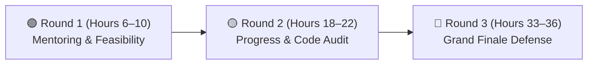

# Grand Finale Pitch Strategy, Timing & Jury Q&A Defense

[🏠 Home](../README.md) > [📁 Submission Guides](./official_sih_ppt_template.md) > **Pitch Strategy & Defense**

> **Epistemic Classification**: `[STRATEGIC RECOMMENDATION]`  
> **Source Basis**: Synthesized from past 1st-prize winning presentations and official SIH evaluation guidelines.

---

## ⏱️ 1. The Strict 7-Minute Grand Finale Pitch Breakdown

In Round 3, teams have strictly **7 minutes to present** followed by **3 minutes of Q&A defense**. Exceeding 7 minutes leads to evaluators cutting off the live demo.

```
00:00 ───► 01:30 (90s)  : Slide 1 & 2 — The Problem & Acute Ministry Bottleneck
01:30 ───► 04:30 (180s) : LIVE WORKING DEMO (The Core 35 Points)
04:30 ───► 06:00 (90s)  : Slide 3 & 4 — Architecture, Edge Latency & Security / DPDP
06:00 ───► 07:00 (60s)  : Slide 5 & 6 — Real-World Impact, ₹ OpEx Savings & Citations
07:00 ───► 10:00 (180s) : DEFENSE & JURY Q&A
```

---

## 🔄 2. Strategy for the 3 Continuous Judging Rounds



### 🟢 Round 1: Mentoring & Feasibility Review (Hours 6–10)
* **Goal**: Validate whether you comprehend the ministry's practical workflow.
* **Tactics**:
  - Present your architecture diagram, database schema, and Figma wireframes.
  - Ask the mentor about unwritten field edge cases (e.g. *"How do ground staff handle power cuts or illiterate applicants?"*).
  - Actively log mentor feedback — evaluators verify if you applied their advice in Round 2.

### 🟡 Round 2: Progress & Code Quality Audit (Hours 18–22)
* **Goal**: Inspect actual running code, Git commit velocity, database tables, and API responses.
* **Tactics**:
  - Open Postman / Swagger and trigger live API requests that write real rows to your local database.
  - If using AI/ML, demonstrate live inference latency metrics, confusion matrices, and model quantization (ONNX).
  - Never fake an API call in Round 2 — evaluators inspect browser Network tabs and server logs.

### 🔴 Round 3: The Grand Finale Pitch & Defense (Hours 33–36)
* **Goal**: Stress-test your architecture, cost feasibility, and live demo under pressure.
* **Tactics**:
  - All 6 members speak clearly for at least 45 seconds each.
  - Perform the live demo directly on `localhost` with Wi-Fi switched off to prove offline resilience.
  - Answer questions calmly with specific numbers rather than defensive arguments.

---

## 🛡️ 3. Battle-Tested Answers to the Toughest Jury Questions

| Tough Jury Question | ❌ Bad Answer (Loses Points) | ✅ Winning Answer (Scores Maximum Points) |
| :--- | :--- | :--- |
| **"How will you scale this to 100 million users across India?"** | *"We will host it on AWS Cloud and turn on autoscaling."* | *"Our backend uses stateless microservices with Redis caching for hot reads and database partitioning by state/district. Edge inferencing offloads 70% of compute to user devices, keeping central server costs under **₹0.04 per active session**."* |
| **"What if an illiterate citizen speaks in a rural dialect?"** | *"They will need to use our English text form."* | *"We integrated **Bhashini Indic ASR & TTS APIs** supporting 22 scheduled Indian languages with voice-guided navigation, so the user never has to type a single word."* |
| **"What if someone feeds fake or malicious data into your app?"** | *"Our AI model will automatically detect it."* | *"We enforce a 3-layer guardrail: 1) Client-side schema constraints, 2) Cryptographic HMAC verification of device payloads, and 3) An anomaly isolation quarantine layer that flags records exceeding 3 standard deviations."* |
| **"Why not just use an existing commercial ERP or Google Forms?"** | *"Our solution is cheaper and built by us."* | *"Commercial tools cost ₹2,000/user/month (fiscally unviable for 10,000 rural offices), fail completely when 2G drops, and store citizen data overseas in violation of the **DPDP Act 2023**."* |
| **"Why is your ML model accurate? Did you just overfit on test data?"** | *"It achieved 99% accuracy on our training split."* | *"We evaluated on a **stratified 5-fold cross-validation split** across 12,000 real-world samples under diverse lighting and noise conditions, prioritizing **F1-score (0.93)** to eliminate dangerous false negatives."* |

---

## 💻 4. Golden Rules for the Live Demonstration

> [!TIP]
> 1. **Run 100% on `localhost`**: Never rely on venue Wi-Fi during the live demo. The network almost always suffers congestion during final judging.
> 2. **Seed Realistic Indian Data**: Populate your database with realistic Indian names, real PIN codes, and genuine district coordinates instead of `test1`, `foo`, `bar`.
> 3. **Keep a 60-Second Video Backup**: Have a crisp screen-recording walkthrough stored on an iPad or phone in case of a catastrophic laptop crash.
