# SIH 36-Hour Continuous Sprint Execution Playbook

[🏠 Home](../README.md) > [📁 Sprint Playbook](./36hr_execution_masterplan.md) > **36-Hour Execution Playbook**

> **Epistemic Classification**: `[STRATEGIC RECOMMENDATION]`  
> **Purpose**: A production schedule, Git milestone discipline, and shift rotation strategy for the 36-hour continuous Grand Finale offline sprint.

---

## 🧭 Executive Summary & Non-Negotiable Rules

> [!IMPORTANT]
> The Grand Finale is a continuous 36-hour offline hackathon. Teams that win do **not** code for 36 hours straight without structure. They win by executing strict deliverable gates, enforcing rest shifts, and practicing disaster recovery.

```mermaid
gantt
    title SIH 36-Hour Grand Finale Milestone Schedule
    dateFormat X
    axisFormat Hour %d
    section Phase 1: Setup & Round 1
    Environment Setup & DB Scaffold :0, 4
    Figma / Flow Finalization       :2, 6
    Round 1 Mentoring Pitch         :6, 10
    section Phase 2: Core Engineering
    Core APIs & Backend Engine      :8, 18
    ML Pipeline & Inference / Hardware Rig :10, 20
    Round 2 Progress Inspection     :18, 22
    section Phase 3: Polish & Defense
    UI/UX Integration & India Stack APIs :20, 28
    Localhost Freeze & Mock DB Seeding :28, 32
    Dry Run & Round 3 Final Pitch   :32, 36
```



---

## 🕒 Phase-by-Phase Deliverable Gates

### 🟢 Phase 1: Foundation & Round 1 Alignment (Hours 0 – 10)

| Hour | Milestone / Objective | Responsible Role | Key Deliverables for Mentors |
| :---: | :--- | :--- | :--- |
| **0 – 2** | **Zero-Hour Repo & Env Setup** | DevOps & Backend Lead | • Git initialized with `main`, `dev`, `feature/*` branches<br>• Docker compose running DB (PostgreSQL/Redis/SQLite)<br>• Basic health check (`/health` returning 200 OK) |
| **2 – 6** | **UI Flow & API Contract Freeze** | UI/UX & Frontend Dev | • Figma screens locked for all core user personas<br>• OpenAPI / Swagger spec locked with mock payloads<br>• DB schema migrations applied |
| **6 – 10** | **ROUND 1: Mentoring & Feasibility Review** | Whole Team | • Present Figma, DB schema, and architecture diagram<br>• **Goal**: Probe mentor for unwritten ministry edge cases |

#### 📋 Phase 1 Checkpoint Checklist
- [ ] Git repository cloned on all laptops with branch protection.
- [ ] Database running locally with initial schema migrations.
- [ ] API contract locked (Swagger/Postman collection shared across team).
- [ ] Mentor feedback from Round 1 written down and prioritized in action log.

---

### 🟡 Phase 2: Core Engineering & Round 2 Depth Audit (Hours 10 – 24)

| Hour | Milestone / Objective | Responsible Role | Key Deliverables for Mentors |
| :---: | :--- | :--- | :--- |
| **10 – 18** | **Core Logic, AI & Hardware Build** | Backend, ML & Hardware | • Real DB queries functional (no mock arrays)<br>• AI model quantized to ONNX/TensorRT (measure edge latency)<br>• Hardware sensor read loop transmitting MQTT/LoRa packets |
| **18 – 22** | **ROUND 2: Progress & Code Quality Audit** | Whole Team | • Demonstrate live API calls inserting real rows into DB<br>• Show active Git commit history with atomic commits<br>• Show ML latency logs or sensor oscilloscope outputs |
| **22 – 24** | **Shift 1 Rest Window (Mandatory)** | Shift A Sleeps | • First 3 members sleep (see rotation matrix below) |

#### 📋 Phase 2 Checkpoint Checklist
- [ ] Real database persistence working end-to-end.
- [ ] AI model inference latency under 200ms on local CPU/Edge.
- [ ] Git commit log shows active contributions from multiple members.
- [ ] Shift A members in bed resting (mandatory to prevent Hour-28 brain fog).

---

### 🔴 Phase 3: Integration, Polish & Grand Finale Pitch (Hours 24 – 36)

| Hour | Milestone / Objective | Responsible Role | Key Deliverables for Mentors |
| :---: | :--- | :--- | :--- |
| **24 – 28** | **India Stack & Edge Integration** | Full-Stack & Integration | • Connect Bhashini voice / DigiLocker mock / SMS webhooks<br>• Build offline SQLite / IndexedDB sync layer |
| **28 – 31** | **CODE FREEZE & Localhost Hardening** | DevOps & Lead Dev | • 🚫 **ABSOLUTE CODE FREEZE — NO NEW FEATURES**<br>• Seed DB with realistic Indian datasets (real pin codes, names)<br>• Disconnect Wi-Fi and verify 100% offline functionality |
| **31 – 33** | **Demo Video & Slide Finalization** | Documentation Lead | • Record 60-second screen capture walkthrough (backup demo)<br>• Polish final 6-slide PDF presentation |
| **33 – 36** | **ROUND 3: Grand Finale Pitch & Defense** | All 6 Members | • 7-minute pitch + 3-minute jury Q&A defense<br>• All 6 members speak; perform live offline demo |

#### 📋 Phase 3 Checkpoint Checklist
- [ ] Code freeze enforced at Hour 28.
- [ ] Localhost demo tested with Wi-Fi completely turned OFF.
- [ ] Realistic Indian seed data populated in database (no "foo/bar" or "test123").
- [ ] 60-second backup video saved locally and on a phone/iPad.
- [ ] Rehearsed pitch timing with a stopwatch (strictly $\le 7$ minutes).

---

## 👥 Team Role Matrix & 2-Shift Rest Rotation

> [!WARNING]
> Never have all 6 members stay awake the entire 36 hours. Sleep deprivation causes fatal syntax errors and stumbling presentations in Round 3.

### 6-Member Role Division

```
┌───────────────────────────────────────┬───────────────────────────────────────┐
│ 1. TEAM LEAD & SYSTEMS ARCHITECT      │ 4. AI / ML / HARDWARE SPECIALIST      │
│ • Delivers Slides 1–3                 │ • Model quantization & edge latency   │
│ • Handles system scaling Q&A          │ • Sensor telemetry & circuit tuning   │
├───────────────────────────────────────┼───────────────────────────────────────┤
│ 2. BACKEND & DATABASE ENGINEER        │ 5. INTEGRATION & SECURITY LEAD        │
│ • DB schemas & REST/gRPC endpoints    │ • India Stack (Bhashini, DigiLocker)  │
│ • Redis caching, auth & indexing      │ • DPDP compliance & data encryption   │
├───────────────────────────────────────┼───────────────────────────────────────┤
│ 3. FRONTEND & UI/UX ENGINEER          │ 6. TESTING & PRESENTATION LEAD        │
│ • Responsive web/PWA interface        │ • Seed datasets & backup demo video   │
│ • Voice UI & accessibility (WCAG)     │ • Rehearsals & stopwatch timekeeper   │
└───────────────────────────────────────┴───────────────────────────────────────┘
```

### 🛌 2-Shift Sleep Schedule (Hours 20 – 26)

* **Shift A (Sleep Hours 20:00 – 23:00)**: Frontend Dev + Testing/Pitch Lead
* **Shift B (Sleep Hours 23:00 – 02:00)**: Backend Dev + AI/Hardware Specialist
* *Team Lead coordinates handover between shifts.*

---

## 🛡️ Emergency Disaster Recovery Protocols

| Disaster Scenario | What Usually Happens | Immediate Counter-Action |
| :--- | :--- | :--- |
| 🛜 **Venue Wi-Fi Dies** | Cloud APIs fail; app crashes on load | Switch instantly to pre-configured **Localhost Docker containers**. |
| 💥 **Database Corrupted** | Schema error or broken migration | Run pre-written script: `npm run db:reset:seed` (rebuilds clean DB in 4s). |
| 🔋 **Laptop Battery Dies** | Power cord fails at judging table | Switch immediately to backup laptop #2 (pre-cloned mirror repo). |
| 🐛 **Live Demo Fatal Bug** | Unhandled exception during demo | Seamlessly transition to pre-recorded **60-second video demo** without panic. |
| ⏱️ **Timer Runs Out** | Jury cuts you off at Slide 3 | Skip straight to Slide 5 (Impact & Architecture) and jump into the live demo. |
